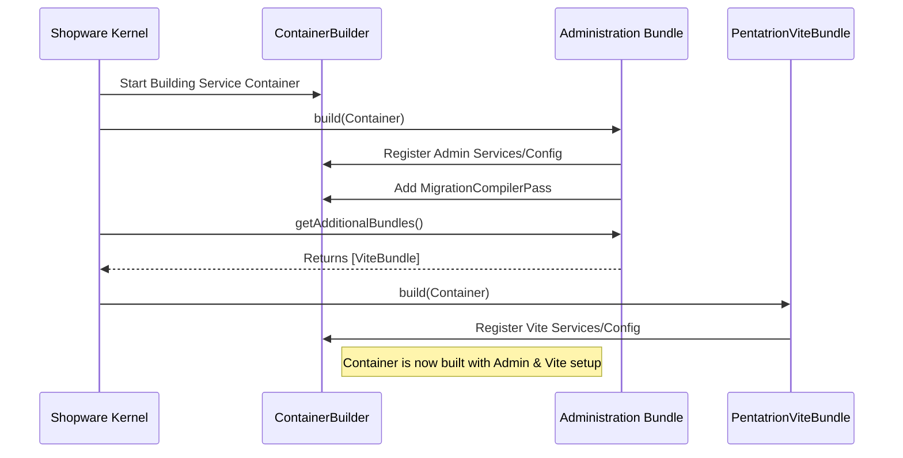

# Chapter 1: Administration Bundle

Welcome to the Shopware Administration tutorial! We're excited to guide you through the core concepts that make the Shopware Administration work. Think of the Administration as the control center for an online store – it's where merchants manage products, orders, customers, and much more.

In this first chapter, we'll explore the very foundation of this control center: the **Administration Bundle**.

## What Problem Does it Solve? The Need for a Foundation

Imagine building a large office complex. Before individual offices, meeting rooms, or departments can exist, you need a main building – a foundational structure that holds everything together, provides essential utilities (like electricity and water), and defines the overall layout.

The Shopware Administration is like that office complex. It has many different parts: pages for managing products, sections for handling orders, tools for configuring the store, etc. But all these parts need a central place to be organized and connected. They need shared resources and a common starting point.

This is where the **Administration Bundle** comes in. It acts as that main office building for the entire Shopware Administration.

**Use Case:** Setting up the basic framework for the Shopware Administration area so that all other administrative features can be added later.

## What is the Administration Bundle?

The Administration Bundle is the primary **entry point** and **foundation** for everything related to the Shopware Administration interface (the part of Shopware used by store owners and staff).

Think of it this way:

*   **It's the Organizer:** It tells Shopware, "Hey, there's an Administration area here!"
*   **It's the Setup Crew:** It registers essential background services and configurations needed for the Administration to function.
*   **It's the Resource Provider:** It makes sure necessary components, like the system for managing frontend assets (JavaScript and CSS used in your browser), are included.

Without this bundle, the Shopware Administration simply wouldn't exist or load. It lays the groundwork upon which all other administration features, like managing products or viewing orders, are built.

## A Look at the Code: The Bundle Class

Every major functional part of Shopware (and applications built with its underlying framework, Symfony) is often organized into a "Bundle". Here's the main file defining the Administration Bundle:

```php
<?php declare(strict_types=1);

namespace Shopware\Administration;

// Imports classes from other parts of Shopware/Symfony
use Pentatrion\ViteBundle\PentatrionViteBundle;
use Shopware\Administration\DependencyInjection\AdministrationMigrationCompilerPass;
use Shopware\Core\Framework\Bundle; // Base class for all Shopware bundles
use Shopware\Core\Framework\Log\Package;
use Shopware\Core\Framework\Parameter\AdditionalBundleParameters;
use Symfony\Component\DependencyInjection\ContainerBuilder;

/**
 * @internal - This means it's mainly for Shopware's internal use
 */
#[Package('framework')]
class Administration extends Bundle // It inherits from the base Bundle class
{
    // (Some methods omitted for simplicity)

    public function build(ContainerBuilder $container): void
    {
        parent::build($container); // Calls the build method of the parent Bundle class
        // Custom setup steps for the Administration Bundle happen here
        // For example, registering special configurations or services.

        // This adds a specific step to handle database updates (migrations)
        $container->addCompilerPass(
            new AdministrationMigrationCompilerPass(),
            PassConfig::TYPE_BEFORE_OPTIMIZATION, 0
        );
    }

    public function getAdditionalBundles(AdditionalBundleParameters $parameters): array
    {
        // This bundle also brings in another bundle needed for frontend assets
        return [
            new PentatrionViteBundle(),
        ];
    }
}
```

**Explanation:**

*   This PHP class `Administration` extends Shopware's base `Bundle` class. This tells Shopware that this is a bundle and how to interact with it.
*   The `build()` method is crucial. When Shopware starts up, it calls this method for every active bundle. The Administration Bundle uses this to register important services and configurations within Shopware's central "service container" (a registry of all available tools and services).
*   It also adds a `CompilerPass` (think of it as a configuration step) specifically for handling database changes (`Migrations`) related to the Administration.
*   The `getAdditionalBundles()` method tells Shopware, "To make the Administration work, you also need this *other* bundle: `PentatrionViteBundle`." This specific bundle is responsible for managing the JavaScript and CSS files built using a tool called Vite, which are essential for displaying the Administration interface in the browser. We'll touch on this more in [Chapter 7: Admin Asset Management & Build Process](07_admin_asset_management___build_process_.md).

You typically don't interact *directly* with this `Administration.php` file when developing features *within* the Administration. Its main job is the initial setup performed automatically by Shopware.

## How it Works Internally: The Setup Process

So, what actually happens when Shopware loads this bundle?

1.  **Shopware Starts:** When you access Shopware (either the storefront or the administration area), the core Shopware application boots up.
2.  **Bundle Discovery:** Shopware identifies all the available Bundles, including our `Administration` bundle.
3.  **Building the Container:** Shopware uses a central "Service Container" to manage all its different parts and services. During the process of building this container, it calls the `build()` method on each bundle.
4.  **Administration Bundle's `build()`:**
    *   The `Administration::build()` method is executed.
    *   It registers specific services needed only for the Administration.
    *   It adds the `AdministrationMigrationCompilerPass`. This pass ensures that any database changes required by the Administration area are correctly registered and can be executed later.
5.  **Loading Additional Bundles:** Shopware calls `getAdditionalBundles()`. The Administration Bundle returns the `PentatrionViteBundle`. Shopware then loads and configures this Vite bundle as well, making the Administration's frontend assets available.
6.  **Ready:** Once the container is built, the Administration Bundle has established the necessary foundation. Other parts of Shopware can now register routes, controllers, and services that rely on this foundation to create the actual user interface and functionality of the Administration.

Here's a simplified diagram showing the interaction during startup:



## Diving Deeper into the Code

Let's look again at the key parts:

**1. `build(ContainerBuilder $container)` in `Administration.php`:**

```php
    public function build(ContainerBuilder $container): void
    {
        parent::build($container); // Standard Bundle setup
        $this->buildDefaultConfig($container); // Load default config files

        // Registering the Migration Compiler Pass
        $container->addCompilerPass(
            new AdministrationMigrationCompilerPass(), // The pass to add
            PassConfig::TYPE_BEFORE_OPTIMIZATION, // When to run it
            0 // Priority
        );
    }
```

*   This method receives the `ContainerBuilder`, which is like a blueprint for the final Service Container.
*   The `addCompilerPass(...)` line is important. It hooks into the container building process. The `AdministrationMigrationCompilerPass` (defined in a separate file) specifically looks for database migration files within the Administration bundle directory and registers them with Shopware's migration system.

**2. `AdministrationMigrationCompilerPass.php`:**

```php
<?php declare(strict_types=1);

namespace Shopware\Administration\DependencyInjection;

use Shopware\Core\Framework\DependencyInjection\CompilerPass\AbstractMigrationReplacementCompilerPass;
// ...

class AdministrationMigrationCompilerPass extends AbstractMigrationReplacementCompilerPass
{
    // Tells the system *where* to look for migration files
    protected function getMigrationPath(): string
    {
        // Returns the directory containing the Administration bundle
        return \dirname(__DIR__);
    }

    // Helps categorize these migrations
    protected function getMigrationNamespacePart(): string
    {
        return 'Administration';
    }
}
```

*   This class provides the logic needed by the `build` method. It tells Shopware's migration system exactly where to find the database update scripts associated with the Administration bundle.

**3. `getAdditionalBundles(...)` in `Administration.php`:**

```php
    public function getAdditionalBundles(AdditionalBundleParameters $parameters): array
    {
        return [
            // Include the Vite bundle, essential for frontend assets
            new PentatrionViteBundle(),
        ];
    }
```

*   This method ensures that the `PentatrionViteBundle` is loaded alongside the `Administration` bundle. This is critical because the Administration's user interface is built using modern JavaScript and CSS, which are compiled and managed by Vite through this bundle.

## Conclusion

You've now seen the cornerstone of the Shopware Administration: the **Administration Bundle**. While you might not modify this bundle directly very often, understanding its role is crucial.

*   It acts as the **main entry point** and **foundation** for the entire Admin area.
*   It **registers essential services, configurations, and database migrations**.
*   It brings in **dependencies**, like the Vite bundle for handling frontend assets (JavaScript/CSS).

Think of it as the architect laying down the blueprints and pouring the foundation for our "office building" before any specific rooms or features can be added.

Now that we have the foundation in place, we need ways to handle user requests and display different pages within the Administration. That's where Controllers come in.

Ready to learn how user interactions are handled? Let's move on to the next chapter: [Chapter 2: Administration Controllers](02_administration_controllers_.md).

---

Generated by [AI Codebase Knowledge Builder](https://github.com/The-Pocket/Tutorial-Codebase-Knowledge)