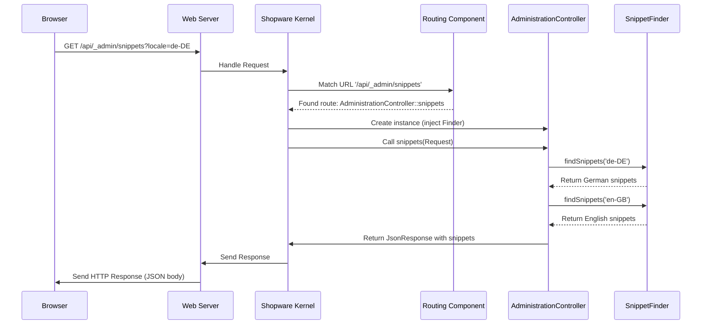

# Chapter 2: Administration Controllers

In [Chapter 1: Administration Bundle](01_administration_bundle_.md), we learned about the foundational structure, the "main building," for the Shopware Administration. Now that we have the building, how do we handle requests coming into it? How does someone ask for specific information, like a list of available text snippets or the current user's settings?

## What Problem Do They Solve? Handling Specific Requests

Imagine our Administration building again. When someone enters, they usually go to a receptionist or a specific department manager to ask for something. They don't just wander around hoping to find what they need. They have a specific destination and a specific request.

Similarly, when your web browser (the Administration UI) needs data from the server (like the list of products, customer details, or configuration options), it sends a request to a specific web address (URL). We need something on the server side to "listen" for these requests at those specific addresses, understand what's being asked for, perform the necessary actions (like fetching data from a database), and send back a structured response.

This is exactly what **Administration Controllers** do. They act like the receptionists or department managers for specific tasks within the Administration.

**Use Case:** The Administration user interface needs to display text labels (like "Save", "Cancel", "Product Name") in the user's chosen language. The UI needs to ask the backend for a list of all available text snippets for that language.

## What are Administration Controllers?

Administration Controllers are PHP classes designed to handle incoming web requests directed to the Administration's API (Application Programming Interface). Think of the API as the set of official "request counters" or "service desks" available in our Administration building.

Here's what a controller typically does:

1.  **Listens at a Specific Address (Route):** Each controller method is usually linked to a specific URL path (like `/api/_admin/snippets`). This is called a "Route". When a request hits that URL, Shopware knows which controller method to call.
2.  **Receives the Request:** The controller method gets information about the incoming request, such as any data sent with it or parameters in the URL.
3.  **Processes the Request:** It performs the necessary logic. This often involves using other specialized services (like asking a "Snippet Manager" service for the text snippets).
4.  **Prepares the Response:** It gathers the results of the processing.
5.  **Sends Back the Response:** It sends the results back to the browser, usually formatted as JSON (JavaScript Object Notation), which is a standard format that web browsers easily understand.

Think of a controller like the "Customer Service Department Manager":

*   They handle requests specifically for customer service (a specific route, e.g., `/api/customers`).
*   They receive the customer's request details.
*   They might look up customer information in a database (using a service).
*   They formulate a response (e.g., the customer's details).
*   They send this response back.

## How to Use Controllers: Fetching Snippets

Let's look at a simplified example of how a controller handles our use case: fetching snippets.

We'll focus on the relevant parts of the `AdministrationController.php` file.

```php
<?php declare(strict_types=1);

namespace Shopware\Administration\Controller;

// Imports necessary classes
use Shopware\Administration\Snippet\SnippetFinderInterface; // Tool for finding snippets
use Symfony\Bundle\FrameworkBundle\Controller\AbstractController;
use Symfony\Component\HttpFoundation\JsonResponse; // For sending JSON responses
use Symfony\Component\HttpFoundation\Request; // Represents the incoming request
use Symfony\Component\HttpFoundation\Response;
use Symfony\Component\Routing\Attribute\Route; // Defines the URL route

// Controllers often extend this base class
class AdministrationController extends AbstractController
{
    // The controller gets the tools it needs (like the SnippetFinder) when it's created
    public function __construct(
        private readonly SnippetFinderInterface $snippetFinder
    ) {
    }

    // This annotation links the URL '/api/_admin/snippets' to this method
    #[Route(path: '/api/_admin/snippets', name: 'api.admin.snippets', methods: ['GET'])]
    public function snippets(Request $request): Response // Method receives the incoming Request
    {
        // Get the desired language (locale) from the URL query, default to 'en-GB'
        $locale = $request->query->get('locale', 'en-GB');

        // Use the SnippetFinder tool to get snippets for this locale
        $foundSnippets = $this->snippetFinder->findSnippets((string) $locale);

        // Prepare the response data
        $responseData = [
            $locale => $foundSnippets,
        ];

        // If the requested locale wasn't the default 'en-GB', also include 'en-GB' snippets
        if ($locale !== 'en-GB') {
            $responseData['en-GB'] = $this->snippetFinder->findSnippets('en-GB');
        }

        // Send the data back as a JSON response
        return new JsonResponse($responseData);
    }

    // ... other methods might exist in the real controller ...
}
```

**Explanation:**

1.  **`#[Route(...)]`:** This is an attribute that tells Shopware: "If a GET request comes in for the URL `/api/_admin/snippets`, execute the `snippets` method below."
2.  **`public function snippets(Request $request): Response`:** This defines the method. It takes the incoming `Request` object as input, which contains all information about the request (like URL parameters). It's expected to return a `Response` object.
3.  **`$request->query->get('locale', 'en-GB')`:** This extracts the `locale` parameter from the URL query string (e.g., `/api/_admin/snippets?locale=de-DE`). If it's not provided, it defaults to `en-GB`.
4.  **`$this->snippetFinder->findSnippets(...)`:** This is where the controller uses another specialized service (`SnippetFinderInterface`) to do the actual work of finding the snippets. We'll learn more about services like this in later chapters, such as [Chapter 4: Snippet Management](04_snippet_management_.md).
5.  **`new JsonResponse(...)`:** This creates a Response object that automatically formats the provided `$responseData` array into JSON and sets the correct HTTP headers, ready to be sent back to the browser.

**Input/Output:**

*   **Input:** An HTTP GET request from the browser to the URL `/api/_admin/snippets?locale=de-DE`.
*   **Output:** An HTTP response with a JSON body like this (simplified):

```json
{
  "de-DE": {
    "global.button.save": "Speichern",
    "global.button.cancel": "Abbrechen",
    // ... more German snippets
  },
  "en-GB": {
    "global.button.save": "Save",
    "global.button.cancel": "Cancel",
    // ... more English snippets
  }
}
```

The Administration UI receives this JSON and can then use the snippets to display text in the correct language.

## How it Works Internally: The Request Lifecycle

What happens behind the scenes when the browser requests snippets?

1.  **Request:** Your browser sends an HTTP GET request to your Shopware server, targeting `/api/_admin/snippets?locale=de-DE`.
2.  **Web Server:** A web server (like Apache or Nginx) receives the request and passes it to Shopware's entry point (usually `index.php`).
3.  **Shopware Kernel:** The core of Shopware (the Kernel) takes the request.
4.  **Routing:** The Kernel uses its Routing component to match the requested URL (`/api/_admin/snippets`) to the configured route (`api.admin.snippets`). It determines that `AdministrationController::snippets` is the designated handler.
5.  **Controller Instantiation:** Shopware creates an instance of `AdministrationController`, automatically providing it with the services it needs (like the `SnippetFinderInterface`) via its constructor (this is called Dependency Injection).
6.  **Action Execution:** The Kernel calls the `snippets` method on the controller instance, passing the `Request` object.
7.  **Service Interaction:** The `snippets` method calls the `findSnippets` method on the `snippetFinder` service.
8.  **Data Retrieval:** The `snippetFinder` service does its work (e.g., reads snippet files from the disk or a database).
9.  **Response Creation:** The `snippets` method receives the snippet data back from the service and creates a `JsonResponse` object containing this data.
10. **Response Sending:** The Kernel takes the `JsonResponse` object and sends it back through the web server to your browser.
11. **UI Update:** The browser receives the JSON response and the Administration UI uses the data to display the correct text labels.

Here's a simplified sequence diagram:



## Diving Deeper into the Code

Let's revisit the key pieces enabling this:

**1. The Route (`AdministrationController.php`):**

```php
// This attribute connects the URL path and HTTP method to the controller action.
#[Route(
    path: '/api/_admin/snippets', // The URL path this method responds to
    name: 'api.admin.snippets',  // An internal name for this route
    methods: ['GET']           // The HTTP method(s) allowed (e.g., GET, POST)
)]
public function snippets(Request $request): Response
{
    // ... method body ...
}
```

*   The `#[Route]` attribute is crucial. It's processed by Shopware's Routing component during startup to build a map of URL paths to controller methods.

**2. Service Injection (`AdministrationController.php`):**

```php
// The __construct method declares dependencies
public function __construct(
    // Declares that this controller needs a service implementing SnippetFinderInterface
    private readonly SnippetFinderInterface $snippetFinder
) {
    // PHP 8+ allows defining and assigning properties directly in the constructor signature.
    // Shopware's service container automatically provides the correct service instance here.
}
```

*   Controllers usually don't contain *all* the logic themselves. They delegate tasks to specialized services. By declaring `SnippetFinderInterface` in the constructor, the controller tells Shopware, "I need a tool that can find snippets." Shopware's service container automatically finds and provides the registered service that implements this interface.

**3. Returning JSON (`AdministrationController.php`):**

```php
        // ... prepare $responseData array ...

        // Create a JsonResponse object.
        // It automatically handles setting the Content-Type header to application/json
        // and encodes the PHP array into a JSON string.
        return new JsonResponse($responseData);
```

*   Using `JsonResponse` is the standard and easiest way to return JSON data from a controller in Shopware (and the underlying Symfony framework).

## Conclusion

You've now met the "department managers" of the Administration: the **Controllers**.

*   They act as **entry points** for specific API requests.
*   They are linked to **URLs via Routes**.
*   They **receive request details**, **process them** (often using other Services), and **return structured responses** (typically JSON).
*   They orchestrate the work needed to fulfill a request from the Administration UI.

We saw how `AdministrationController` handles requests for text snippets by using the `SnippetFinderInterface`. But what if the user wants to search across different types of data, like products, orders, and customers, all at once? For that, we have a dedicated service.

Let's move on to discover how the Administration handles searching: [Chapter 3: Admin Search Service](03_admin_search_service_.md).

---

Generated by [AI Codebase Knowledge Builder](https://github.com/The-Pocket/Tutorial-Codebase-Knowledge)