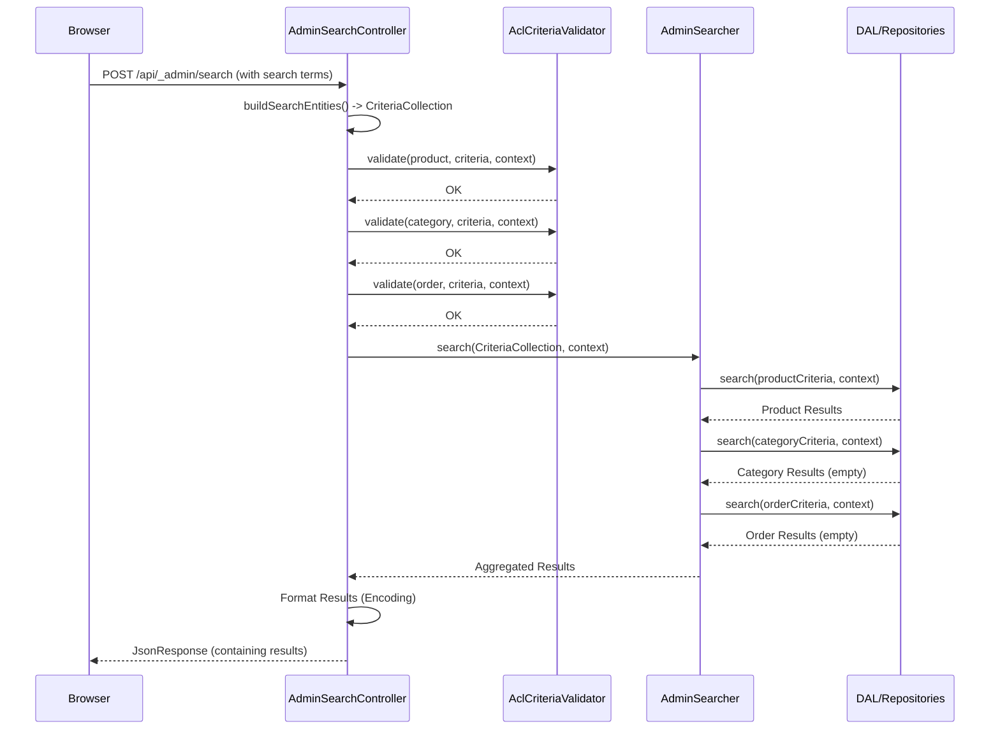

# Chapter 3: Admin Search Service

In [Chapter 2: Administration Controllers](02_administration_controllers_.md), we saw how Controllers act like department managers, handling specific requests for things like text snippets. But what if a store manager wants to quickly find *anything* related to a specific term – maybe a customer name, an order number, or a product title – without knowing exactly which "department" to ask? They need a central search, like a helpful librarian for the entire administration.

## What Problem Does it Solve? Finding Anything, Anywhere

Imagine the Shopware Administration as a huge library with different sections: one for product catalogs, one for customer records, another for orders, and so on. If you needed to find all information related to "Max Muster," you wouldn't want to search the product section, then the customer section, then the order section separately. You'd want to go to the main desk and ask the librarian to find everything about "Max Muster" across *all* relevant sections.

The **Admin Search Service** is that central librarian. It provides a single point to search across different types of data within the Administration (like products, orders, customers) simultaneously.

**Use Case:** An admin user types "Red T-Shirt" into the main search bar in the Shopware Administration. They expect to see a list of matching products, perhaps categories that include "Red T-Shirt", and maybe even relevant orders, all in one consolidated view.

## What is the Admin Search Service?

The Admin Search Service is a specialized service (`AdminSearcher`) within Shopware responsible for performing searches across multiple data types (we often call these data types "entities").

Think of it like this:

1.  **Receives the Request:** It gets the search term (e.g., "Red T-Shirt") and the list of "library sections" (entities like `product`, `category`, `order`) to search within. This request usually comes via a dedicated controller, like `AdminSearchController`.
2.  **Checks Permissions:** Just like a librarian might check if you have clearance to view certain archives, this service ensures the admin user performing the search actually has the permission to view data from each requested entity. You shouldn't see order details if you don't have permission for orders!
3.  **Delegates the Search:** It asks the specialized "assistants" (called Repositories) responsible for each entity type to perform the actual search within their specific section.
4.  **Gathers Results:** It collects the findings from all the assistants.
5.  **Returns Results:** It bundles everything together and gives it back (usually to the controller) to be displayed to the user.

This service acts as the central coordinator for searching, making it easy to implement a powerful, unified search experience in the Administration.

## How it's Used: Asking the Librarian

You typically don't call the `AdminSearcher` service directly from the browser. Instead, the Administration's user interface (the part you see in your browser) makes a request to a specific API endpoint handled by a controller, usually `AdminSearchController`.

This controller takes the user's input (the search term and maybe which areas to search) and prepares a structured request for the `AdminSearcher`.

**Example Scenario:**

Let's stick with the "Red T-Shirt" example.

1.  **Input (User Action):** The user types "Red T-Shirt" into the global search bar and hits Enter.
2.  **Input (API Request):** The browser sends a request (e.g., a POST request) to `/api/_admin/search`. The body of this request might look something like this (simplified):

```json
{
  "product": {
    "term": "Red T-Shirt",
    "limit": 5
  },
  "category": {
    "term": "Red T-Shirt",
    "limit": 5
  },
  "order": {
    "term": "Red T-Shirt",
    "limit": 5
  }
}
```

This tells the backend: "Search for 'Red T-Shirt' in products, categories, and orders, and give me back at most 5 results for each."

3.  **Processing:** The `AdminSearchController` receives this, validates permissions, uses the `AdminSearcher` to perform the searches, and gets the results.
4.  **Output (API Response):** The controller sends back a JSON response like this (simplified):

```json
{
  "data": {
    "product": {
      "total": 1,
      "data": [
        { "id": "prod123", "name": "Awesome Red T-Shirt", /* ... more product details ... */ }
      ]
    },
    "category": {
      "total": 0,
      "data": []
    },
    "order": {
      "total": 0,
      "data": []
    }
    // If permissions were missing for an entity, an error message might appear here instead
  }
}
```

This response tells the UI: "We found 1 matching product, 0 categories, and 0 orders. Here are the details for the product." The UI then displays this information nicely.

## A Look at the Code: The Controller's Role

The primary interaction point for the frontend is the `AdminSearchController`. Let's look at a simplified version of its `search` method:

```php
<?php // File: Controller/AdminSearchController.php

// ... necessary imports ...
use Shopware\Administration\Service\AdminSearcher;
use Shopware\Administration\Framework\Search\CriteriaCollection;
use Symfony\Component\HttpFoundation\Request;
use Symfony\Component\HttpFoundation\JsonResponse;
use Shopware\Core\Framework\Context;
// ... other imports ...

class AdminSearchController extends AbstractController
{
    public function __construct(
        // The controller needs the searcher service
        private readonly AdminSearcher $searcher,
        // ... other needed services like permission checker, criteria builder ...
        private readonly AclCriteriaValidator $criteriaValidator,
        private readonly RequestCriteriaBuilder $requestCriteriaBuilder
    ) {}

    #[Route(path: '/api/_admin/search', methods: ['POST'])]
    public function search(Request $request, Context $context): JsonResponse
    {
        // 1. Figure out what entities to search and build criteria
        // (Simplified - uses helper services)
        $criteriaCollection = $this->buildSearchEntities($request, $context);

        // 2. Check permissions for each requested entity
        foreach ($criteriaCollection as $entity => $criteria) {
            $missing = $this->criteriaValidator->validate($entity, $criteria, $context);
            if (!empty($missing)) {
                // If permissions are missing, remove from search and note the error
                $criteriaCollection->remove($entity);
                // ... handle error reporting (omitted for simplicity) ...
            }
        }

        // 3. Ask the AdminSearcher to perform the search
        $results = $this->searcher->search($criteriaCollection, $context);

        // 4. Prepare and return the response (simplified)
        // ... encode results properly (omitted) ...
        return new JsonResponse(['data' => $results]);
    }

    // Helper method to parse the request and create search criteria
    private function buildSearchEntities(
        Request $request,
        Context $context
    ): CriteriaCollection {
        // ... complex logic using RequestCriteriaBuilder is here ...
        // It reads the JSON body and creates Criteria objects for each entity
        // Returns a CriteriaCollection containing Criteria for 'product', 'category', etc.
        $collection = new CriteriaCollection(); // Example placeholder
        // ... imagine parsing logic here ...
        return $collection;
    }
}
```

**Explanation:**

1.  **Dependencies:** The controller gets the `AdminSearcher` and other necessary tools (like the `AclCriteriaValidator` for permissions) injected via its constructor.
2.  **Build Criteria:** The `buildSearchEntities` helper (shown simplified) interprets the incoming JSON request and creates a `CriteriaCollection`. This collection holds individual `Criteria` objects (which define search terms, limits, filters, etc.) for each entity (`product`, `category`, `order`).
3.  **Validate Permissions:** It loops through the requested entities in the `CriteriaCollection` and uses `criteriaValidator->validate()` to check if the current user has permission to read data for that entity based on the requested criteria. If not, that entity is removed from the search.
4.  **Call Searcher:** It passes the *validated* `CriteriaCollection` to the `searcher->search()` method.
5.  **Return Response:** It takes the results from the `searcher` and wraps them in a `JsonResponse` to send back to the browser.

## How it Works Internally: The Search Process

Let's follow the "Red T-Shirt" request behind the scenes:

1.  **Request Arrives:** The POST request hits `/api/_admin/search`.
2.  **Routing:** Shopware routes the request to `AdminSearchController::search`.
3.  **Criteria Building:** The controller's `buildSearchEntities` method parses the JSON body and creates a `CriteriaCollection` containing `Criteria` objects for `product`, `category`, and `order`, each configured to search for "Red T-Shirt" with a limit of 5.
4.  **Permission Check:** The controller loops through `product`, `category`, `order`. For each, it calls the `AclCriteriaValidator`. Let's assume the user has permission for all three.
5.  **Search Execution:** The controller calls `searcher->search(criteriaCollection, context)`.
6.  **Inside the Searcher (`AdminSearcher::search`):**
    *   The `AdminSearcher` receives the `CriteriaCollection`.
    *   It iterates through the collection (product, category, order).
    *   For `product`:
        *   It checks again if the context allows reading products (`$context->isAllowed('product:read')`).
        *   It gets the `ProductRepository` (the specialized assistant for products).
        *   It calls `$productRepository->search(productCriteria, context)`.
    *   For `category`:
        *   It checks read permission for categories.
        *   It gets the `CategoryRepository`.
        *   It calls `$categoryRepository->search(categoryCriteria, context)`.
    *   For `order`:
        *   It checks read permission for orders.
        *   It gets the `OrderRepository`.
        *   It calls `$orderRepository->search(orderCriteria, context)`.
7.  **Data Retrieval:** Each Repository queries the database based on the provided criteria. Let's say the `ProductRepository` finds one "Awesome Red T-Shirt", while the others find nothing.
8.  **Aggregation:** The `AdminSearcher` collects the results from each repository: a list containing one product, an empty list for categories, and an empty list for orders, along with the total counts.
9.  **Return to Controller:** The `AdminSearcher` returns this aggregated result structure to the `AdminSearchController`.
10. **Response Formatting:** The controller (using helpers like `JsonEntityEncoder`, omitted before for simplicity) formats the product entity data correctly and packages everything into the final `JsonResponse`.
11. **Response Sent:** The `JsonResponse` is sent back to the browser.

Here's a simplified sequence diagram:



## Diving Deeper into the Code

Let's peek inside the `AdminSearcher`:

```php
<?php // File: Service/AdminSearcher.php

// ... imports ...
use Shopware\Administration\Framework\Search\CriteriaCollection;
use Shopware\Core\Framework\Context;
use Shopware\Core\Framework\DataAbstractionLayer\DefinitionInstanceRegistry;
use Shopware\Core\Framework\Api\Acl\Role\AclRoleDefinition; // For permission checks

class AdminSearcher
{
    public function __construct(
        // Needs the registry to find the right Repository for each entity
        private readonly DefinitionInstanceRegistry $definitionRegistry
    ) {}

    public function search(CriteriaCollection $entities, Context $context): array
    {
        $result = [];

        // Loop through each entity requested in the collection
        foreach ($entities as $entityName => $criteria) {
            // Double-check if the entity type actually exists
            if (!$this->definitionRegistry->has($entityName)) {
                continue; // Skip if unknown entity
            }

            // Check basic read permission for this entity type
            if (!$context->isAllowed($entityName . ':' . AclRoleDefinition::PRIVILEGE_READ)) {
                continue; // Skip if user cannot read this entity type
            }

            // Get the correct data manager (Repository) for this entity
            $repository = $this->definitionRegistry->getRepository($entityName);

            // Ask the repository to search based on the specific criteria
            $searchResult = $repository->search($criteria, $context);

            // Store the found items and the total count
            $result[$entityName] = [
                'data' => $searchResult->getEntities(),
                'total' => $searchResult->getTotal(),
            ];
        }

        return $result; // Return the aggregated results
    }
}
```

**Explanation:**

1.  **Looping:** The `search` method iterates over the `CriteriaCollection` provided by the controller.
2.  **Permission Check:** It performs a basic check (`$context->isAllowed(...)`) to see if the user context grants the fundamental 'read' privilege for the entity type (`product`, `category`, etc.). Note: More fine-grained permission checks might happen inside the `repository->search` call itself.
3.  **Get Repository:** It uses the `DefinitionInstanceRegistry` (a central directory of entity types and their managers) to get the specific `Repository` responsible for handling data of the current `$entityName`.
4.  **Delegate Search:** It calls the `search()` method on that specific repository, passing the `Criteria` object (containing search term, limits, etc.) relevant only to that entity.
5.  **Collect Results:** It takes the `SearchResult` returned by the repository, extracts the actual data items (`getEntities()`) and the total number of possible matches (`getTotal()`), and stores them in the `$result` array, keyed by the entity name.

The `CriteriaCollection` mentioned is a simple helper class:

```php
<?php // File: Framework/Search/CriteriaCollection.php

// ... imports ...
use Shopware\Core\Framework\DataAbstractionLayer\Search\Criteria;
use Shopware\Core\Framework\Struct\Collection;

/**
 * A collection specifically for holding Criteria objects,
 * usually keyed by entity name.
 * @extends Collection<Criteria>
 */
class CriteriaCollection extends Collection
{
    // Tells the Collection it expects to hold Criteria objects
    protected function getExpectedClass(): ?string
    {
        return Criteria::class;
    }
}
```

It's essentially a specialized list or dictionary designed to hold multiple `Criteria` objects, making it easy to pass them around.

## Conclusion

You've now met the Administration's central librarian: the **Admin Search Service** (`AdminSearcher`).

*   It provides a **unified way to search** across different data types (entities) like products, orders, and customers.
*   It works together with a controller (`AdminSearchController`) to handle requests from the UI.
*   It **respects user permissions** (ACL), ensuring users only see data they are allowed to access.
*   It **delegates** the actual searching to specialized Repositories for each entity type.
*   It **aggregates** the results into a single response.

This service is key to providing a powerful and convenient search experience within the Shopware Administration.

Now that we understand how searching works and how controllers handle requests (like fetching snippets, as seen in Chapter 2), let's dive deeper into how those text snippets themselves are managed.

Ready to learn about managing labels and text? Let's move on to [Chapter 4: Snippet Management](04_snippet_management_.md).

---

Generated by [AI Codebase Knowledge Builder](https://github.com/The-Pocket/Tutorial-Codebase-Knowledge)