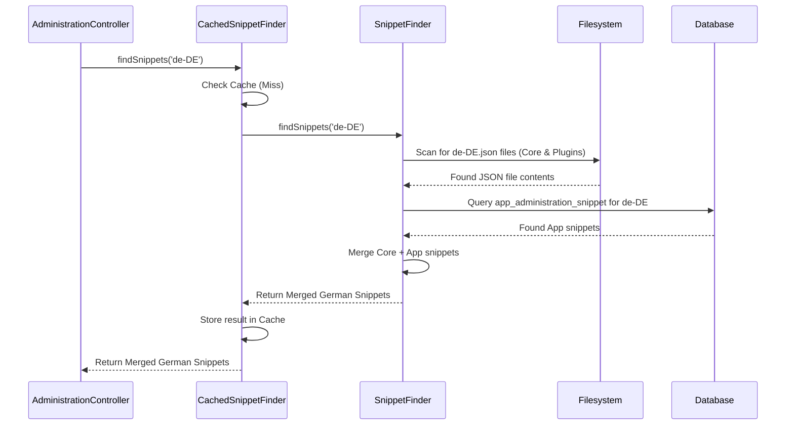

# Chapter 4: Snippet Management

In the previous chapters, we explored the basic [Administration Bundle](01_administration_bundle_.md), how [Controllers](02_administration_controllers_.md) handle requests, and how the [Admin Search Service](03_admin_search_service_.md) helps find data. Now, let's look at something fundamental to any user interface: the text it displays. How does the Administration know whether to show "Save" or "Speichern"?

## What Problem Does it Solve? Speaking the User's Language

Imagine logging into the Shopware Administration. You see buttons, menus, titles, and messages everywhere. If you speak English, you expect to see "Products," "Orders," and "Customers." But if you speak German, you'd expect "Produkte," "Bestellungen," and "Kunden."

The Administration interface needs to be multilingual. We need a system that can:

1.  Store all the text labels (like "Save", "Cancel", "Product Name") used throughout the interface.
2.  Keep track of translations for these labels in different languages (locales).
3.  Deliver the correct text in the language requested by the user's browser or settings.

This is where **Snippet Management** comes in. It acts like the Administration's dedicated translation service or multilingual dictionary.

**Use Case:** The Administration UI needs to display buttons. It asks the Snippet Management system for the text of the "save" button in German (`de-DE`). The system should provide the German word "Speichern".

## What is Snippet Management?

Snippet Management is the system responsible for finding, organizing, combining, and providing all the little pieces of text (called **snippets**) used in the Administration UI.

Think of it like this:

*   **It's a Dictionary:** It holds key-value pairs. The "key" is a unique identifier (like `global.button.save`), and the "value" is the actual text ("Save" in English, "Speichern" in German).
*   **It's Multilingual:** It manages these key-value pairs for multiple languages (locales, like `en-GB`, `de-DE`, `fr-FR`).
*   **It's a Collector:** It gathers snippets from different places:
    *   **Core Snippets:** Text provided by Shopware itself.
    *   **App/Plugin Snippets:** Text added by third-party apps or plugins to extend the interface.
*   **It's a Provider:** When the UI needs text for a specific language, it asks the Snippet Management system, which finds and returns the correct translations.

Without this system, the Administration could only display text in one hardcoded language, making it unusable for a global audience.

## How It's Used: Getting the Right Words

As we saw briefly in [Chapter 2: Administration Controllers](02_administration_controllers_.md), the Administration UI makes an API request to get the snippets it needs.

1.  **Request:** The browser, knowing the user wants German (`de-DE`), sends a GET request to `/api/_admin/snippets?locale=de-DE`.
2.  **Controller:** The `AdministrationController::snippets` method receives this request.
3.  **Service:** The controller doesn't find the snippets itself. It uses a specialized service that implements the `SnippetFinderInterface`. Let's call this the "Snippet Finder" service.
4.  **Finding:** The Snippet Finder service looks for all German snippets (`de-DE`) from the core and any active apps/plugins. It also fetches the default English (`en-GB`) snippets as a fallback.
5.  **Response:** The controller gets the snippets back from the service and sends them to the browser as JSON.

**Input (to the Snippet Finder service):**

*   Locale: `de-DE`

**Output (from the Snippet Finder service, simplified):**

```json
// For de-DE locale
{
  "global.button.save": "Speichern",
  "global.button.cancel": "Abbrechen",
  "sw-product.list.title": "Produkte",
  // ... many more German snippets
}

// For en-GB locale (also fetched)
{
  "global.button.save": "Save",
  "global.button.cancel": "Cancel",
  "sw-product.list.title": "Products",
  // ... many more English snippets
}
```

The `AdministrationController` then combines these into a single JSON response for the browser.

```php
// Simplified excerpt from AdministrationController.php

// ... injection of SnippetFinderInterface ...

#[Route(path: '/api/_admin/snippets', name: 'api.admin.snippets', methods: ['GET'])]
public function snippets(Request $request): Response
{
    // Get desired language, default to 'en-GB'
    $locale = $request->query->get('locale', 'en-GB');

    // Use the injected service to find snippets
    $foundSnippets = $this->snippetFinder->findSnippets((string) $locale);

    // Prepare response, including default 'en-GB' as fallback
    $responseData = [$locale => $foundSnippets];
    if ($locale !== 'en-GB') {
        $responseData['en-GB'] = $this->snippetFinder->findSnippets('en-GB');
    }

    // Send JSON back
    return new JsonResponse($responseData);
}
```

This code shows the controller asking the `snippetFinder` service for the snippets based on the requested locale.

## How it Works Internally: Finding and Combining Snippets

Where does the `SnippetFinder` service actually look for these snippets?

1.  **Core Files:** It scans specific directories within the Shopware core code and enabled bundles for JSON files named after the requested locale (e.g., `de-DE.json`). These files contain the standard translations.
    *   Example path: `vendor/shopware/administration/Resources/app/administration/src/app/snippet/de-DE.json`
2.  **Plugin Files:** It performs the same scan within the directories of all active plugins/apps that provide frontend code.
3.  **App Database Snippets:** It checks a specific database table (`app_administration_snippet`) for snippets added by installed Apps. Apps often store their snippets here rather than in files.
4.  **Merging:** It takes all the snippets found (from core files, plugin files, and the database) for the requested locale and merges them together. If the same snippet key exists in multiple places (e.g., a plugin tries to override a core snippet), there are rules about which one takes precedence (usually, later ones override earlier ones, but core snippets are protected). App snippets are merged carefully to avoid conflicts.
5.  **Caching:** To speed things up, the results are often cached. The first time snippets for `de-DE` are requested, the system does all the searching and merging. Subsequent requests for `de-DE` can often retrieve the combined snippets directly from a cache, skipping the search process. This is handled by the `CachedSnippetFinder`.

Here's a simplified view of the process when the cache is empty:



## Diving Deeper into the Code

Let's look at the key players:

**1. The Interface (`SnippetFinderInterface.php`)**

This defines the basic contract – what any snippet finder service must be able to do.

```php
<?php declare(strict_types=1);
namespace Shopware\Administration\Snippet;
// ...

interface SnippetFinderInterface
{
    /**
     * Finds all snippets for a given locale.
     * @return array<string, mixed> Key-value pairs of snippets
     */
    public function findSnippets(string $locale): array;
}
```

*   It's very simple: just one method, `findSnippets`, that takes a locale string (like `en-GB`) and returns an array of snippets.

**2. The Core Implementation (`SnippetFinder.php`)**

This class does the actual work of searching files and the database.

```php
<?php declare(strict_types=1);
namespace Shopware\Administration\Snippet;
// ... imports: Kernel, Connection, Finder ...

class SnippetFinder implements SnippetFinderInterface
{
    // Needs the Kernel to find bundle paths and Connection for DB access
    public function __construct(
        private readonly Kernel $kernel,
        private readonly Connection $connection
    ) {}

    public function findSnippets(string $locale): array
    {
        // 1. Find all relevant JSON files
        $snippetFiles = $this->findSnippetFiles($locale);

        // 2. Parse JSON files into PHP arrays
        $coreSnippets = $this->parseFiles($snippetFiles);

        // 3. Fetch App snippets from the database
        $appSnippets = $this->getAppAdministrationSnippets($locale);

        // 4. Merge them together (simplified)
        $mergedSnippets = array_replace_recursive($coreSnippets, $appSnippets);
        // (Real implementation has more checks for conflicts)

        return $mergedSnippets;
    }

    // Helper to find JSON files (uses Symfony Finder component)
    private function findSnippetFiles(string $locale): array
    {
        // ... logic to get bundle paths ...
        // ... use Finder to locate files named "$locale.json" ...
        return $foundFiles; // Returns array of file paths
    }

    // Helper to parse JSON files
    private function parseFiles(array $files): array
    {
        // ... loop through files, read content, json_decode ...
        return $parsedSnippets; // Returns merged array from files
    }

    // Helper to get App snippets from DB
    private function getAppAdministrationSnippets(string $locale): array
    {
        // ... SQL query on 'app_administration_snippet' table ...
        // ... join with 'locale' and 'app' tables ...
        // ... filter by locale code and active apps ...
        // ... merge results from different apps ...
        return $dbSnippets; // Returns merged array from DB
    }
}
```

*   This class uses the `Kernel` to locate where bundles (core and plugins) store their snippet files.
*   It uses the Symfony `Finder` component to efficiently search directories for the correct JSON files (e.g., `en-GB.json`).
*   It uses the database `Connection` to query the `app_administration_snippet` table for snippets added by Apps.
*   It merges the results from files and the database.

**3. Example Snippet File (`en-GB.json`)**

These are simple JSON files mapping keys to translated strings.

```json
{
  "global": {
    "button": {
      "save": "Save",
      "cancel": "Cancel",
      "edit": "Edit",
      "delete": "Delete"
    },
    "label": {
      "name": "Name",
      "description": "Description"
    }
  },
  "sw-product": {
    "list": {
      "title": "Products",
      "buttonAddProduct": "Add product"
    },
    "detail": {
      "tabGeneral": "General",
      "tabSpecifications": "Specifications"
    }
  }
  // ... more snippets structured by area/module
}
```

*   The keys often use a hierarchical structure (e.g., `global.button.save`) to keep things organized.

**4. Caching (`CachedSnippetFinder.php`)**

This class wraps the `SnippetFinder` to add caching.

```php
<?php declare(strict_types=1);
namespace Shopware\Administration\Snippet;
// ... imports: AdapterInterface (Cache) ...

class CachedSnippetFinder implements SnippetFinderInterface
{
    public const CACHE_TAG = 'admin-snippet';

    // Needs the actual finder and a cache service
    public function __construct(
        private readonly SnippetFinder $snippetFinder, // The 'real' finder
        private readonly AdapterInterface $cache      // Cache system
    ) {}

    public function findSnippets(string $locale): array
    {
        // Generate a unique key for this locale in the cache
        $cacheKey = 'admin_snippet_' . $locale;
        $item = $this->cache->getItem($cacheKey);

        // Is the result already in the cache?
        if ($item->isHit()) {
            return $item->get(); // Return cached result directly
        }

        // Not in cache: get snippets from the real finder
        $snippets = $this->snippetFinder->findSnippets($locale);

        // Store the result in the cache for next time
        $item->set($snippets);
        $item->tag(self::CACHE_TAG); // Tag for easier cache clearing
        $this->cache->save($item);

        return $snippets; // Return the fresh result
    }
}
```

*   It first checks the cache (`$this->cache->getItem`).
*   If the data is found (`$item->isHit()`), it returns it immediately.
*   If not found, it calls the original `$this->snippetFinder` to do the work.
*   It then stores (`$this->cache->save()`) the result before returning it, so the next request will be faster.

## Conclusion

You've now learned about the **Snippet Management** system, the Administration's built-in dictionary and translation service.

*   It solves the problem of displaying UI text in **multiple languages (locales)**.
*   It uses unique **keys** (like `global.button.save`) mapped to translated **values**.
*   It finds snippets from **core/plugin JSON files** and the **database (for Apps)**.
*   The `SnippetFinderInterface` (and its implementations `SnippetFinder` and `CachedSnippetFinder`) orchestrates the discovery and merging process.
*   **Caching** is used to significantly speed up snippet delivery after the first request.

This system ensures that users see the Administration interface in their preferred language, making Shopware accessible globally.

We've seen how the UI gets its text, but how does the system store settings specific to the *currently logged-in user*, like their preferred list view settings or interface language? That's the job of the User Configuration Service.

Ready to explore user-specific settings? Let's move on to [Chapter 5: User Configuration Service](05_user_configuration_service_.md).

---

Generated by [AI Codebase Knowledge Builder](https://github.com/The-Pocket/Tutorial-Codebase-Knowledge)