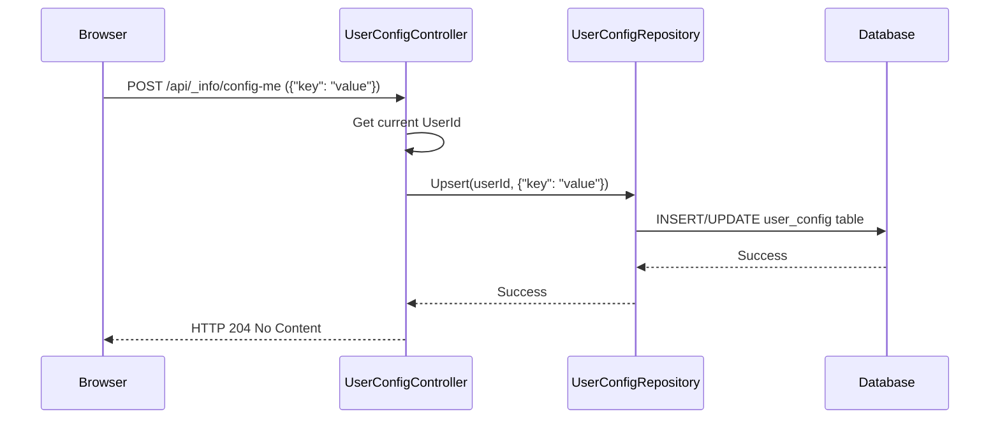

# Chapter 5: User Configuration Service

In [Chapter 4: Snippet Management](04_snippet_management_.md), we learned how the Administration gets the right text labels displayed in the user's language. But what about settings that are specific to *each individual administrator*? How does the system remember that *you* prefer a certain layout, or which sales channels *you* have marked as favorites?

## What Problem Does it Solve? Remembering Personal Preferences

Imagine you're an administrator working with several sales channels (like different online stores or marketplaces managed within one Shopware instance). You probably work with some more often than others. Wouldn't it be nice if the Administration interface could remember your "favorite" sales channels and perhaps display them more prominently for quick access?

Without a way to store settings *per user*, the interface would be the same for everyone, and you'd have to find your preferred sales channels manually every time. We need a way to store and retrieve these personal preferences.

This is where the **User Configuration Service** comes in. It acts like a personal settings profile for each admin staff member.

**Use Case:** An admin user wants to mark the "EU Store" and "US Store" sales channels as their favorites. The system should remember this choice, so the next time they log in, these channels might appear first in a list or be easily accessible.

## What is the User Configuration Service?

The User Configuration Service is a mechanism within Shopware that allows storing and retrieving settings tied to a specific administration user account. Think of it like the settings area in your web browser or your favorite app – it remembers *your* choices, not everyone else's.

Key characteristics:

*   **User-Specific:** Settings are stored individually for each user. Your favorites don't affect another admin's favorites.
*   **Key-Value Store:** It works like a simple dictionary. You define a unique "key" (like `sales-channel-favorites`) and associate a "value" with it (like a list of sales channel IDs).
*   **Persistent:** Settings are saved in the database, so they are remembered even after the user logs out and back in.
*   **Flexible:** It can store various types of information, such as lists of IDs, boolean flags (true/false), or simple text values, often stored as JSON.

This service provides the backend mechanism for features that require remembering user choices, like favorited items, UI layout preferences, or maybe dismissed notification messages.

## How It's Used: Saving and Loading Preferences

The Administration UI interacts with this service through specific API endpoints, usually handled by the `UserConfigController`.

**Scenario 1: Saving a Favorite Sales Channel**

1.  **User Action:** The user clicks a "favorite" icon next to the "US Store" sales channel.
2.  **UI Request:** The browser sends a POST request to the `/api/_info/config-me` endpoint. The request body contains the settings to be saved or updated.

    *Input (Simplified JSON Body):*
    ```json
    {
      "sales-channel-favorites": ["us-store-id", "eu-store-id"]
    }
    ```
    This tells the backend: "For the currently logged-in user, set the value for the key `sales-channel-favorites` to be this list of IDs."

3.  **Controller Action:** The `UserConfigController::updateConfigMe` method receives this request. It identifies the current user, finds their existing configuration for this key (if any), and updates or creates the entry in the database with the new value.

    ```php
    // Simplified UserConfigController.php

    // ... constructor injects userConfigRepository ...

    #[Route(path: '/api/_info/config-me', methods: ['POST'])]
    public function updateConfigMe(Context $context, Request $request): Response
    {
        // Get the key-value pairs from the request body
        $postUpdateConfigs = $request->request->all();

        if (empty($postUpdateConfigs)) {
            return new JsonResponse(null, Response::HTTP_NO_CONTENT); // Nothing to save
        }

        // Use a helper method to save/update the data in the database
        $this->massUpsert($context, $postUpdateConfigs);

        // Send back a "No Content" response, indicating success
        return new JsonResponse(null, Response::HTTP_NO_CONTENT);
    }

    // Simplified helper to save/update
    private function massUpsert(Context $context, array $postUpdateConfigs): void
    {
        $userId = $this->getUserId($context); // Get current user's ID
        // ... logic to check existing config and prepare data ...
        // Uses the userConfigRepository to save the data to the 'user_config' table
        // For each key-value pair:
        //   - If key exists for user -> UPDATE value
        //   - If key doesn't exist -> INSERT new row (user_id, key, value)
        // ... (Implementation uses MultiInsertQueryQueue for efficiency) ...
    }
    ```
    *   **Explanation:** The controller receives the JSON data. The `massUpsert` method (meaning "update if exists, insert if not") handles the database interaction, ensuring the user's `sales-channel-favorites` key is correctly saved with the provided list of IDs. It relies on the standard `EntityRepository` for the `user_config` entity (more on this below).

4.  **Output:** The server sends back an HTTP 204 "No Content" response. This signals to the browser that the update was successful, but there's no specific data to return in the response body. The user's preference is now saved in the database.

**Scenario 2: Loading Favorite Sales Channels**

1.  **User Action:** The user logs in or navigates to a page that displays favorite sales channels.
2.  **UI Request:** The browser sends a GET request to `/api/_info/config-me`. It might include specific keys it's interested in via query parameters.

    *Input (URL):* `/api/_info/config-me?keys[]=sales-channel-favorites`
    This asks the backend: "For the currently logged-in user, please give me the value associated with the key `sales-channel-favorites`."

3.  **Controller Action:** The `UserConfigController::getConfigMe` method handles this. It identifies the current user and uses the `userConfigRepository` to fetch the requested configuration keys from the database.

    ```php
    // Simplified UserConfigController.php

    // ... constructor injects userConfigRepository ...

    #[Route(path: '/api/_info/config-me', methods: ['GET'])]
    public function getConfigMe(Context $context, Request $request): Response
    {
        // Get the list of keys requested (e.g., ['sales-channel-favorites'])
        $keys = $request->query->all('keys');

        // Use a helper to fetch the config for the current user and specified keys
        $userConfigs = $this->getOwnUserConfig($context, $keys);

        // Format the data for the JSON response
        $data = [];
        foreach ($userConfigs as $userConfig) {
            $data[$userConfig->getKey()] = $userConfig->getValue();
        }

        return new JsonResponse(['data' => $data]);
    }

    // Simplified helper to read config
    private function getOwnUserConfig(Context $context, array $keys): UserConfigCollection
    {
        $userId = $this->getUserId($context); // Get current user's ID

        // Prepare criteria to find config for this user and specific keys
        $criteria = new Criteria();
        $criteria->addFilter(new EqualsFilter('userId', $userId));
        if (!empty($keys)) {
            $criteria->addFilter(new EqualsAnyFilter('key', $keys));
        }

        // Use the repository to search the 'user_config' table
        // Returns a collection of UserConfig entities
        return $this->userConfigRepository->search($criteria, $context)->getEntities();
    }
    ```
    *   **Explanation:** The `getConfigMe` method uses the `getOwnUserConfig` helper. This helper builds a `Criteria` object specifying the user ID and the requested keys, then uses the `userConfigRepository->search()` method to retrieve the matching records from the database.

4.  **Output:** The server sends back a JSON response containing the requested configuration data.

    *Output (JSON Body):*
    ```json
    {
      "data": {
        "sales-channel-favorites": ["us-store-id", "eu-store-id"]
      }
    }
    ```
    The UI receives this and can now display the user's favorite sales channels correctly.

## How it Works Internally: Storing the Data

Under the hood, the User Configuration Service relies on a dedicated database table and Shopware's standard data handling mechanisms.

1.  **Database Table:** There's a table, typically named `user_config`, designed to store these settings. It usually has columns like:
    *   `id` (Primary Key)
    *   `user_id` (Foreign Key linking to the `user` table)
    *   `key` (The name of the setting, e.g., `sales-channel-favorites`)
    *   `value` (The actual setting data, often stored as JSON text)
    *   `created_at`, `updated_at` (Timestamps)
2.  **Entity & Repository:** Shopware defines a `UserConfig` entity representing a row in this table and provides a standard `EntityRepository` for interacting with it. The `UserConfigController` uses this repository to perform Create, Read, Update, and Delete (CRUD) operations on the user configuration data.
3.  **Request Flow (Saving):**
    *   Browser sends POST request to `/api/_info/config-me` with JSON data.
    *   Routing directs the request to `UserConfigController::updateConfigMe`.
    *   Controller gets the current user's ID from the security context.
    *   Controller uses `userConfigRepository`'s mechanisms (often involving `upsert` or combining `search` and `update`/`create`) to save the key-value pairs to the `user_config` table for that user ID.
    *   Database performs the INSERT or UPDATE operation.
    *   Controller returns HTTP 204.
4.  **Request Flow (Loading):**
    *   Browser sends GET request to `/api/_info/config-me?keys[]=...`.
    *   Routing directs the request to `UserConfigController::getConfigMe`.
    *   Controller gets the current user's ID.
    *   Controller builds `Criteria` specifying the user ID and requested keys.
    *   Controller calls `userConfigRepository->search(criteria, context)`.
    *   Repository translates criteria into a SQL query (`SELECT * FROM user_config WHERE user_id = ? AND key IN (...)`).
    *   Database executes the query and returns matching rows.
    *   Repository maps the rows back to `UserConfig` entity objects.
    *   Controller formats the entities into the JSON response.
    *   Controller returns HTTP 200 with JSON data.

Here's a simplified sequence diagram for saving a setting:



## Diving Deeper into the Code

Let's look at related code pieces:

**1. Controller (`UserConfigController.php`)**

We've seen simplified versions above. The key is its reliance on the `userConfigRepository` injected via the constructor:

```php
// File: Controller/UserConfigController.php
// ... imports ...

class UserConfigController extends AbstractController
{
    /**
     * @param EntityRepository<UserConfigCollection> $userConfigRepository
     */
    public function __construct(
        // Shopware automatically provides the correct repository for user_config
        private readonly EntityRepository $userConfigRepository,
        // Connection might be used for optimizations like massUpsert
        private readonly Connection $connection
    ) {
    }

    // ... getConfigMe and updateConfigMe methods ...
}
```

*   **Explanation:** The controller declares its need for the `EntityRepository` configured for `UserConfigCollection`. Shopware's service container automatically provides the correct instance, ready to interact with the `user_config` table.

**2. Migration Example (`Migration1636121186CopySalesChannelIdsIntoUserConfig.php`)**

Sometimes, initial user configurations need to be set up, perhaps when a feature is first introduced. Migrations can be used for this. This migration (simplified) aims to pre-populate the `sales-channel-favorites` for existing users based on *all* sales channels they could see at the time.

```php
// File: Migration/V6_4/Migration1636121186CopySalesChannelIdsIntoUserConfig.php
// ... imports ...

class Migration1636121186CopySalesChannelIdsIntoUserConfig extends MigrationStep
{
    private const CONFIG_KEY = 'sales-channel-favorites';

    public function update(Connection $connection): void
    {
        // 1. Fetch all users and the sales channels they might see (simplified concept)
        $userData = $this->fetchPotentialFavorites($connection); // Hypothetical fetch

        // 2. Insert initial favorites into user_config for each user
        foreach ($userData as $userId => $potentialFavoriteIds) {
            // Limit to a certain number, e.g., 7
            $favoritesToSave = array_slice($potentialFavoriteIds, 0, 7);

            $connection->insert('user_config', [
                'id' => Uuid::randomBytes(), // Generate a new ID
                'user_id' => Uuid::fromHexToBytes($userId), // User's ID
                '`key`' => self::CONFIG_KEY, // The setting key
                '`value`' => json_encode($favoritesToSave), // Store list as JSON
                'created_at' => (new \DateTime())->format(Defaults::STORAGE_DATE_TIME_FORMAT),
            ]);
        }
    }
    // ... helper methods like fetchPotentialFavorites ...
}
```

*   **Explanation:** This migration runs once during an update. It gets user and sales channel data and then directly inserts rows into the `user_config` table using the database `Connection`, setting an initial value for the `sales-channel-favorites` key for each user. This demonstrates how the `user_config` table can be populated programmatically.

**3. Subscriber Example (`SalesChannelUserConfigSubscriber.php`)**

What happens if a sales channel that a user marked as a favorite gets deleted? The stored favorite ID becomes invalid. A Subscriber can listen for such events and clean up the user configuration.

```php
// File: System/SalesChannel/Subscriber/SalesChannelUserConfigSubscriber.php
// ... imports ...

class SalesChannelUserConfigSubscriber implements EventSubscriberInterface
{
    final public const CONFIG_KEY = 'sales-channel-favorites';

    /** @param EntityRepository<UserConfigCollection> $userConfigRepository */
    public function __construct(private readonly EntityRepository $userConfigRepository) {}

    public static function getSubscribedEvents(): array
    {
        // Listen for when sales channels are deleted
        return ['sales_channel.deleted' => 'onSalesChannelDeleted'];
    }

    // Method called when the 'sales_channel.deleted' event occurs
    public function onSalesChannelDeleted(EntityDeletedEvent $deletedEvent): void
    {
        $context = $deletedEvent->getContext();
        $deletedSalesChannelIds = $deletedEvent->getIds(); // Get IDs of deleted channels

        // Find all user configs that store favorite sales channels
        $criteria = new Criteria();
        $criteria->addFilter(new EqualsFilter('key', self::CONFIG_KEY));
        $favoriteConfigs = $this->userConfigRepository->search($criteria, $context)->getEntities();

        $updates = [];
        foreach ($favoriteConfigs as $config) {
            $currentFavorites = $config->getValue() ?? []; // Get list of favorite IDs
            // Check if any of the deleted IDs are in the user's favorites
            $matching = array_intersect($deletedSalesChannelIds, $currentFavorites);

            if ($matching) { // If there's an intersection
                // Remove the deleted IDs from the user's list
                $newFavorites = array_values(array_diff($currentFavorites, $matching));
                // Prepare an update operation
                $updates[] = ['id' => $config->getId(), 'value' => $newFavorites];
            }
        }

        // If any updates are needed, save them back to the database
        if (!empty($updates)) {
            $this->userConfigRepository->upsert($updates, $context);
        }
    }
}
```

*   **Explanation:** This subscriber listens for the `sales_channel.deleted` event. When triggered, it fetches all user configurations for the `sales-channel-favorites` key. For each user's list of favorites, it checks if any of the deleted sales channel IDs are present. If so, it removes them and updates the user's configuration entry via the `userConfigRepository`. This keeps the stored preferences consistent.

## Conclusion

You've now learned about the **User Configuration Service**, the mechanism for storing personal settings for administration users.

*   It solves the problem of remembering **user-specific preferences** like favorites or UI choices.
*   It acts as a **key-value store** tied to each user account.
*   Settings are managed via the `UserConfigController` and stored in the `user_config` database table, using the standard `EntityRepository`.
*   Other parts of the system, like **Migrations** or **Subscribers**, can interact with this data to initialize or maintain it.

This service is essential for creating a personalized and user-friendly experience within the Shopware Administration.

So far, we've looked at core components like controllers, search, snippets, and user settings. But Shopware is highly extensible. How do third-party Apps and custom plugins interact with and extend the Administration UI and its backend services?

Let's explore how the Administration allows for extensions: [Chapter 6: Admin Extension API & App Interaction](06_admin_extension_api___app_interaction_.md).

---

Generated by [AI Codebase Knowledge Builder](https://github.com/The-Pocket/Tutorial-Codebase-Knowledge)