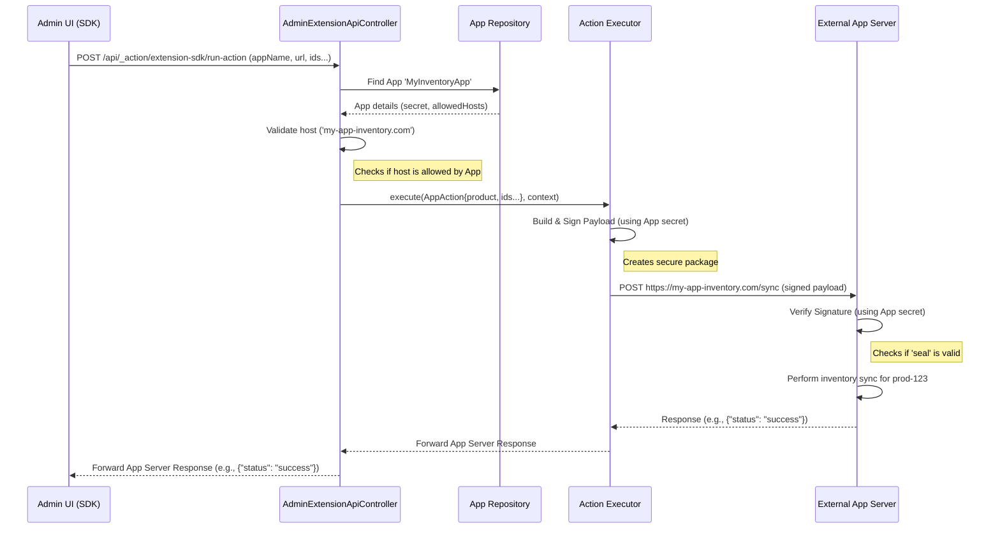

# Chapter 6: Admin Extension API & App Interaction

In [Chapter 5: User Configuration Service](05_user_configuration_service_.md), we explored how Shopware remembers settings specific to individual admin users. That's great for core features, but what happens when third-party developers want to extend the Administration? How can their Apps securely talk back to the Shopware backend or run their own logic when a user interacts with their extension in the Admin area?

## What Problem Does it Solve? Secure Communication for Partners

Imagine the Shopware Administration as a secure main office building. We've learned about internal departments like [Controllers](02_administration_controllers_.md) and [Snippet Management](04_snippet_management_.md). Now, trusted external partners (Apps) want to set up a small desk or add a button inside this office.

When someone uses the App's button (e.g., "Send product to MyExternalService"), the App needs a way to:

1.  Know that the button was *actually* clicked within *this specific* Shopware store's admin area.
2.  Get the necessary information (like the product ID).
3.  Securely trigger its own backend logic (running on the App developer's server) without exposing sensitive shop credentials.

Simply letting Apps make random calls isn't secure. We need a dedicated, secure communication channel. This is what the **Admin Extension API** provides – think of it as a special, guarded communication booth or API gateway just for registered Apps interacting with the Admin.

**Use Case:** An installed App adds a button labelled "Sync with External Inventory" to the product detail page in the Administration. When an admin user clicks this button for a specific product, the App's external service needs to be notified securely, receiving the product ID and shop information, so it can update its own inventory records.

## What is the Admin Extension API?

The Admin Extension API isn't a public API for anyone to call. Instead, it's a set of *internal* Shopware API endpoints specifically designed to facilitate secure communication *between* the Shopware Administration frontend (running in the user's browser) and the backend systems of installed Apps.

It primarily offers two key capabilities:

1.  **Running Actions:** Allows the Admin UI to trigger a backend process defined by an App. When the user clicks an App's button in the Admin, the UI calls a specific Shopware endpoint (`/api/_action/extension-sdk/run-action`). Shopware then securely packages the request details (like which product was selected), signs it using the App's secret key (proving it's legitimate), and forwards it to the URL specified by the App developer. The App's server receives this signed request, verifies it, and runs its custom logic.
2.  **Signing URIs:** Allows the Admin UI to request a special, cryptographically signed URL that points to an App's backend service. When the UI needs to embed an App's page (like a dashboard) in an iframe or open a secure link, it asks Shopware via another endpoint (`/api/_action/extension-sdk/sign-uri`) to sign the target URL. Shopware adds parameters (like shop ID, user language) and a secure signature. The App's server can then verify this signature to ensure the request genuinely came from the specific Shopware instance.

Essentially, Shopware acts as a trusted intermediary, verifying requests and adding security signatures, so Apps and the Admin can interact without compromising sensitive information.

## How It's Used: Triggering the App's Inventory Sync

Let's solve our use case: the "Sync with External Inventory" button.

1.  **App Setup (Simplified):** The App developer, during installation, registers their button and tells Shopware the URL of their service that should handle the sync action (e.g., `https://my-app-inventory.com/sync`). This is usually done in the App's `manifest.xml` file.
2.  **User Action:** The admin user is viewing "Product Awesome" (ID: `prod-123`) and clicks the "Sync with External Inventory" button provided by the App.
3.  **Admin UI Request (JavaScript):** The JavaScript code running in the Admin UI (often using Shopware's "Admin Extension SDK" library) detects the click and makes a POST request to Shopware's internal API.

    *   **Target:** `POST /api/_action/extension-sdk/run-action`
    *   **Input (Request Body - Simplified):**
        ```json
        {
          "appName": "MyInventoryApp",
          "url": "https://my-app-inventory.com/sync",
          "entity": "product",
          "action": "syncInventory",
          "ids": ["prod-123"]
        }
        ```
        This tells Shopware: "For 'MyInventoryApp', trigger the action 'syncInventory' located at the given URL, for the 'product' entity with ID 'prod-123'."

4.  **Shopware Controller Action:** The `AdminExtensionApiController::runAction` method receives this request.
5.  **Backend Processing:**
    *   The controller finds the registered App named "MyInventoryApp".
    *   It checks if the App exists, is active, and has a secret key defined.
    *   It verifies that the target `url` (`https://my-app-inventory.com`) is listed in the App's allowed hosts (a security measure).
    *   It prepares a secure payload containing shop information, context details, and the provided `entity` and `ids`.
    *   It uses the App's secret key to generate a cryptographic signature (an HMAC hash) for this payload.
    *   It sends a POST request to the App's `url` (`https://my-app-inventory.com/sync`) with the signed payload in the request body and headers.
6.  **App Server:** The App's server at `https://my-app-inventory.com/sync` receives the POST request.
    *   It extracts the signature from the request headers.
    *   It uses the *same* secret key (which the App developer knows) to recalculate the signature based on the received payload.
    *   **Verification:** It compares its calculated signature with the one received from Shopware. If they match, the request is authentic!
    *   It performs the inventory sync logic for product `prod-123`.
    *   It sends a response back to Shopware (e.g., `{"status": "success", "message": "Inventory synced!"}`).
7.  **Response to Admin UI:** Shopware's `AdminExtensionApiController` forwards the response received from the App's server back to the Admin UI in the browser. The UI can then show a notification like "Inventory synced!".

This process ensures that the App's server only acts on requests genuinely originating from the Shopware Admin via the secure Extension API channel.

## How it Works Internally: The Secure Handshake

Let's visualize the `run-action` flow:

1.  The Admin UI, instructed by the App's code, sends a request to Shopware's internal `run-action` endpoint.
2.  Shopware's `AdminExtensionApiController` validates the request (finds the App, checks the host).
3.  It uses the `Executor` service, which packages the relevant data (shop ID, product ID, etc.) into a standardized payload.
4.  The `Executor` signs this payload using the specific App's secret key (like sealing a letter with a unique wax seal).
5.  The `Executor` sends this signed payload as a POST request to the URL provided by the App developer.
6.  The App's external server receives the request. It uses its copy of the secret key to verify the "seal" (signature).
7.  If verified, the App processes the request and sends a response back to the `Executor`.
8.  The `Executor` forwards this response to the `AdminExtensionApiController`.
9.  The controller sends the response back to the Admin UI.



## Diving Deeper into the Code

Let's look at the controller responsible for handling these requests.

**`AdminExtensionApiController.php`**

This controller has methods mapped to the internal API routes used by the Admin Extension SDK.

```php
<?php declare(strict_types=1);
namespace Shopware\Administration\Controller;

// Necessary imports for App handling, signing, etc.
use Shopware\Core\Framework\App\ActionButton\Executor;
use Shopware\Core\Framework\App\Hmac\QuerySigner;
use Shopware\Core\Framework\App\AppCollection;
use Shopware\Core\Framework\DataAbstractionLayer\EntityRepository;
// ... other imports ...

class AdminExtensionApiController extends AbstractController
{
    // Inject necessary services: Executor for running actions,
    // App Repository to find Apps, QuerySigner for signing URIs.
    /** @param EntityRepository<AppCollection> $appRepository */
    public function __construct(
        private readonly Executor $executor,
        private readonly EntityRepository $appRepository,
        private readonly QuerySigner $querySigner
        // ... other helpers might be injected ...
    ) {}

    // Handles requests to run App actions
    #[Route(path: '/api/_action/extension-sdk/run-action', methods: ['POST'])]
    public function runAction(RequestDataBag $requestDataBag, Context $context): Response
    {
        // 1. Get details from the request (appName, url, entity, ids)
        $appName = $requestDataBag->get('appName');
        $targetUrl = $requestDataBag->getString('url');
        $ids = $requestDataBag->get('ids', [])->all();
        // ... get entity, action name ...

        // 2. Find the App in the database
        // (Simplified: Search app repository for appName)
        $app = $this->findAppByName($appName, $context);
        // (Error handling if app not found or no secret)

        // 3. Validate the target host against App's allowed hosts
        $this->validateHost($targetUrl, $app);
        // (Error handling if host not allowed)

        // 4. Create an AppAction object containing all necessary info
        $action = new AppAction(
            $app, /* ... source info ... */ $targetUrl, /* ... entity, action, ids ... */
        );

        // 5. Use the Executor service to sign and send the request to the App
        return $this->executor->execute($action, $context); // Returns App's response
    }

    // Handles requests to get a signed URI for an App
    #[Route(path: '/api/_action/extension-sdk/sign-uri', methods: ['POST'])]
    public function signUri(RequestDataBag $requestDataBag, Context $context): Response
    {
        // 1. Get appName and the URI to be signed from the request
        $appName = $requestDataBag->get('appName');
        $uriToSign = $requestDataBag->get('uri');

        // 2. Find the App in the database
        $app = $this->findAppByName($appName, $context);
        // (Error handling...)

        // 3. Use the QuerySigner service to add security parameters and signature
        $signedUri = $this->querySigner->signUri($uriToSign, $app, $context);

        // 4. Return the signed URI as JSON
        return new JsonResponse(['uri' => $signedUri->__toString()]);
    }

    // --- Helper methods (simplified) ---
    private function findAppByName(string $appName, Context $context): AppEntity { /* ... */ }
    private function validateHost(string $targetUrl, AppEntity $app): void { /* ... */ }
}
```

**Explanation:**

*   **Dependencies:** The controller relies on injected services like `Executor` (to handle sending the action request) and `QuerySigner` (to handle signing URIs). It also needs the `EntityRepository` for Apps to fetch App details like the secret key and allowed hosts.
*   **`runAction`:** This method takes the details provided by the Admin UI (app name, target URL, entity, IDs), finds the corresponding App, validates the request, constructs an `AppAction` object, and then delegates the actual sending and signing to the `Executor` service. The response from the App's server is returned directly.
*   **`signUri`:** This method takes the App name and the URI that needs signing. It finds the App and uses the `QuerySigner` service to add the necessary security parameters and the HMAC signature, returning the fully signed URI.

**A Note on App Snippets:**

As mentioned in [Chapter 4: Snippet Management](04_snippet_management_.md), Apps can also provide their own text snippets for the Administration UI. These are *not* typically handled via the Extension API but are stored in the Shopware database when the App is installed or updated.

*   **`AppAdministrationSnippetDefinition.php`:** Defines the structure for storing App snippets in the database table `app_administration_snippet`. Each entry links an App, a locale (language), and the snippet value (usually a JSON string of key-value pairs).
*   **`AppAdministrationSnippetPersister.php`:** A service used internally during App installation/update to read snippet files from the App's package and save them into the database table defined by `AppAdministrationSnippetDefinition`.

The `SnippetFinder` service (discussed in Chapter 4) automatically includes these database snippets when collecting translations for the Admin UI.

## Conclusion

You've now learned about the **Admin Extension API**, the secure gateway enabling communication between the Shopware Administration UI and external App backends.

*   It solves the problem of allowing third-party Apps to **securely trigger actions** or receive **authenticated requests** originating from the Admin interface.
*   Key components include internal API endpoints like `/api/_action/extension-sdk/run-action` and `/api/_action/extension-sdk/sign-uri`, handled by the `AdminExtensionApiController`.
*   Services like `Executor` and `QuerySigner` use the App's unique **secret key** to create **cryptographic signatures**, ensuring the authenticity and integrity of communication.
*   This allows Apps to extend the Administration UI with interactive elements (like buttons) that securely communicate with their own external services.

We've seen how the backend handles core logic, user preferences, and secure App interactions. But how is the Administration's frontend itself – all the JavaScript and CSS that makes up the user interface – built, managed, and delivered to your browser?

Let's explore the final piece of the puzzle: [Chapter 7: Admin Asset Management & Build Process](07_admin_asset_management___build_process_.md).

---

Generated by [AI Codebase Knowledge Builder](https://github.com/The-Pocket/Tutorial-Codebase-Knowledge)