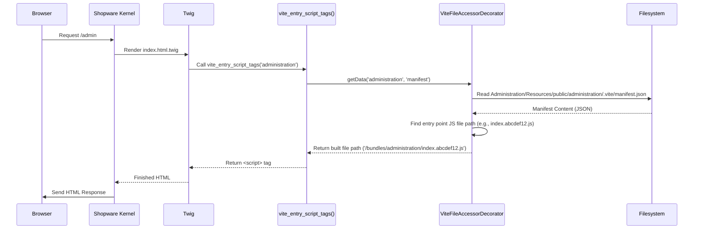

# Chapter 7: Admin Asset Management & Build Process

Welcome to the final chapter! In [Chapter 6: Admin Extension API & App Interaction](06_admin_extension_api___app_interaction_.md), we saw how external Apps can securely communicate with the Shopware Administration. Now, let's zoom out and look at how the Administration's *own* user interface – all the buttons, forms, lists, and styles you see – is actually built and delivered to your browser.

## What Problem Does it Solve? Building and Delivering the User Interface

Imagine the Administration UI is like the interior design and furnishings of our office building. We have the raw materials: JavaScript code for interactivity, CSS/SCSS code for styling, and Vue.js components for building the interface elements. Browsers, however, don't always understand these raw materials directly (especially modern JavaScript or SCSS). They need them processed, optimized, and packaged into formats they can readily use (like standard JavaScript and CSS files).

Furthermore, loading dozens or hundreds of small individual files is slow. We need a process to:

1.  **Build:** Convert modern JavaScript, SCSS, and Vue components into browser-compatible JavaScript and CSS.
2.  **Optimize:** Combine files, shrink their size (minify), and make them load efficiently.
3.  **Manage:** Keep track of which built file corresponds to which original source file.
4.  **Deliver:** Tell the browser exactly which final, optimized files to load for the Administration interface.
5.  **Clean Up:** Optionally remove the raw source files after building, as they aren't needed to *run* the Administration, only to build it.

This entire process is **Admin Asset Management & Build Process**. Think of it as the construction crew (Vite builder), cleanup crew (delete command), and delivery service (asset serving) for the Admin building's interior.

**Use Case:** A developer modifies the visual style of a button in an SCSS file within the Administration's source code. How does this change get compiled into an optimized CSS file that the browser loads when an admin user visits the relevant page?

## What is Asset Management & Build?

This encompasses the tools and steps used to handle the frontend assets (JavaScript, CSS, images, fonts) specifically for the Shopware Administration interface. The key player here is a modern build tool called **Vite**.

Here's a breakdown:

1.  **Vite Build Process:** Uses Vite to compile, bundle, and optimize the source JavaScript (`.js`, `.vue`) and stylesheet (`.scss`) files located in `platform/src/Administration/Resources/app/administration/src`.
2.  **Cleanup Command:** An optional command (`administration:delete-files-after-build`) removes the original source files *after* the build is complete. This is useful for production environments to reduce deployment size, as only the built files are needed to run the Admin UI.
3.  **Asset Serving:** Relies on the `PentatrionViteBundle` (introduced in [Chapter 1: Administration Bundle](01_administration_bundle_.md)) and helper services (`ViteFileAccessorDecorator`) to correctly locate and link the final, built JavaScript and CSS files in the HTML delivered to the browser.

## How It's Used: From Source Code to Browser

Let's follow our use case – changing a button's style.

1.  **Developer Action:** A developer edits an SCSS file, for example, `.../administration/src/app/assets/scss/components/_button.scss`.
2.  **Build Command:** The developer (or a deployment script) runs the build command within the Administration's frontend directory (`platform/src/Administration/Resources/app/administration`). This is typically done using npm (Node Package Manager):
    ```bash
    # Navigate to the correct directory
    cd platform/src/Administration/Resources/app/administration

    # Install dependencies (if not already done)
    npm install

    # Run the build process
    npm run build
    ```
3.  **Vite Magic:** `npm run build` triggers Vite. Vite reads its configuration (`vite.config.js`), finds all the entry points (main JS/SCSS files), processes all imported files (like our changed `_button.scss`), compiles SCSS to CSS, transpiles modern JS, bundles everything, minifies it, and generates optimized output files.
4.  **Output:** The optimized files are placed in a specific output directory, typically `platform/src/Administration/Resources/public/administration/`. This directory will contain:
    *   Bundled JavaScript files (often with hashed names like `index.abcdef12.js`).
    *   Bundled CSS files (e.g., `index.fedcba98.css`).
    *   A `manifest.json` file: This crucial file acts like a map, listing the original entry point files and the actual, final filenames of the built assets they correspond to.
    *   Other assets like fonts or images if needed.
5.  **Optional Cleanup:** If desired for a production build, the cleanup command can be run:
    ```bash
    # Navigate back to the main project root
    cd ../../../../..

    # Run the cleanup command
    bin/console administration:delete-files-after-build
    ```
    This removes the source directories (`src`, `test`, etc.) from within `platform/src/Administration/Resources/app/administration`.
6.  **Serving to Browser:** When an admin user requests the Administration interface:
    *   Shopware renders the main HTML template (`index.html.twig`).
    *   This template uses special Twig functions provided by the Vite bundle (like `vite_entry_script_tags('administration')` and `vite_entry_link_tags('administration')`).
    *   These functions consult the `manifest.json` file (via the `ViteFileAccessorDecorator` service) to find the *exact* names of the built JS and CSS files needed.
    *   The Twig functions output the correct `<script>` and `<link rel="stylesheet">` tags in the HTML, pointing to the optimized files (e.g., `<script src="/administration/index.abcdef12.js">`).
    *   The browser receives the HTML and loads the specified optimized assets. The user sees the Administration interface with the updated button style.

## How it Works Internally: The Build and Serve Pipeline

Let's break down the key stages:

**1. Build Time (Vite)**

*   When `npm run build` is executed, Node.js runs the Vite build process defined in `vite.config.js`.
*   Vite analyzes the source code starting from entry points (like `main.js`).
*   It uses plugins to handle different file types (Vue components, SCSS, TypeScript).
*   It performs transformations: SCSS -> CSS, modern JS -> browser-compatible JS.
*   It optimizes: Bundles code into fewer files, minifies (removes whitespace/comments), generates source maps (for debugging), and adds content hashes to filenames for cache busting.
*   It outputs the final assets and the `manifest.json` to the designated public directory.

**2. Cleanup Time (Command)**

*   The `DeleteAdminFilesAfterBuildCommand` is a Symfony console command.
*   When executed (`bin/console administration:delete-files-after-build`), it uses the `Finder` component to locate specific directories and files within `Administration/Resources/app/administration/` that contain source code (like `src`, `test`, `node_modules`, build scripts).
*   It explicitly avoids deleting essential files like the core snippet files (`de-DE.json`, `en-GB.json`) required at runtime.
*   It uses filesystem functions (`unlink`, `rmdir`) to delete the identified source files and directories.

```php
<?php // Simplified: Command\DeleteAdminFilesAfterBuildCommand.php

// ... imports: Command, Input, Output, Finder, Filesystem ...

class DeleteAdminFilesAfterBuildCommand extends Command
{
    // ... configuration ...

    protected function execute(InputInterface $input, OutputInterface $output): int
    {
        // Get the path to the Administration bundle
        $adminDir = \dirname((string) (new \ReflectionClass(Administration::class))->getFileName());
        $adminAppDir = $adminDir . '/Resources/app/administration';

        // Define directories and files to remove (source code, tests, etc.)
        $pathsToRemove = [
            $adminAppDir . '/src/app',
            $adminAppDir . '/src/core',
            $adminAppDir . '/src/module', // Except snippet files!
            $adminAppDir . '/src/meta',
            $adminAppDir . '/test',
            $adminAppDir . '/scripts',
            $adminAppDir . '/eslint-rules',
            $adminAppDir . '/package-lock.json',
            // ... other source/build related paths ...
        ];

        // Use Finder/Filesystem to remove these paths
        // (Simplified - actual command has more nuanced logic)
        foreach ($pathsToRemove as $path) {
            if (is_dir($path)) {
                $this->removeDirectory($path); // Custom recursive remove
            } elseif (file_exists($path)) {
                unlink($path);
            }
        }

        $output->writeln('Unnecessary source files removed.');
        return Command::SUCCESS;
    }

    // Helper function to remove directories recursively
    private function removeDirectory(string $dir): void { /* ... */ }
}
```

*   **Explanation:** The command identifies the `Administration/Resources/app/administration` directory and defines a list of subdirectories and files containing source code or build-time tools. It then iterates through this list and removes them from the filesystem, leaving only the essential runtime files (like snippets) and the built assets (in `Resources/public/administration`).

**3. Serve Time (ViteBundle & Twig)**

*   When a request for the Administration comes in, Shopware determines the main Twig template to render (`@Administration/administration/index.html.twig`).
*   Inside this template, tags like `{{ vite_entry_script_tags('administration') }}` are encountered.
*   Twig calls the underlying function provided by the `PentatrionViteBundle`.
*   This function uses the `ViteFileAccessorDecorator` service.
*   The `ViteFileAccessorDecorator` knows where to find the `manifest.json` file for the 'administration' build configuration (within `Administration/Resources/public/administration/.vite/manifest.json`).
*   It reads the manifest to find the actual hashed filename for the main JavaScript entry point (e.g., `index.abcdef12.js`).
*   It prepends the correct public asset path (e.g., `/bundles/administration/`).
*   It returns the full path (e.g., `/bundles/administration/index.abcdef12.js`) to the Twig function.
*   The Twig function generates the final HTML `<script src="/bundles/administration/index.abcdef12.js" type="module"></script>`.
*   The same process happens for CSS files using `vite_entry_link_tags`.

Here's a simplified sequence diagram for serving assets:



Let's peek at the decorator:

```php
<?php // Simplified: Framework\Twig\ViteFileAccessorDecorator.php

// ... imports: FileAccessor, Kernel, Filesystem, AssetPackage ...

class ViteFileAccessorDecorator extends FileAccessor
{
    private string $assetPath; // Base public path (e.g., /)

    public function __construct(
        array $configs,
        private readonly AssetPackage $package, // Symfony Asset service
        private readonly KernelInterface $kernel, // To find bundles
        private readonly Filesystem $filesystem // To read files
    ) {
        $this->assetPath = $this->package->getUrl(''); // Get base asset URL
        parent::__construct($this->assetPath, $configs, null);
    }

    /** @return array<string, mixed> */
    public function getData(string $configName, string $fileType): array
    {
        // Default config is 'Administration'
        $bundleName = ($configName === '_default' ? 'Administration' : $configName);
        $bundle = $this->kernel->getBundle($bundleName);

        // Construct path to the manifest/entrypoints file
        $viteFilePath = $bundle->getPath()
                        . '/Resources/public/administration/.vite/'
                        . self::FILES[$fileType]; // e.g., 'manifest.json'

        if (!$this->filesystem->exists($viteFilePath)) {
            return []; // File not found
        }

        // Read and decode the JSON file
        $content = json_decode(
            $this->filesystem->readFile($viteFilePath), true
        );

        // Adjust paths within the manifest to include the base asset path
        // (Simplified - actual code modifies entry points more specifically)
        foreach ($content['entryPoints'] ?? [] as &$entryData) {
            // ... logic to prepend $this->assetPath to file URLs ...
        }

        return $content;
    }
    // ... other methods like hasFile, getBundleData ...
}
```

*   **Explanation:** This service decorates (extends) the base `FileAccessor` from the Vite bundle. Its primary job in the `getData` method is to locate the correct `manifest.json` (or `entrypoints.json`) file within the specified bundle's public resources. It reads the file, decodes the JSON, and crucially modifies the file paths listed inside to ensure they correctly point to the public URLs where the assets are served from, using the Symfony Asset package (`$this->assetPath`). The Twig functions then use this processed data to generate the final HTML tags.

## Conclusion

You've reached the end of the tutorial! In this final chapter, we demystified the **Admin Asset Management & Build Process**.

*   We learned that the Administration UI's source code (JS, SCSS, Vue) needs to be **built and optimized** for browsers.
*   **Vite** is the primary tool used for this build process, triggered by commands like `npm run build`.
*   The build produces optimized JS and CSS files and a `manifest.json` map in a public directory.
*   An optional **cleanup command** (`administration:delete-files-after-build`) can remove the source files after building, saving space in production deployments.
*   At runtime, the `PentatrionViteBundle`, helper services like `ViteFileAccessorDecorator`, and Twig functions (`vite_entry_script_tags`, `vite_entry_link_tags`) work together to read the `manifest.json` and **serve the correct, optimized assets** to the user's browser.

Understanding this process helps you see how changes in the Administration's frontend code make their way into the final user interface and how Shopware manages these assets efficiently.

We hope this journey through the core concepts of the Shopware Administration has been insightful. You now have a foundational understanding of how Bundles provide structure, Controllers handle requests, Services perform specific tasks (like Search, Snippets, User Config), Apps interact securely, and how the frontend itself is built and delivered. Happy developing!

---

Generated by [AI Codebase Knowledge Builder](https://github.com/The-Pocket/Tutorial-Codebase-Knowledge)