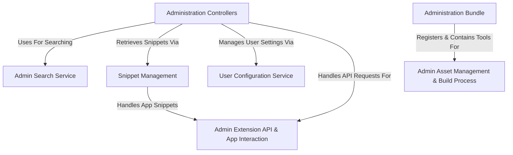

# Tutorial: Administration

The **Administration** project provides the *backend user interface* for Shopware.
It allows shop administrators to manage various aspects like products, orders, customers, and system settings.
It includes services for **searching** data, managing **text translations** (*snippets*), handling user-specific **configurations**, and interacting with third-party **Apps** through a dedicated API.
It also manages the frontend **assets** (like JavaScript and CSS) needed to build and display the administration interface.

**Source Repository:** [None](None)

## Chapters

1. [Administration Bundle
](01_administration_bundle_.md)
2. [Administration Controllers
](02_administration_controllers_.md)
3. [Admin Search Service
](03_admin_search_service_.md)
4. [Snippet Management
](04_snippet_management_.md)
5. [User Configuration Service
](05_user_configuration_service_.md)
6. [Admin Extension API & App Interaction
](06_admin_extension_api___app_interaction_.md)
7. [Admin Asset Management & Build Process
](07_admin_asset_management___build_process_.md)

---

Generated by [AI Codebase Knowledge Builder](https://github.com/The-Pocket/Tutorial-Codebase-Knowledge)