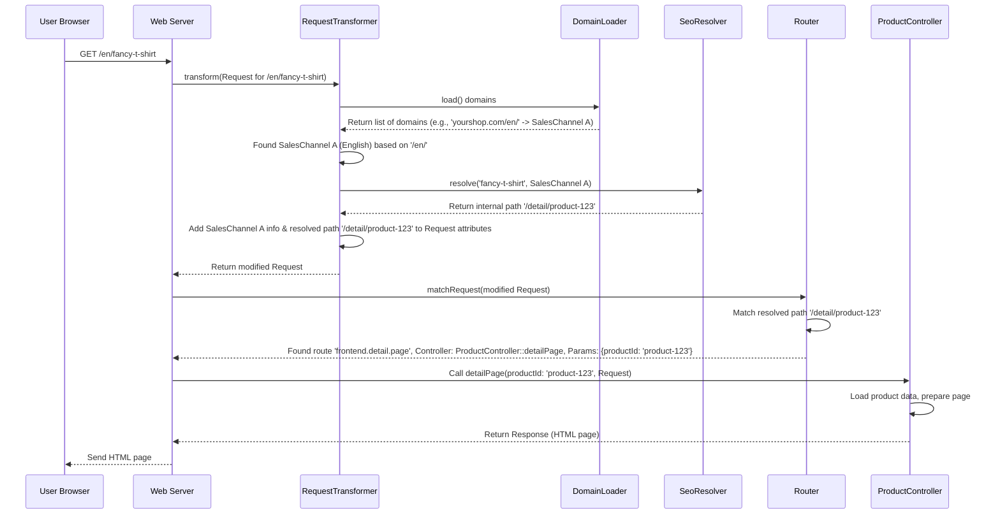

# Chapter 1: Storefront Routing (RequestTransformer, Router)

Welcome to the Shopware Storefront! This is the first chapter in our journey to understand how the Storefront works behind the scenes.

Imagine you walk into a large department store. How do you find the specific section you need, like "Men's Shoes" or "Electronics"? You might look at a directory near the entrance, or maybe the store is organized by language or currency if it's an international store. Shopware's Storefront Routing works similarly for your online shop.

**What problem does Routing solve?**

When a user types a URL like `https://yourshop.com/en/products/cool-t-shirt` into their browser or clicks a link, how does Shopware know:

1.  Which language and currency should be used (e.g., English)?
2.  Which specific page or function inside the application should handle this request (e.g., show the product page for "cool-t-shirt")?

Storefront Routing is the system that figures this out. It acts like the shop's address system and internal directory combined. The two main components responsible for this are the `RequestTransformer` and the `Router`.

Let's break them down.

## Key Concepts

### 1. The Request

Everything starts with a **Request**. When a user's browser asks for a URL from your shop, it sends an HTTP Request. This request contains the URL (`/en/products/cool-t-shirt`), information about the browser, and other details.

### 2. Sales Channel

Think of a **Sales Channel** as a specific "version" or "context" of your shop. You might have:

*   One Sales Channel for English-speaking customers using Euros (€).
*   Another for German-speaking customers using Euros (€).
*   Maybe a completely different storefront design for B2B customers.

Each Sales Channel usually has its own domain or URL prefix (like `yourshop.com/en/` or `yourshop.de/`), language, currency, theme, and other settings.

### 3. RequestTransformer: The Shop's Concierge

The `RequestTransformer` is one of the first parts of Shopware to look at an incoming request for the Storefront. Its main job is:

*   **Identify the Sales Channel:** Based on the URL requested (e.g., `yourshop.com/en/`), it figures out which Sales Channel the user is trying to access. It gets information about configured domains and their associated Sales Channels from a service called `DomainLoader`.
*   **Modify the Request:** It adds important information *directly* to the request object. This includes the ID of the identified Sales Channel, the language, the currency, the base URL for this Sales Channel (e.g., `/en/`), and more.
*   **Handle SEO URLs:** It often works with an `SeoResolver` to translate "pretty" URLs like `/cool-t-shirt` into the internal path Shopware understands, like `/detail/product-id-123`.

Think of the `RequestTransformer` as the helpful concierge at the department store entrance. You tell them you're looking for something (the URL), they check which part of the store serves your needs (the Sales Channel based on language/currency via the URL), and they give you directions (modify the request with context and the internal path).

```php
// Simplified idea of what RequestTransformer does

class RequestTransformer
{
    // ... (dependencies like DomainLoader, SeoResolver)

    public function transform(Request $request): Request
    {
        // 1. Which URL are we dealing with?
        $url = $request->getUri(); // e.g., "https://yourshop.com/en/cool-t-shirt"

        // 2. Ask DomainLoader: Which Sales Channel does this URL belong to?
        $salesChannelInfo = $this->findSalesChannel($request);
        // $salesChannelInfo might contain: { id: 'abc...', languageId: '...', currencyId: '...', url: 'https://yourshop.com/en/' }

        if ($salesChannelInfo === null) {
            // Handle error: No matching Sales Channel found!
            throw new SalesChannelMappingException($url);
        }

        // 3. Figure out the "real" internal path (handle SEO URLs)
        // Base URL part: '/en/'
        $baseUrl = /* calculate base URL from $salesChannelInfo['url'] */;
        // SEO part: 'cool-t-shirt'
        $seoPath = /* extract path after base URL */;
        // Ask SeoResolver: What does 'cool-t-shirt' mean?
        $resolved = $this->seoResolver->resolve($salesChannelInfo['languageId'], $salesChannelInfo['salesChannelId'], $seoPath);
        // $resolved might be: { pathInfo: '/detail/xyz-product-id' }

        // 4. Add information to the request attributes
        $request->attributes->set(PlatformRequest::ATTRIBUTE_SALES_CHANNEL_ID, $salesChannelInfo['salesChannelId']);
        $request->attributes->set(SalesChannelRequest::ATTRIBUTE_DOMAIN_LOCALE, $salesChannelInfo['locale']); // e.g., 'en-GB'
        $request->attributes->set(SalesChannelRequest::ATTRIBUTE_DOMAIN_CURRENCY_ID, $salesChannelInfo['currencyId']);
        $request->attributes->set(RequestTransformer::SALES_CHANNEL_BASE_URL, $baseUrl); // e.g., '/en/'
        $request->attributes->set(RequestTransformer::SALES_CHANNEL_RESOLVED_URI, $resolved['pathInfo']); // e.g., '/detail/xyz-product-id'
        // ... and other attributes

        // 5. Update the request's URI to the internal one (for the Router)
        $request->server->set('REQUEST_URI', $request->getBaseUrl() . $resolved['pathInfo']);

        return $request;
    }

    // ... helper methods like findSalesChannel
}
```

This simplified code shows the core steps: find the Sales Channel, resolve the SEO URL to an internal path, and add all this context to the request's attributes.

### 4. Router: The Shop's Internal Directory

Once the `RequestTransformer` has done its job, the request (now enriched with Sales Channel context and the resolved internal path) is passed to the `Router`.

The `Router`'s job is:

*   **Match the Path:** It looks at the internal path provided by the `RequestTransformer` (e.g., `/detail/xyz-product-id`).
*   **Find the Controller:** It compares this path against a list of known "routes". Each route defines a pattern (like `/detail/{productId}`) and links it to a specific **Controller** function (often called an "Action"). Think of Controllers as departments in our store analogy (Product Department, Checkout Department). We'll learn more about them in [StorefrontController](03_storefrontcontroller_.md).
*   **Extract Parameters:** If the route pattern includes placeholders (like `{productId}`), the Router extracts the actual values from the path (like `xyz-product-id`).

So, the `Router` acts like the internal directory or map inside the department store. Based on the directions from the concierge (`RequestTransformer`), it tells the system exactly which department (`Controller`) and which specific counter (`Action`) should handle the customer's request, and what specific item (`productId`) they are interested in.

```php
// Simplified idea of what the Router does

class Router
{
    // ... (dependencies like the Symfony Router)

    public function matchRequest(Request $request): array
    {
        // 1. Get the internal path resolved by RequestTransformer
        // This was stored in the 'REQUEST_URI' server variable or an attribute
        $internalPath = $request->attributes->get(RequestTransformer::SALES_CHANNEL_RESOLVED_URI); // e.g., '/detail/xyz-product-id'

        // 2. Ask the underlying Symfony Router to match this path
        // The router has a list like:
        // - 'frontend.detail.page': path='/detail/{productId}', controller='App\Storefront\Controller\ProductController::detailPage'
        // - 'frontend.navigation.page': path='/navigation/{navigationId}', controller='App\Storefront\Controller\NavigationController::index'
        // ... and many more
        $match = $this->symfonyRouter->match($internalPath);
        // $match might be:
        // {
        //   "_route": "frontend.detail.page",
        //   "_controller": "App\\Storefront\\Controller\\ProductController::detailPage",
        //   "productId": "xyz-product-id"
        // }

        return $match;
    }

    // The Router is also used to *generate* URLs
    public function generate(string $name, array $parameters = []): string
    {
        // e.g., generate('frontend.detail.page', ['productId' => 'abc'])

        // 1. Generate the basic internal path
        $internalPath = $this->symfonyRouter->generate($name, $parameters); // e.g., '/detail/abc'

        // 2. Get the Sales Channel base URL (e.g., '/en/') from the current request
        $salesChannelBaseUrl = $this->getSalesChannelBaseUrl(); // Reads from RequestTransformer::SALES_CHANNEL_BASE_URL

        // 3. Combine them
        $fullUrl = $salesChannelBaseUrl . ltrim($internalPath, '/'); // e.g., '/en/detail/abc'

        // (Potentially look up SEO URL for '/en/detail/abc' and return that instead)

        return $fullUrl; // Might return '/en/cool-product-name' if SEO URL exists
    }

    // ... helper methods like getSalesChannelBaseUrl
}
```

This simplified `Router` takes the internal path, finds the matching Controller action and parameters, and can also build correct URLs (including the Sales Channel prefix like `/en/`) when needed elsewhere in the application.

## How They Work Together: A Simple Walkthrough

Let's trace a request for `https://yourshop.com/en/fancy-t-shirt`:



1.  **Request:** The browser requests `/en/fancy-t-shirt`.
2.  **RequestTransformer:**
    *   Consults `DomainLoader` to find that the base `yourshop.com/en/` maps to the English Sales Channel.
    *   Extracts the SEO part `fancy-t-shirt`.
    *   Asks `SeoResolver` what `fancy-t-shirt` means for the English Sales Channel. `SeoResolver` might look this up in the database and find it corresponds to the internal path `/detail/product-123`.
    *   Adds attributes to the request: `salesChannelId`, `languageId`, `currencyId`, `baseUrl` (`/en/`), `resolvedUri` (`/detail/product-123`), etc.
3.  **Router:**
    *   Receives the modified request.
    *   Looks at the `resolvedUri` attribute: `/detail/product-123`.
    *   Matches this path against its known routes. It finds the `frontend.detail.page` route, which is handled by `ProductController::detailPage` and expects a `productId` parameter.
    *   Extracts `productId` = `product-123`.
4.  **Dispatch:** Shopware then calls the `detailPage` method on the `ProductController`, passing the request and the extracted `productId`. The controller then does its work to display the product page.

## Diving Deeper into Code Snippets

Let's look at some relevant code pieces:

### `DomainLoader` (Getting Sales Channel Info)

This class is responsible for fetching all configured Sales Channel domains (URLs) and their associated settings (language, currency, etc.) usually from the database.

```php
// File: Framework/Routing/DomainLoader.php (Simplified)

class DomainLoader extends AbstractDomainLoader
{
    // ... (constructor with database connection)

    public function load(): array
    {
        // Builds a database query to fetch information about
        // sales_channel_domain, sales_channel, language, currency, snippet_set, theme
        $query = $this->connection->createQueryBuilder();
        $query->select(...) // Select necessary fields like domain.url, sales_channel.id, language.id, etc.
              ->from('sales_channel')
              ->innerJoin(...) // Link tables together
              ->where('sales_channel.type_id = :storefrontTypeId') // Only get Storefront Sales Channels
              ->andWhere('sales_channel.active');

        // Executes the query and fetches all results
        $domainsData = $query->executeQuery()->fetchAllAssociative();

        // Formats the data into an array keyed by the full URL (e.g., "https://yourshop.com/en/")
        // $domains['https://yourshop.com/en/'] = [ 'id' => '...', 'salesChannelId' => '...', ... ];
        $domains = FetchModeHelper::groupUnique($domainsData);

        // Often cached by CachedDomainLoader for performance
        return $domains;
    }
}
```

This `load` method fetches all active Storefront domains from the database so the `RequestTransformer` can quickly find a match for the incoming request's URL.

### `RequestTransformer` (Applying the Context)

We saw the conceptual flow before. Here's a bit more on how it applies the information:

```php
// File: Framework/Routing/RequestTransformer.php (Simplified)

public function transform(Request $request): Request
{
    // ... (find $salesChannel using DomainLoader, resolve $seoPath using SeoResolver -> $resolved)

    // Store the original URL path for reference if needed
    $request->attributes->set(self::ORIGINAL_REQUEST_URI, $request->getRequestUri());

    // --- Key Attributes Set ---
    // Identifies the store context
    $request->attributes->set(PlatformRequest::ATTRIBUTE_SALES_CHANNEL_ID, $salesChannel['salesChannelId']);
    // Tells the system this is a Storefront request
    $request->attributes->set(SalesChannelRequest::ATTRIBUTE_IS_SALES_CHANNEL_REQUEST, true);
    // Domain-specific settings
    $request->attributes->set(SalesChannelRequest::ATTRIBUTE_DOMAIN_LOCALE, $salesChannel['locale']); // e.g., en-GB
    $request->attributes->set(SalesChannelRequest::ATTRIBUTE_DOMAIN_SNIPPET_SET_ID, $salesChannel['snippetSetId']);
    $request->attributes->set(SalesChannelRequest::ATTRIBUTE_DOMAIN_CURRENCY_ID, $salesChannel['currencyId']);
    // URLs for building links later
    $request->attributes->set(self::SALES_CHANNEL_BASE_URL, $baseUrl); // e.g., /en/
    $request->attributes->set(self::STOREFRONT_URL, /* Full URL including scheme, host, base URL */);
    // The path the Router should use for matching
    $request->attributes->set(self::SALES_CHANNEL_RESOLVED_URI, $resolved['pathInfo']); // e.g., /detail/product-123

    // Also set theme information
    $request->attributes->set(SalesChannelRequest::ATTRIBUTE_THEME_ID, $salesChannel['themeId']);

    // Modify the server variable so the Router uses the resolved URI
    $transformedServerVars = array_merge($request->server->all(), ['REQUEST_URI' => $request->getBaseUrl() . $resolved['pathInfo']]);
    $transformedRequest = $request->duplicate(null, null, null, null, null, $transformedServerVars);

    return $transformedRequest;
}
```

The `RequestTransformer` essentially "stamps" the request with all the necessary context derived from the URL.

### `Router` (Matching and Generating)

The `Router` uses the information prepared by the `RequestTransformer`.

```php
// File: Framework/Routing/Router.php (Simplified)

class Router implements RouterInterface
{
    // ... (constructor with Symfony Router, RequestStack)

    // --- Matching ---
    public function matchRequest(Request $request): array
    {
        // Check if RequestTransformer added its info
        if (!$request->attributes->has(PlatformRequest::ATTRIBUTE_SALES_CHANNEL_ID)) {
            // If not, probably not a Storefront request, use default matching
            return $this->decorated->matchRequest($request);
        }

        // Get the resolved internal URI set by RequestTransformer
        $resolvedUri = $request->attributes->get(RequestTransformer::SALES_CHANNEL_RESOLVED_URI); // e.g., /detail/product-123

        // Use the underlying Symfony router to match this *internal* path
        return $this->decorated->match($resolvedUri);
        // Returns ['_controller' => ..., '_route' => ..., 'productId' => 'product-123']
    }

    // --- Generating URLs ---
    public function generate(string $name, array $parameters = [], int $referenceType = self::ABSOLUTE_PATH): string
    {
        // Is this a route for the Storefront (e.g., frontend.detail.page)?
        if (!$this->isStorefrontRoute($name)) {
            return $this->decorated->generate($name, $parameters, $referenceType);
        }

        // 1. Generate the basic internal path (e.g., /detail/product-123)
        $internalPath = $this->decorated->generate($name, $parameters);

        // 2. Get the base URL for the current Sales Channel (e.g., /en/)
        $salesChannelBaseUrl = $this->getSalesChannelBaseUrl(); // Reads from RequestTransformer::SALES_CHANNEL_BASE_URL attribute

        // 3. Prepend the Sales Channel base URL
        // Example: /shopware/public (basePath) + /en/ (salesChannelBaseUrl) + /detail/product-123 (internalPath after removing basePath)
        $url = $this->getBasePath() . rtrim($salesChannelBaseUrl, '/') . $this->removePrefix($internalPath, $this->getBasePath());

        // (Actual implementation handles different reference types like ABSOLUTE_URL correctly)
        // (It might also convert the final URL back into an SEO URL if available)

        return $url; // e.g., /shopware/public/en/detail/product-123 (or potentially /shopware/public/en/fancy-t-shirt)
    }

    private function getSalesChannelBaseUrl(): string
    {
        // Helper to safely get the attribute from the current main request
        $request = $this->requestStack->getMainRequest();
        $url = $request?->attributes->get(RequestTransformer::SALES_CHANNEL_BASE_URL, '');
        return empty($url) ? '' : '/' . trim($url, '/') . '/'; // Ensure it has surrounding slashes if not empty
    }

    // ... other helpers like getBasePath, isStorefrontRoute, removePrefix
}
```

The `Router` relies heavily on the attributes set by the `RequestTransformer` both for matching the incoming request and for correctly generating URLs that include the necessary Sales Channel path prefix.

## Conclusion

We've seen how Shopware uses **Storefront Routing** to connect the URL a user visits to the correct part of your application.

*   The **`RequestTransformer`** acts first, like a concierge. It inspects the incoming URL, uses `DomainLoader` to figure out the **Sales Channel** context (language, currency, etc.), resolves any SEO URL parts with help from `SeoResolver`, and stamps the request with all this vital information.
*   The **`Router`** then acts like an internal directory. It takes the internal path prepared by the `RequestTransformer` and matches it against known routes to find the specific **Controller** action responsible for handling the request. It also helps generate correct URLs for links within the Storefront.

Together, they ensure that when a user requests `yourshop.com/en/fancy-t-shirt`, they see the correct product page, in English, with the right currency, and using the appropriate theme for that Sales Channel.

Now that we understand how Shopware decides *which* page to show, let's move on to how it determines *how* that page should look.

Next up: [Chapter 2: Theme System (ThemeService, ThemeCompiler, StorefrontPluginConfiguration)](02_theme_system__themeservice__themecompiler__storefrontpluginconfiguration__.md)

---

Generated by [AI Codebase Knowledge Builder](https://github.com/The-Pocket/Tutorial-Codebase-Knowledge)