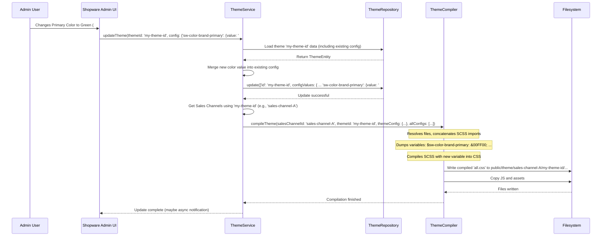

# Chapter 2: Theme System (ThemeService, ThemeCompiler, StorefrontPluginConfiguration)

Welcome back! In [Chapter 1: Storefront Routing (RequestTransformer, Router)](01_storefront_routing__requesttransformer__router__.md), we learned how Shopware figures out *which* page to show based on the URL. Now, let's explore how Shopware decides *how* that page should look and feel.

**What problem does the Theme System solve?**

Imagine you want to change the main color of your online shop from blue to green, or maybe add your company's logo to the header. How does Shopware manage these visual changes? How does it allow you (or a theme developer) to customize the appearance without breaking the shop's functionality?

This is where the **Theme System** comes in. It's like the interior design and branding service for your digital storefront. It handles everything related to the visual presentation – colors, fonts, logos, layouts, and more.

Let's meet the main players in this system.

## Key Concepts

### 1. The Theme: Your Shop's Style Guide

A **Theme** is a collection of files (like style sheets, scripts, images, and configuration files) that define the visual appearance of your Storefront. Think of it as the complete style guide for your shop, specifying everything from the color palette to the typography. Shopware comes with a default theme ("Storefront"), but you can install others or create your own.

### 2. `theme.json`: The Blueprint

Every theme (and sometimes plugins that modify the storefront) has a special file called `theme.json` located in its `Resources` directory. This file is like the blueprint or the design specification. It contains crucial information:

*   **Metadata:** Theme name, author, description.
*   **Configuration:** Defines customizable settings (like colors, fonts, logo options) that can often be changed in the Shopware Administration without coding.
*   **File References:** Lists the core SCSS (style) and JavaScript (script) files the theme uses.
*   **Asset Paths:** Specifies where images, fonts, and other assets are located.
*   **Inheritance:** Can define which other themes or configurations it builds upon (e.g., a custom theme might inherit from the default "Storefront" theme).

```json
// Example: Simplified theme.json
{
  "name": "MyCustomTheme",
  "author": "Your Name",
  "description": "A beautiful custom theme.",
  "views": [
     "@Storefront", // Inherit templates from the base theme
     "Resources/views" // Add our own custom templates
  ],
  "style": [
    "Resources/app/storefront/src/scss/base.scss" // Main style file
  ],
  "script": [
    "Resources/app/storefront/src/main.js" // Main script file
  ],
  "asset": [
    "Resources/app/storefront/dist", // Where compiled assets go
    "Resources/app/storefront/assets" // Where source assets (images, fonts) are
  ],
  "config": {
    "fields": {
      "sw-color-brand-primary": {
        "label": { "en-GB": "Primary color" },
        "type": "color",
        "value": "#007bff", // Default primary color (blue)
        "editable": true // Can be changed in Admin
      },
      "sw-logo-desktop": {
        "label": { "en-GB": "Desktop Logo" },
        "type": "media",
        "value": "Resources/app/storefront/assets/logo.png",
        "editable": true
      }
      // ... more configuration fields
    }
  }
}
```

This simplified example shows how `theme.json` defines the theme's structure, files, and customizable options like the primary color and logo.

### 3. StorefrontPluginConfiguration: Reading the Blueprint

How does Shopware read and understand all these `theme.json` files from the core, installed plugins, and active apps? That's the job of the `StorefrontPluginConfigurationFactory` and `StorefrontPluginRegistry`.

Think of the `StorefrontPluginConfigurationFactory` as the architect who knows how to read blueprints (`theme.json`). It takes a theme or plugin bundle and creates a `StorefrontPluginConfiguration` object – a structured representation of the information found in `theme.json`.

The `StorefrontPluginRegistry` keeps track of all these configuration objects for all active extensions.

```php
// Simplified idea of reading theme.json

class StorefrontPluginConfigurationFactory
{
    // ...

    // Reads theme.json from a bundle (plugin/theme)
    public function createFromBundle(Bundle $bundle): StorefrontPluginConfiguration
    {
        $config = new StorefrontPluginConfiguration($bundle->getName());
        $path = $bundle->getPath();
        $themeJsonPath = $path . '/Resources/theme.json';

        if (file_exists($themeJsonPath)) {
            // Load and parse the JSON file
            $jsonData = json_decode(file_get_contents($themeJsonPath), true);

            // Populate the config object with data from JSON
            $config->setIsTheme(true);
            $config->setName($jsonData['name'] ?? $bundle->getName());
            $config->setAuthor($jsonData['author'] ?? 'unknown');
            $config->setThemeJson($jsonData); // Store the raw JSON
            $config->setThemeConfig($jsonData['config'] ?? null); // Store the 'config' section
            // ... set styles, scripts, assets based on jsonData['style'], jsonData['script'] etc.

            // Example: setting style files
            $styles = new FileCollection();
            if (isset($jsonData['style']) && is_array($jsonData['style'])) {
                foreach ($jsonData['style'] as $file) {
                    // (Real implementation handles relative paths and resolves '@' imports)
                   $styles->add(new File($file));
                }
            }
            $config->setStyleFiles($styles);

        } else {
            // It's likely a plugin without a theme.json, maybe with just assets
            $config->setIsTheme(false);
            // ... look for default asset paths etc.
        }

        return $config;
    }
}

// The registry uses the factory to load all configs
class StorefrontPluginRegistry
{
    // ... (dependencies: KernelInterface, Factory)

    public function getConfigurations(): StorefrontPluginConfigurationCollection
    {
        // If not already loaded...
        $collection = new StorefrontPluginConfigurationCollection();
        foreach ($this->kernel->getBundles() as $bundle) {
           if ($bundle instanceof Bundle) { // Shopware Bundles (Plugins/Themes)
                // Use the factory to read theme.json / plugin structure
                $config = $this->pluginConfigurationFactory->createFromBundle($bundle);
                $collection->add($config);
           }
        }
        // ... also load configs for Apps ...
        return $collection;
    }
}
```

These classes work together to find all `theme.json` files and standard plugin structures, parse them, and make the information available as `StorefrontPluginConfiguration` objects.

### 4. ThemeService: The Project Manager

The `ThemeService` is like the project manager responsible for overseeing the theme's implementation in your shop. Its key tasks are:

*   **Assigning Themes:** It connects a specific theme to a specific Sales Channel. You might have different themes for different Sales Channels (e.g., a B2C theme and a B2B theme).
*   **Handling Updates:** When you change a theme's configuration in the Admin (e.g., pick a new primary color), the `ThemeService` saves this new configuration.
*   **Triggering Compilation:** After a theme is assigned or its configuration changes, the `ThemeService` tells the `ThemeCompiler` that it needs to rebuild the styles and scripts.

```php
// Simplified idea of ThemeService actions

class ThemeService
{
    // ... (dependencies: ThemeRepository, ThemeCompiler, ConfigLoader, etc.)

    // Connects a theme to a sales channel
    public function assignTheme(string $themeId, string $salesChannelId, Context $context): bool
    {
        // 1. Trigger compilation for this specific combination *before* assigning
        // (Unless skipped, maybe during initial setup)
        $this->compileTheme($salesChannelId, $themeId, $context);

        // 2. Save the assignment in the database
        // (Uses themeSalesChannelRepository->upsert(...))
        $this->saveAssignment($themeId, $salesChannelId, $context);

        // 3. Notify other parts of the system (optional)
        $this->dispatcher->dispatch(new ThemeAssignedEvent($themeId, $salesChannelId));

        return true;
    }

    // Saves new configuration values for a theme
    public function updateTheme(string $themeId, ?array $config, /*...*/ Context $context): void
    {
        // 1. Load the current theme data
        $theme = $this->getTheme($themeId, $context);

        // 2. Prepare the update data (merging new config with old)
        $data = ['id' => $themeId, 'configValues' => $this->mergeConfig($theme, $config)];

        // 3. Save the updated config values to the database
        $this->themeRepository->update([$data], $context);

        // 4. Trigger recompilation for all Sales Channels using this theme
        $this->compileThemeById($themeId, $context);
    }

    // Triggers the actual compilation via ThemeCompiler
    public function compileTheme(string $salesChannelId, string $themeId, Context $context): void
    {
        // Get the theme's full configuration (merged from parents, database overrides, etc.)
        $themeConfig = $this->configLoader->load($themeId, $context);

        // Get configurations of *all* plugins/apps (needed for resolving '@' imports)
        $allConfigs = $this->extensionRegistry->getConfigurations();

        // Tell the compiler to do its work
        $this->themeCompiler->compileTheme(
            $salesChannelId,
            $themeId,
            $themeConfig,
            $allConfigs,
            true, // Compile assets (images, fonts) too?
            $context
        );
    }

     // Compiles theme for all assigned Sales Channels
    public function compileThemeById(string $themeId, Context $context): void
    {
        // Find all Sales Channels using this theme or its children
        $mappings = $this->getThemeDependencyMapping($themeId); // Checks database

        foreach ($mappings as $mapping) {
            // Compile each specific combination
            $this->compileTheme($mapping->getSalesChannelId(), $mapping->getThemeId(), $context);
        }
    }

    // ... helper methods like getTheme, mergeConfig, getThemeDependencyMapping ...
}
```

The `ThemeService` orchestrates the process, ensuring themes are correctly assigned, configurations are saved, and the compiler is called when needed.

### 5. ThemeCompiler: The Builder

The `ThemeCompiler` is the builder or the construction crew. It takes the raw materials and the blueprint and creates the finished product.

*   **Input:**
    *   The theme's configuration (colors, fonts, etc., loaded by `ThemeService` via `ConfigLoader`).
    *   The theme's source SCSS files (defined in `theme.json`).
    *   The theme's source JavaScript files (defined in `theme.json`).
    *   Source files from *other* plugins/apps (if the theme inherits from them using `@` syntax).
*   **Process:**
    1.  **Variable Injection:** It injects the theme configuration values (like `$sw-color-brand-primary: #ff00ff;`) into the SCSS code.
    2.  **SCSS Compilation:** It uses an SCSS compiler (like `scssphp/scssphp`) to process the SCSS files. This involves handling imports (`@import`), mixins, functions, nesting, and finally converting everything into standard CSS that browsers understand.
    3.  **JavaScript Bundling (Simplified View):** It ensures the necessary JavaScript files are copied or prepared for the browser. (Modern Shopware uses Webpack for complex JS bundling, but the `ThemeCompiler` ensures the final outputs are placed correctly).
    4.  **Asset Copying:** It copies assets like images and fonts to a publicly accessible location.
*   **Output:**
    *   One or more final CSS files (e.g., `all.css`).
    *   One or more final JavaScript files (e.g., `all.js`).
    *   Copied assets (images, fonts).

These output files are stored in a specific directory structure within the `public/theme` folder, identified by the Sales Channel ID and Theme ID.

```php
// Simplified idea of ThemeCompiler actions

class ThemeCompiler implements ThemeCompilerInterface
{
    // ... (dependencies: Filesystem, ScssCompiler, ThemeFileResolver, etc.)

    public function compileTheme(
        string $salesChannelId,
        string $themeId,
        StorefrontPluginConfiguration $themeConfig, // The specific theme's resolved config
        StorefrontPluginConfigurationCollection $configurationCollection, // All plugin configs
        bool $withAssets,
        Context $context
    ): void {
        // 1. Resolve all SCSS file paths (following @imports like @Storefront)
        $resolvedFiles = $this->themeFileResolver->resolveFiles($themeConfig, $configurationCollection, false);
        $styleFiles = $resolvedFiles[ThemeFileResolver::STYLE_FILES]; // A collection of File objects

        // 2. Concatenate @import statements for all resolved SCSS files
        $concatenatedStyles = $this->concatenateStyles($styleFiles);
        // $concatenatedStyles might look like:
        // @import '/path/to/shopware/storefront/src/scss/base.scss';
        // @import '/path/to/my-theme/src/scss/custom.scss';

        // 3. Compile the concatenated SCSS into CSS
        $compiledCss = $this->compileStyles(
            $concatenatedStyles,
            $themeConfig, // Contains config values like colors
            $styleFiles->getResolveMappings(), // Helps SCSS compiler find @imports
            $salesChannelId,
            $themeId,
            $context
        );
        // $compiledCss is now standard CSS code

        // 4. Determine the output path (e.g., public/theme/saleschannel-uuid/theme-uuid/)
        $themePrefix = $this->themePathBuilder->generateNewPath($salesChannelId, $themeId, Uuid::randomHex());
        $outputPath = 'theme/' . $themePrefix; // e.g., theme/ab12...cd34/ef56...gh78

        // 5. Write the compiled CSS to the output path
        $this->filesystem->write($outputPath . '/css/all.css', $compiledCss);

        // 6. Copy JavaScript files (simplified - assumes pre-built JS)
        $scriptFiles = $this->copyScriptFilesToTheme($configurationCollection, $themePrefix);
        // Copies files like all.js to $outputPath/js/

        // 7. Copy Assets (images, fonts) if requested
        if ($withAssets) {
            $assetFiles = $this->copyAssetFilesToTheme($themeConfig, $configurationCollection, $outputPath);
        }

        // 8. Update internal state/cache indicating the theme is compiled
        $this->themePathBuilder->saveSeed(/*...*/); // Marks the compiled version as ready
    }

    // Helper to turn SCSS into CSS
    private function compileStyles(string $scssInput, StorefrontPluginConfiguration $configuration, /*...*/) : string
    {
        // a) Prepare variables from config (e.g., '$sw-color-brand-primary: #ff00ff;')
        $variables = $this->dumpVariables($configuration->getThemeConfig() ?? [], /*...*/);

        // b) Configure the SCSS compiler (import paths, output style)
        $compilerConfig = new CompilerConfiguration(/*...*/);
        $compilerConfig->setValue('outputStyle', OutputStyle::COMPRESSED); // Minify CSS

        // c) Compile! Inject variables before the main SCSS imports
        $css = $this->scssCompiler->compileString($compilerConfig, $variables . $scssInput);

        return $css; // Returns the final CSS string
    }

    // ... other helpers: concatenateStyles, copyScriptFilesToTheme, copyAssetFilesToTheme, dumpVariables ...
}
```

The `ThemeCompiler` takes the configuration and source files, processes them (compiling SCSS, preparing JS, copying assets), and places the final, browser-ready files in the correct public directory.

## How They Work Together: Changing the Primary Color

Let's trace what happens when you change the primary color of your theme in the Shopware Administration:



1.  **Admin Change:** You use the color picker in the Admin UI to set the primary color to green for "My Custom Theme".
2.  **API Call:** The Admin UI calls the Shopware API, eventually reaching the `ThemeService::updateTheme` method with the theme ID and the new color configuration.
3.  **Save Config:** `ThemeService` merges the new color value with the theme's existing configuration and uses `ThemeRepository` to save the updated `configValues` to the database.
4.  **Trigger Compile:** `ThemeService` identifies all Sales Channels using this theme (let's say just one: `sales-channel-A`). It then calls `ThemeCompiler::compileTheme` for this combination.
5.  **Compilation:**
    *   `ThemeCompiler` resolves all necessary SCSS/JS/asset files based on `theme.json` and inherited configurations (using `ThemeFileResolver`).
    *   It prepares the configuration variables, including `$sw-color-brand-primary: #00FF00;`.
    *   It compiles the SCSS files, injecting the variables. The resulting CSS now uses `#00FF00` wherever `$sw-color-brand-primary` was used.
    *   It copies the necessary JS files and assets.
6.  **Write Files:** The `ThemeCompiler` writes the newly generated `all.css` (with the green color), `all.js`, and assets to the specific directory for that theme and sales channel (e.g., `public/theme/sales-channel-A-id/my-theme-id/hash/...`).
7.  **Done:** The next time a user visits a page on `sales-channel-A`, the web server serves the *newly compiled* CSS and JS files, and they see the shop with the green primary color.

## Conclusion

The Shopware Theme System provides a powerful and flexible way to manage the visual appearance of your Storefront.

*   **`theme.json`** acts as the blueprint, defining settings, files, and inheritance.
*   **`StorefrontPluginConfiguration`** (created by its factory and managed by the registry) represents this blueprint in code after being read.
*   **`ThemeService`** is the manager, handling theme assignments to Sales Channels, saving configuration changes, and initiating the compilation process.
*   **`ThemeCompiler`** is the builder, taking the source files (SCSS, JS) and configuration, processing them, and generating the final, browser-ready CSS, JavaScript, and assets.

This system allows for easy customization through the Admin UI, inheritance from base themes, and complex styling possibilities using SCSS, ultimately controlling how your shop looks to your customers.

Now that we know how Shopware decides *which* page to show (Routing) and *how* it should look (Theming), let's look at the code that actually handles the request for a specific page and prepares the data for it.

Next up: [Chapter 3: StorefrontController](03_storefrontcontroller_.md)

---

Generated by [AI Codebase Knowledge Builder](https://github.com/The-Pocket/Tutorial-Codebase-Knowledge)