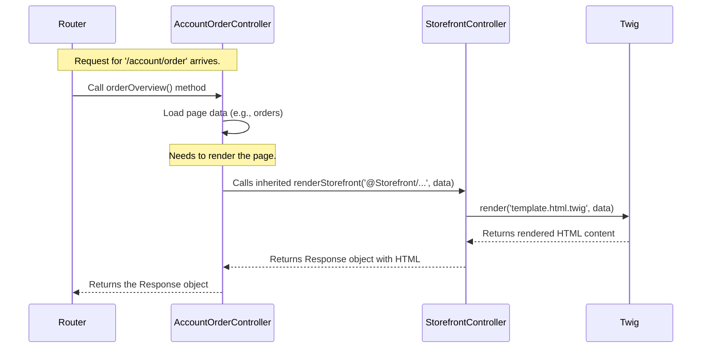

# Chapter 3: StorefrontController

Welcome back! In [Chapter 2: Theme System (ThemeService, ThemeCompiler, StorefrontPluginConfiguration)](02_theme_system__themeservice__themecompiler__storefrontpluginconfiguration__.md), we learned how Shopware manages the look and feel of your store using themes. Now, we'll look at the code component that acts as the main director for handling user interactions: the `StorefrontController`.

**What problem does `StorefrontController` solve?**

Imagine you visit an online shop and click on "My Orders". How does the shop know what to do? It needs a specific piece of code to handle that request, fetch your order history, and prepare the page to show it to you.

In [Chapter 1: Storefront Routing (RequestTransformer, Router)](01_storefront_routing__requesttransformer__router__.md), we saw how the Router directs incoming requests to the right *function* (called an "Action") inside a specific **Controller** class. The `StorefrontController` is the foundation upon which all these specific controllers (like `AccountOrderController` for handling orders, or `ProductController` for showing products) are built.

Think of the `StorefrontController` as the **main office building** for your shop's customer service operations. Inside this building, you have different departments:

*   The "Orders Department" (`AccountOrderController`) handles viewing past orders.
*   The "Product Information Department" (`ProductController`) handles showing product details.
*   The "Shopping Cart Department" (`CartController`) handles adding items to the cart.

While each department handles specific tasks, they all need access to common building facilities like:

*   Sending mail (showing messages to the user).
*   Using the printing room (rendering the web page).
*   Accessing the building directory (getting information about the current shop context).

The `StorefrontController` provides these **shared tools and services** to all the specific controller "departments". It's a base class, meaning other controllers inherit its helpful functions.

## Key Concepts

### 1. Base Controller (The Blueprint)

`StorefrontController` is an **abstract base class**. "Abstract" means you don't use it directly to handle a request, but other classes build upon it. It acts as a blueprint, defining common functionalities and requirements for all Storefront controllers. Any controller that needs to handle requests in the storefront (like showing a product page, handling the cart, or managing user accounts) will **extend** `StorefrontController`.

### 2. Shared Tools (The Building Services)

Controllers need to perform common tasks repeatedly. `StorefrontController` provides convenient methods for these tasks:

*   **`renderStorefront()`:** This is like the building's "printing room". It takes your data and a template file (the page layout) and generates the final HTML page to send to the user's browser.
*   **`addFlash()`:** This is like the building's "internal mail service". It allows controllers to display short messages (like "Success! Your order was placed." or "Error! Item could not be added.") to the user on the *next* page they visit. These are often called "flash messages".
*   **`trans()`:** Provides access to the shop's translation service, allowing controllers to display text in the user's selected language.
*   **Getting Context:** Provides easy access to important information about the current request, like the Sales Channel, logged-in customer, currency, etc.

### 3. Specific Controllers (The Departments)

Classes like `ProductController`, `CartController`, `AccountOrderController`, `CheckoutController`, etc., are the actual workers. They **extend** `StorefrontController`. This means they automatically inherit all the useful methods (`renderStorefront`, `addFlash`, etc.) from the base class.

```php
// File: src/Storefront/Controller/AccountOrderController.php (Simplified Example)

// Notice how it 'extends' StorefrontController
class AccountOrderController extends StorefrontController
{
    // ... (Dependencies like Order loaders are injected here)

    /**
     * This function handles the request to view the order overview page.
     */
    #[Route('/account/order', name: 'frontend.account.order.page', /* ... */)]
    public function orderOverview(Request $request, SalesChannelContext $context): Response
    {
        // 1. Load the data needed for the page (e.g., using an OrderPageLoader)
        $page = $this->orderPageLoader->load($request, $context);

        // 2. Maybe add a success message from a previous action
        // $this->addFlash(self::SUCCESS, 'Your order details were updated!');

        // 3. Use the inherited 'renderStorefront' method to show the page
        // It takes the template file path and the data ($page)
        return $this->renderStorefront(
            '@Storefront/storefront/page/account/order-history/index.html.twig', // The template file
            ['page' => $page] // The data to pass to the template
        );
    }

    // ... other methods like cancelOrder(), orderSingleOverview() etc.
}
```

In this simplified example, `AccountOrderController` doesn't need to define *how* to render a template or *how* to add a flash message. It just calls `renderStorefront()` or `addFlash()` methods that it got for free by extending `StorefrontController`.

## How it Works Internally

The `StorefrontController` itself doesn't handle specific routes like `/account/order`. That's the job of the specific controllers (`AccountOrderController`). The base class is primarily a provider of helper methods and common setup.

Here’s a simplified flow:



1.  **Routing:** The [Router](01_storefront_routing__requesttransformer__router__.md) determines that the `/account/order` URL should be handled by the `orderOverview` method inside `AccountOrderController`.
2.  **Execution:** Shopware calls `AccountOrderController::orderOverview()`.
3.  **Data Loading:** `AccountOrderController` uses its specific logic (and maybe a [PageLoader](04_page___pageloader_pattern_.md)) to gather the necessary data (like the list of orders).
4.  **Rendering Call:** `AccountOrderController` calls `$this->renderStorefront()` to display the page. Because it *extends* `StorefrontController`, this call actually executes the `renderStorefront` method defined in the `StorefrontController` base class.
5.  **Base Class Work:** The `renderStorefront` method in `StorefrontController` uses the Twig service (Shopware's template engine) to render the specified template file with the provided data.
6.  **Response:** It creates an HTTP Response object containing the final HTML and returns it.
7.  **Return:** The `AccountOrderController` returns this Response, which is eventually sent back to the user's browser.

### Diving Deeper into `StorefrontController` Code

Let's look at simplified versions of some key methods within `StorefrontController` itself.

```php
// File: src/Storefront/Controller/StorefrontController.php (Simplified)

use Symfony\Bundle\FrameworkBundle\Controller\AbstractController;
use Symfony\Component\HttpFoundation\Response;
use Twig\Environment; // The Twig template engine service
use Symfony\Contracts\Translation\TranslatorInterface; // Translation service
// ... other imports

abstract class StorefrontController extends AbstractController
{
    // StorefrontController itself inherits from Symfony's AbstractController,
    // gaining basic controller features like access to services.

    /**
     * Renders a Storefront view.
     *
     * @param array<string, mixed> $parameters Data passed to the template
     */
    protected function renderStorefront(string $view, array $parameters = []): Response
    {
        // 1. Get the Twig service from the container
        $twig = $this->container->get('twig');

        // 2. (Internal Detail: Dispatch an event allowing others to modify parameters)
        // $event = new StorefrontRenderEvent($view, $parameters, ...);
        // $this->container->get('event_dispatcher')->dispatch($event);
        // $parameters = $event->getParameters();

        // 3. Find the actual template file path (handles theme inheritance)
        // $view = $this->resolveTemplate($view);

        // 4. Render the template using Twig
        $content = $twig->render($view, $parameters);

        // 5. Create a Response object
        $response = new Response($content);

        // 6. (Internal Detail: Replace SEO URL placeholders, etc.)
        // $response = $this->processSeoUrls($response);

        // 7. Return the Response
        return $response;
    }

    /**
     * Adds a flash message for the next request.
     * Types are typically 'success', 'danger', 'warning', 'info'.
     */
    protected function addFlash(string $type, string $message): void
    {
        // Get the current request object
        $request = $this->container->get('request_stack')->getCurrentRequest();

        // Access the session's "flash bag" to store the message
        if ($request && $request->hasSession()) {
             $flashBag = $request->getSession()->getFlashBag();
             $flashBag->add($type, $message);
        }
    }

    /**
     * Translates a snippet key.
     *
     * @param array<string, mixed> $parameters Placeholders for the translation
     */
    protected function trans(string $snippet, array $parameters = []): string
    {
        // Use the translation service
        return $this->container
            ->get('translator')
            ->trans($snippet, $parameters);
    }

    // ... other helper methods like createActionResponse, forwardToRoute etc.
}
```

*   `renderStorefront`: Gets the Twig service, renders the given template (`$view`) with the provided data (`$parameters`), and returns the HTML wrapped in a `Response` object. It handles details like theme template resolution and SEO URL processing behind the scenes.
*   `addFlash`: Accesses the user's session and adds a message tagged with a specific type (like `success` or `danger`) to the "flash bag". This message will typically be displayed on the *next* page the user views.
*   `trans`: Uses the Symfony Translator service to look up a translation for a given `$snippet` key (e.g., `account.orderSaveSuccess`) and replaces any placeholders (like `%orderNumber%`) with values from `$parameters`.

These helper methods encapsulate common logic, making the specific controllers (like `AccountOrderController`) cleaner and more focused on their primary task (e.g., handling orders).

## Conclusion

The `StorefrontController` acts as a vital foundation for all controllers handling web requests in the Shopware Storefront. It doesn't handle specific routes itself, but it provides a set of essential, shared tools (`renderStorefront`, `addFlash`, `trans`, etc.) that its child controllers (like `ProductController`, `AccountOrderController`, `CheckoutController`) inherit and use.

Think of it as the central office building providing services that all departments rely on to do their jobs efficiently. This keeps the code organized, avoids repetition, and ensures consistency across different parts of the storefront.

Now that we understand how controllers handle requests and use shared tools, let's look at a common pattern used within these controllers to load and prepare the data needed for a page.

Next up: [Chapter 4: Page / PageLoader Pattern](04_page___pageloader_pattern_.md)

---

Generated by [AI Codebase Knowledge Builder](https://github.com/The-Pocket/Tutorial-Codebase-Knowledge)