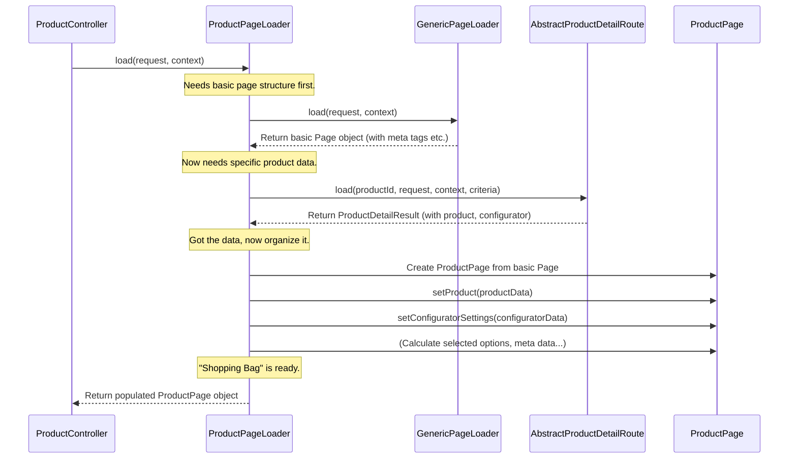

# Chapter 4: Page / PageLoader Pattern

Welcome back! In the previous chapter, [StorefrontController](03_storefrontcontroller_.md), we learned how controllers act as directors, handling user requests and using shared tools provided by the base `StorefrontController`. Now, let's look at a smart way these controllers organize the work of gathering all the information needed to display a page.

**What problem does this pattern solve?**

Imagine our `ProductController` needs to show a product page. It needs to fetch:

1.  The main product details (name, description, price).
2.  Product images.
3.  Available variants (colors, sizes).
4.  Customer reviews.
5.  Maybe some recommended accessories.

If we put all the logic for fetching *all* this data directly inside the `ProductController`'s action method, the method would become very long, messy, and hard to manage. It would be doing too many different jobs: handling the request, figuring out *what* data is needed, fetching *all* that data, and then telling the system to display it.

The **Page / PageLoader Pattern** helps us clean this up! It separates the task of "getting the data ready" from the task of "handling the request".

## Key Concepts

Think of it like preparing for a fancy dinner party:

1.  **The Controller (e.g., `ProductController`):** You are the host. Your main job is to welcome the guest (handle the request) and present the meal (render the page).
2.  **The PageLoader (e.g., `ProductPageLoader`):** This is your dedicated **Personal Shopper**. You give them a list ("I need ingredients for the 'Awesome T-Shirt' page"). They run around the store (your shop's database, services, etc.) and gather *everything* needed: the T-shirt details, reviews, images, size options.
3.  **The Page (e.g., `ProductPage`):** This is the **Structured Shopping Bag** (or maybe a fancy recipe box) that the Personal Shopper carefully organizes. They put the T-shirt details in one compartment, the images in another, the reviews neatly stacked. It's not just a random pile of stuff; it's organized data.
4.  **The Handover:** The Personal Shopper (`PageLoader`) gives you, the host (`Controller`), the perfectly organized Shopping Bag (`Page`).
5.  **Serving the Meal:** You (`Controller`) take this organized Bag (`Page`) and hand it directly to your chef (the Twig templating engine via `renderStorefront`) who knows exactly how to use the structured contents to prepare and display the final meal (the webpage).

This way, you (the `Controller`) don't need to know the messy details of shopping; you just ask your shopper (`PageLoader`) for the prepared bag (`Page`) and then present it.

## How to Use It: The Product Page Example

Let's see how `ProductController` might use this pattern.

```php
// File: simplified src/Storefront/Controller/ProductController.php

use Shopware\Storefront\Page\Product\ProductPageLoader; // Import the "Personal Shopper"
use Symfony\Component\HttpFoundation\Request;
use Symfony\Component\HttpFoundation\Response;
use Shopware\Core\System\SalesChannel\SalesChannelContext;
use Shopware\Storefront\Controller\StorefrontController; // Needs the base tools

class ProductController extends StorefrontController
{
    // The Controller asks for the PageLoader service via constructor injection
    public function __construct(
        private readonly ProductPageLoader $productPageLoader // Our "Personal Shopper"
    ) {
    }

    // This method handles requests for product pages
    public function detailPage(Request $request, SalesChannelContext $context): Response
    {
        // 1. Ask the PageLoader to load the data for this request
        // The loader needs the request (e.g., for URL parameters like product ID)
        // and the context (e.g., for current language, currency)
        $page = $this->productPageLoader->load($request, $context);
        // $page is now our organized "Shopping Bag" (ProductPage object)

        // 2. Hand the organized "Page" object to the template
        return $this->renderStorefront(
            '@Storefront/storefront/page/product-detail/index.html.twig', // Template file path
            ['page' => $page] // Pass the whole bag to the template
        );
    }
}
```

**Explanation:**

1.  **Dependency:** The `ProductController` declares that it needs a `ProductPageLoader`. Shopware's service container automatically provides an instance of it.
2.  **Delegate:** Inside the `detailPage` action method, the *only* job related to data fetching is calling `$this->productPageLoader->load()`. It passes the current `$request` and `$context`.
3.  **Receive:** The `load()` method returns a `$page` object (an instance of `ProductPage`). This object contains all the data the loader fetched (product details, reviews, etc.), neatly structured.
4.  **Render:** The controller takes this `$page` object and passes it directly to the `renderStorefront` method (which it inherited from [StorefrontController](03_storefrontcontroller_.md)). The Twig template (`index.html.twig`) can then access the data like `page.product.name` or `page.reviews`.

See how clean the controller method is? Its main responsibilities are clear: receive request, delegate data loading, render view.

## How it Works Internally: The PageLoader's Shopping Trip

What happens inside the `productPageLoader->load()` call?



**Walkthrough:**

1.  **Controller Call:** `ProductController` calls `ProductPageLoader::load()`.
2.  **Generic Base:** The `ProductPageLoader` *first* often calls a `GenericPageLoader`. This generic loader creates a basic `Page` object and might add things common to *all* pages, like standard meta tags (shop name, etc.).
3.  **Specific Data Fetching:** The `ProductPageLoader` then uses specific services or Store API routes (like `AbstractProductDetailRoute`) to fetch the actual product data, configurator settings, etc., based on the `productId` found in the `request`. **Important:** PageLoaders should *not* directly access the database repository. They should use dedicated Store API routes or facades to ensure data consistency and access control.
4.  **Page Creation/Population:** It takes the basic `Page` object received from the `GenericPageLoader` and creates a more specific `ProductPage` object from it (or adds data to it).
5.  **Set Data:** It calls methods like `setProduct()` and `setConfiguratorSettings()` on the `ProductPage` object, placing the fetched data into the correct "compartments" of the "shopping bag". It might also calculate derived data, like which configurator options are currently selected.
6.  **Event (Optional but common):** Before returning, it often dispatches a `ProductPageLoadedEvent`. This allows other plugins or parts of the system to hook in and add or modify data on the page just before it's returned to the controller (more on Events and Hooks later!).
7.  **Return:** The fully populated `ProductPage` object is returned to the `ProductController`.

### Diving Deeper into Code

Let's look at simplified versions of the key classes:

**1. The PageLoader (`ProductPageLoader`)**

```php
// File: simplified src/Storefront/Page/Product/ProductPageLoader.php

use Shopware\Storefront\Page\GenericPageLoaderInterface; // Base loader
use Shopware\Core\Content\Product\SalesChannel\Detail\AbstractProductDetailRoute; // Data source
use Shopware\Storefront\Page\Product\ProductPage; // The specific "bag" type
// ... other imports like Request, SalesChannelContext, EventDispatcherInterface

class ProductPageLoader
{
    public function __construct(
        private readonly GenericPageLoaderInterface $genericLoader, // For basic page setup
        private readonly AbstractProductDetailRoute $productDetailRoute, // To fetch product data
        private readonly EventDispatcherInterface $eventDispatcher // To announce page is loaded
    ) {
    }

    public function load(Request $request, SalesChannelContext $context): ProductPage
    {
        // 1. Get base page structure (meta tags, etc.)
        $page = $this->genericLoader->load($request, $context);
        // Convert the generic Page into our specific ProductPage
        $page = ProductPage::createFrom($page);

        // 2. Fetch the product data using a dedicated route
        $productId = $request->attributes->get('productId'); // Get ID from URL
        // (Build criteria for required associations like media, manufacturer)
        $criteria = $this->buildCriteria();
        $productResult = $this->productDetailRoute->load($productId, $request, $context, $criteria);
        $product = $productResult->getProduct();

        // 3. Put data into the "bag" (ProductPage)
        $page->setProduct($product);
        $page->setConfiguratorSettings($productResult->getConfigurator());
        // ... maybe calculate and set selected options based on request/product ...
        // ... maybe set specific meta title based on product name ...

        // 4. Announce that the page is loaded (allows modifications)
        $this->eventDispatcher->dispatch(
            new ProductPageLoadedEvent($page, $context, $request)
        );

        // 5. Return the filled "bag"
        return $page;
    }

    private function buildCriteria(): Criteria { /* ... create Criteria object ... */ }
}
```

This shows the `ProductPageLoader` coordinating the process: using the `GenericPageLoader`, calling the `AbstractProductDetailRoute` to get data, populating the `ProductPage` object, and dispatching an event.

**2. The Page (`ProductPage`)**

```php
// File: simplified src/Storefront/Page/Product/ProductPage.php

use Shopware\Storefront\Page\Page; // Inherits from the base Page structure
use Shopware\Core\Content\Product\SalesChannel\SalesChannelProductEntity;
use Shopware\Core\Content\Property\PropertyGroupCollection;
use Shopware\Core\Content\Cms\CmsPageEntity;

// ProductPage extends the basic Page, adding specific fields for product data
class ProductPage extends Page
{
    // These are the "compartments" in our "shopping bag"
    protected SalesChannelProductEntity $product;
    protected PropertyGroupCollection $configuratorSettings;
    protected ?CmsPageEntity $cmsPage = null;
    // ... other fields like selectedOptions, reviews etc.

    // Methods to put things into the compartments (setters)
    public function setProduct(SalesChannelProductEntity $product): void
    {
        $this->product = $product;
    }

    public function setConfiguratorSettings(PropertyGroupCollection $configuratorSettings): void
    {
        $this->configuratorSettings = $configuratorSettings;
    }

    // Methods to get things out of the compartments (getters) - used by the template
    public function getProduct(): SalesChannelProductEntity
    {
        return $this->product;
    }

    public function getConfiguratorSettings(): PropertyGroupCollection
    {
        return $this->configuratorSettings;
    }

    // ... other getters and setters ...
}
```

The `ProductPage` class is mostly a simple data container. It extends the basic `Page` (which might hold things like `MetaInformation`) and adds specific properties (`$product`, `$configuratorSettings`, etc.) relevant to a product page. It provides getter and setter methods for these properties.

## Conclusion

The **Page / PageLoader Pattern** is a fundamental concept in Shopware Storefront development for keeping code organized and maintainable.

*   **PageLoaders** (like `ProductPageLoader`) act as "Personal Shoppers", encapsulating the logic for fetching *all* data needed for a specific type of page. They use dedicated Store API routes or facades, not direct repository access.
*   **Page** objects (like `ProductPage`) act as "Structured Shopping Bags", holding the fetched data in well-defined properties.
*   **Controllers** (like `ProductController`) delegate the data-loading task to the appropriate PageLoader and then simply pass the resulting Page object to the template (`renderStorefront`).

This separation makes controllers cleaner, data fetching logic reusable and testable, and the overall structure easier to understand.

Sometimes, a page might contain smaller, independent sections that also need their own data, especially when dealing with dynamic updates (like reloading just the cart summary without reloading the whole page). How does Shopware handle that?

Next up: [Chapter 5: Pagelet / PageletLoader Pattern](05_pagelet___pageletloader_pattern_.md)

---

Generated by [AI Codebase Knowledge Builder](https://github.com/The-Pocket/Tutorial-Codebase-Knowledge)