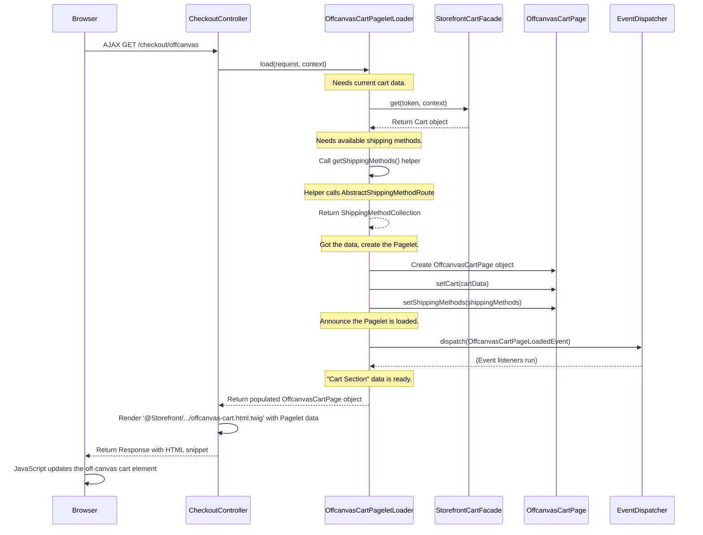

# Chapter 5: Pagelet / PageletLoader Pattern

Welcome back! In [Chapter 4: Page / PageLoader Pattern](04_page___pageloader_pattern_.md), we saw how controllers use PageLoaders to gather all the data needed for a full page and organize it into a Page object. But what about smaller, independent parts *within* a page? Sometimes you want to load or update just a small section, like the shopping cart icon in the header, without reloading the entire page.

**What problem does this pattern solve?**

Imagine you click the "Add to Cart" button. You want the little shopping cart icon in the corner (often called an "off-canvas cart" or "mini-cart") to update instantly, showing the new item and total, without making the whole page flash and reload. Reloading the entire page just to update that small section would be slow and annoying for the user.

How can we load or update just *part* of a page? This is where the **Pagelet / PageletLoader Pattern** comes in handy. It's like the Page/PageLoader pattern, but for smaller components.

## Key Concepts

Think of your main webpage as a big newspaper.

1.  **The Page:** The entire newspaper issue for today. Loaded once when you first visit the page. (Covered in [Chapter 4: Page / PageLoader Pattern](04_page___pageloader_pattern_.md)).
2.  **The Pagelet (e.g., `OffcanvasCartPagelet`, `HeaderPagelet`, `FooterPagelet`):** These are like specific sections *within* the newspaper – the weather forecast, the sports scores, a stock market ticker. They are smaller, self-contained units of information. In Shopware, common Pagelets include the header, the footer, the off-canvas cart, or maybe a product recommendations slider.
3.  **The PageletLoader (e.g., `OffcanvasCartPageletLoader`, `HeaderPageletLoader`):** This is the **Specialized Reporter** assigned *only* to gather information for their specific section. The Weather Reporter (`HeaderPageletLoader` might fetch languages/currencies) doesn't care about the Sports Scores (`OffcanvasCartPageletLoader` fetches cart data). They gather just what's needed for their part.
4.  **Independent Loading (AJAX/ESI):** Often, these newspaper sections (Pagelets) might be updated independently. Maybe the stock market ticker updates every minute, while the main news stays the same. Similarly, Pagelets are often loaded or refreshed using techniques like AJAX (JavaScript fetching data in the background) or ESI (Edge Side Includes - a way for web servers/caches to assemble pages from parts), without requiring a full page reload.

So, the Pagelet / PageletLoader pattern is essentially the same idea as the Page / PageLoader pattern, but applied to smaller, reusable components that often need to be loaded or updated on their own.

## How to Use It: Updating the Off-Canvas Cart

Let's revisit the "Add to Cart" scenario. When the user clicks the button, the browser might make a background request (AJAX) to a specific URL in your shop, like `/checkout/offcanvas`.

The [Storefront Routing (RequestTransformer, Router)](01_storefront_routing__requesttransformer__router__.md) system directs this request to a specific action in a [StorefrontController](03_storefrontcontroller_.md) (perhaps `CheckoutController::offcanvasCartAction`). This action's job is *not* to render the whole page, but just the off-canvas cart Pagelet.

```php
// File: simplified src/Storefront/Controller/CheckoutController.php

use Shopware\Storefront\Page\Checkout\Offcanvas\OffcanvasCartPageLoader; // The "Reporter"
use Symfony\Component\HttpFoundation\Request;
use Symfony\Component\HttpFoundation\Response;
use Shopware\Core\System\SalesChannel\SalesChannelContext;
use Shopware\Storefront\Controller\StorefrontController;

class CheckoutController extends StorefrontController
{
    // The controller asks for the PageletLoader service
    public function __construct(
        private readonly OffcanvasCartPageLoader $offcanvasCartLoader // Our "Cart Reporter"
    ) {
    }

    // This action handles AJAX requests for the off-canvas cart content
    public function offcanvas(Request $request, SalesChannelContext $context): Response
    {
        // 1. Ask the PageletLoader to load data *just* for the off-canvas cart
        $pagelet = $this->offcanvasCartLoader->load($request, $context);
        // $pagelet is now our organized "Cart Section" (OffcanvasCartPagelet object)

        // 2. Render *only* the template for the off-canvas cart
        // Notice: We might pass 'page' for consistency, but the key data is in $pagelet
        return $this->renderStorefront(
            '@Storefront/storefront/layout/header/offcanvas-cart.html.twig',
            ['page' => $pagelet] // Pass the pagelet data to the specific template
        );
    }

    // ... other checkout related actions ...
}
```

**Explanation:**

1.  **Dependency:** The `CheckoutController` gets the `OffcanvasCartPageLoader` injected.
2.  **Delegate:** The `offcanvas` action calls `$this->offcanvasCartLoader->load()` to get the specific data needed *only* for the off-canvas cart.
3.  **Receive:** The loader returns an `$pagelet` object (an instance of `OffcanvasCartPage` - note: sometimes Pagelets extend `Page` for convenience, hence the naming).
4.  **Render Snippet:** The controller uses `renderStorefront` but tells it to render *only* the template for the off-canvas cart (`offcanvas-cart.html.twig`). It passes the `$pagelet` data.
5.  **Return HTML Snippet:** The action returns a Response containing *only* the HTML for the updated cart section, not the whole page.
6.  **Browser Update:** JavaScript code in the user's browser receives this HTML snippet and replaces the content of the existing off-canvas cart element with the new HTML. The user sees the updated cart without a full page refresh.

## How it Works Internally: The PageletLoader's Reporting Task

What happens inside the `offcanvasCartLoader->load()` call? It's very similar to the PageLoader process, but focused on a smaller scope.



**Walkthrough:**

1.  **Controller Call:** `CheckoutController` calls `OffcanvasCartPageletLoader::load()`.
2.  **Data Fetching:**
    *   The loader calls `StorefrontCartFacade::get()` to fetch the current shopping cart contents.
    *   It might call other services/routes like `AbstractShippingMethodRoute` to get available shipping methods (often displayed in the cart). Like PageLoaders, **PageletLoaders must use Store API routes or facades, not direct repository access.**
3.  **Pagelet Creation:** It creates an instance of the specific Pagelet class (e.g., `OffcanvasCartPage`).
4.  **Populate Data:** It uses setter methods (e.g., `setCart()`, `setShippingMethods()`) on the Pagelet object to store the fetched data.
5.  **Event Dispatch:** It dispatches a specific `PageletLoadedEvent` (e.g., `OffcanvasCartPageLoadedEvent`). This allows other plugins to modify the Pagelet data if needed.
6.  **Return:** The populated `OffcanvasCartPage` object is returned to the `CheckoutController`.

### Diving Deeper into Code

Let's look at simplified versions of the key classes involved.

**1. The PageletLoader (`OffcanvasCartPageletLoader`)**

```php
// File: simplified src/Storefront/Page/Checkout/Offcanvas/OffcanvasCartPageLoader.php

use Shopware\Storefront\Checkout\Cart\SalesChannel\StorefrontCartFacade; // Data source for cart
use Shopware\Core\Checkout\Shipping\SalesChannel\AbstractShippingMethodRoute; // Data source for shipping
use Shopware\Storefront\Page\Checkout\Offcanvas\OffcanvasCartPage; // The specific "section"
use Shopware\Storefront\Page\GenericPageLoaderInterface; // May need basic page info
// ... other imports like Request, SalesChannelContext, EventDispatcherInterface

class OffcanvasCartPageLoader
{
    public function __construct(
        private readonly EventDispatcherInterface $eventDispatcher,
        private readonly StorefrontCartFacade $cartService,
        private readonly GenericPageLoaderInterface $genericLoader, // Often used for base context
        private readonly AbstractShippingMethodRoute $shippingMethodRoute
    ) {
    }

    public function load(Request $request, SalesChannelContext $context): OffcanvasCartPage
    {
        // 1. Get base page structure if needed (e.g., for meta tags)
        $page = $this->genericLoader->load($request, $context);
        $page = OffcanvasCartPage::createFrom($page); // Create specific type

        // 2. Fetch the cart data via facade
        $cart = $this->cartService->get($context->getToken(), $context);

        // 3. Fetch available shipping methods via route
        $shippingMethods = $this->getShippingMethods($request, $context);

        // 4. Put data into the "section" (OffcanvasCartPagelet)
        $page->setCart($cart);
        $page->setShippingMethods($shippingMethods);

        // 5. Announce that the Pagelet is loaded
        $this->eventDispatcher->dispatch(
            new OffcanvasCartPageLoadedEvent($page, $context, $request)
        );

        // 6. Return the filled "section"
        return $page;
    }

    // Helper using the Shipping Method Route
    private function getShippingMethods(Request $req, SalesChannelContext $ctx): ShippingMethodCollection
    {
        // ... calls $this->shippingMethodRoute->load(...) ...
        return $this->shippingMethodRoute->load(
            $req->duplicate(['onlyAvailable' => true]), // Example parameter
            $ctx,
            new Criteria()
        )->getShippingMethods();
    }
}
```

This shows the `OffcanvasCartPageletLoader` focusing only on cart and related data, using facades/routes, populating its specific Pagelet (`OffcanvasCartPage`), and dispatching its event.

**2. The Pagelet (`OffcanvasCartPage`)**

Often, Pagelets are simple data containers, sometimes extending the base `Page` or a simpler `Pagelet` base class.

```php
// File: simplified src/Storefront/Page/Checkout/Offcanvas/OffcanvasCartPage.php

use Shopware\Storefront\Page\Page; // Often extends Page for convenience
use Shopware\Core\Checkout\Cart\Cart;
use Shopware\Core\Checkout\Shipping\ShippingMethodCollection;

// Represents the data needed for the off-canvas cart view
class OffcanvasCartPage extends Page
{
    // Specific data fields for this "section"
    protected Cart $cart;
    protected ShippingMethodCollection $shippingMethods;

    // Getters and Setters to access the data
    public function getCart(): Cart { return $this->cart; }
    public function setCart(Cart $cart): void { $this->cart = $cart; }

    public function getShippingMethods(): ShippingMethodCollection { return $this->shippingMethods; }
    public function setShippingMethods(ShippingMethodCollection $methods): void { $this->shippingMethods = $methods; }
}
```

This `OffcanvasCartPage` simply holds the `$cart` and `$shippingMethods` data needed by the `offcanvas-cart.html.twig` template.

**3. Base Classes (Conceptual)**

Shopware provides base classes to help structure this:

*   `Shopware\Storefront\Pagelet\Pagelet`: A simple base class that specific Pagelets *can* extend if they don't need the full `Page` structure.
*   `Shopware\Storefront\Pagelet\PageletLoadedEvent`: An abstract base event that specific Pagelet loaded events (like `OffcanvasCartPageLoadedEvent`, `HeaderPageletLoadedEvent`, `FooterPageletLoadedEvent`) extend.

## Conclusion

The **Pagelet / PageletLoader Pattern** mirrors the [Page / PageLoader Pattern](04_page___pageloader_pattern_.md) but applies it to smaller, self-contained components (Pagelets) within a larger page.

*   **Pagelets** (like `HeaderPagelet`, `FooterPagelet`, `OffcanvasCartPagelet`) hold data for a specific UI section.
*   **PageletLoaders** (like `HeaderPageletLoader`, `OffcanvasCartPageletLoader`) are responsible for fetching data *only* for their corresponding Pagelet, typically using Store API routes or facades.
*   They are often used with **AJAX** or **ESI** to load or update parts of the page dynamically without a full reload.
*   Each PageletLoader typically dispatches its own `PageletLoadedEvent` after loading data.

This pattern is crucial for building modern, dynamic storefronts where parts of the interface need to update quickly and independently, improving user experience and performance.

Now that we've seen how Shopware structures pages and their smaller parts, let's look at a common feature needed on many forms: preventing spam bots.

Next up: [Chapter 6: Captcha Abstraction](06_captcha_abstraction_.md)

---

Generated by [AI Codebase Knowledge Builder](https://github.com/The-Pocket/Tutorial-Codebase-Knowledge)