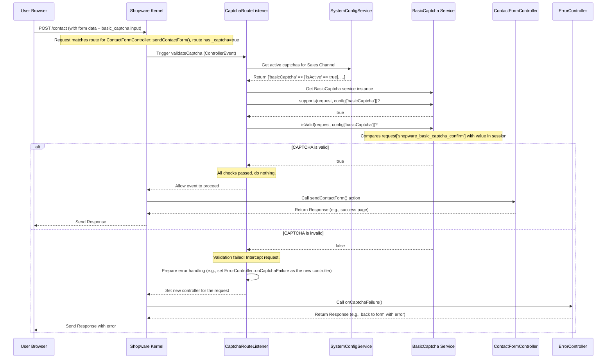

# Chapter 6: Captcha Abstraction

Welcome back! In the previous chapter, [Pagelet / PageletLoader Pattern](05_pagelet___pageletloader_pattern_.md), we learned how Shopware loads or updates smaller, independent parts of a page, like the mini-cart. Often, these interactions involve forms – think of the contact form, the newsletter registration, or product reviews. A big challenge with web forms is protecting them from automated bots that submit spam or try to abuse your site.

**What problem does Captcha Abstraction solve?**

Imagine your shop's contact form is getting filled with thousands of fake messages every day by automated programs (bots). This is annoying and wastes your time. To prevent this, you need a way to check if the submission is coming from a real human. This check is commonly called a **CAPTCHA** (Completely Automated Public Turing test to tell Computers and Humans Apart).

There are many types of CAPTCHAs:

*   **Basic Image Captchas:** Show distorted text in an image that humans can read but bots struggle with.
*   **Google reCAPTCHA (v2):** The familiar "I'm not a robot" checkbox, sometimes followed by an image selection challenge.
*   **Google reCAPTCHA (v3):** Works invisibly in the background, scoring user interactions to guess if they're human.
*   **Honeypots:** Hidden form fields that are invisible to humans but bots often fill them out, revealing themselves.

You might want to use a simple image CAPTCHA at first, but later switch to Google reCAPTCHA for better security or user experience. How can Shopware make it easy to add *any* of these CAPTCHA types to your forms and switch between them without rewriting large parts of your code?

This is where **Captcha Abstraction** comes in! It provides a standardized way to handle different CAPTCHA methods. Think of it like a building's security desk. They might have several ways to verify your identity: checking your ID card, scanning your fingerprint, or asking for a password. The security system is designed so that the *type* of check can be changed (maybe they upgrade from ID cards to fingerprints), but the overall process of checking visitors remains the same.

## Key Concepts

### 1. `AbstractCaptcha`: The Security Check Blueprint

This is an **abstract base class**, like a standard operating procedure manual for security checks. It defines the common questions every CAPTCHA type needs to answer:

*   `supports(Request $request, array $captchaConfig): bool`: "Should I even perform a check for *this* specific incoming request, based on the shop's settings?" (e.g., Is this a POST request? Is this CAPTCHA type enabled in the admin settings?)
*   `isValid(Request $request, array $captchaConfig): bool`: "Okay, I need to check. Based on the information in the request (the user's input), is this CAPTCHA valid?" (e.g., Did the user type the correct text from the image? Did Google verify the reCAPTCHA token?)
*   `getName(): string`: "What is my unique technical name?" (e.g., `basicCaptcha`, `googleReCaptchaV2`).

Specific CAPTCHA implementations *must* provide concrete answers (code) for these methods.

```php
// File: Framework/Captcha/AbstractCaptcha.php (Simplified Concept)
abstract class AbstractCaptcha
{
    // Should this captcha run for this request & config?
    public function supports(Request $request, array $captchaConfig): bool
    {
        // Default check: Only run for POST requests if enabled
        if (!$request->isMethod(Request::METHOD_POST)) { return false; }
        if (empty($captchaConfig)) { return false; }
        return (bool) $captchaConfig['isActive']; // Is it turned on in Admin?
    }

    // Is the submitted CAPTCHA data valid? (Must be implemented by child)
    abstract public function isValid(Request $request, array $captchaConfig): bool;

    // What's the unique name? (Must be implemented by child)
    abstract public function getName(): string;

    // ... other helper methods like shouldBreak(), getData(), getViolations() ...
}
```

This blueprint ensures all CAPTCHA types follow the same basic rules.

### 2. Concrete Implementations: The Specific Security Checks

These classes **extend** `AbstractCaptcha` and implement the specific logic for each CAPTCHA type:

*   `BasicCaptcha`: Implements the image CAPTCHA. `isValid()` checks if the user's input matches a code previously generated and stored (often in the user's session).
*   `GoogleReCaptchaV2`: Implements the "I'm not a robot" checkbox. `isValid()` takes a token submitted by the browser and sends it to Google's servers for verification.
*   `GoogleReCaptchaV3`: Implements the invisible score-based check. `isValid()` also sends a token to Google and checks if the returned score is above a configured threshold.
*   `HoneypotCaptcha`: Implements the hidden field trick. `isValid()` checks if the hidden field (which should be empty for humans) has been filled out (likely by a bot).

### 3. `CaptchaRouteListener`: The Security Guard

This class is the security guard stationed at the entrance (listening to incoming web requests). Its main job is:

*   **Listen:** It listens for requests going to controllers/actions that are marked as needing CAPTCHA validation. (This marking happens via route configuration/annotations).
*   **Check Settings:** When such a request comes in (usually a POST request from a form submission), it checks the shop's settings (via `SystemConfigService`) to see *which* CAPTCHAs are currently active for the Sales Channel.
*   **Delegate Validation:** For each active CAPTCHA type, it gets the corresponding service (e.g., `BasicCaptcha`, `GoogleReCaptchaV2`).
    *   It calls `$captcha->supports()` to see if this specific CAPTCHA should run for this request.
    *   If `supports()` returns true, it calls `$captcha->isValid()`.
*   **React:** If `isValid()` returns `false` for any required CAPTCHA, the `CaptchaRouteListener` steps in. It usually stops the request from reaching its intended destination (like the code that saves the contact form data) and instead shows an error message or redirects the user back to the form with a validation error. If all required CAPTCHAs are valid, the listener does nothing, and the request proceeds normally.

## How to Use It (Conceptual View)

1.  **Template Integration:** A developer adds the necessary HTML and JavaScript for a CAPTCHA to a form template (e.g., `contact/form.html.twig`). Shopware provides Twig helpers or includes for common CAPTCHAs. For example, for Basic Captcha, you might include a template snippet that shows the image and the input field. For Google reCAPTCHA, you'd include the Google script and the `div` element where the widget appears.
2.  **Route Protection:** The route definition (often an annotation on the controller action that handles the form submission, like `ContactFormController::sendContactForm()`) is marked to indicate that CAPTCHA validation is required. This is often done by adding `defaults={"_captcha"=true}` to the route definition.
3.  **Admin Configuration:** The shop owner goes to the Shopware Administration -> Settings -> Basic Information -> Captchas. Here, they can select which CAPTCHA types (Basic Captcha, Google reCAPTCHA v2/v3, Honeypot) should be active for different forms (like registration, contact form, newsletter). They also enter necessary credentials, like Google reCAPTCHA site/secret keys.
4.  **Automatic Validation:** When a user submits the form:
    *   The browser sends the form data (including the CAPTCHA input, like the text typed for Basic Captcha or the token from Google) to the server.
    *   The `CaptchaRouteListener` sees the `_captcha=true` flag on the route.
    *   It checks the admin settings. Let's say Basic Captcha is active.
    *   It gets the `BasicCaptcha` service.
    *   It calls `BasicCaptcha::supports()` (returns true because it's POST and active).
    *   It calls `BasicCaptcha::isValid()` with the request data.
    *   If valid, the request continues to the `ContactFormController`. If invalid, the listener intercepts the request and shows an error.

The beauty is that the `ContactFormController` itself doesn't need to know *which* CAPTCHA is active or how to validate it. The `CaptchaRouteListener` handles that based on the central configuration.

## Internal Implementation Walkthrough

Let's trace what happens when a user submits a contact form protected by the **Basic Captcha**.



1.  **POST Request:** The user submits the contact form. The browser sends the data, including the CAPTCHA value entered by the user, via a POST request.
2.  **Route Match:** Shopware's routing identifies the target controller action (`ContactFormController::sendContactForm`) and sees the `_captcha=true` flag associated with the route.
3.  **Listener Triggered:** Before executing the controller, the Kernel triggers listeners for the `KernelEvents::CONTROLLER` event. The `CaptchaRouteListener::validateCaptcha` method runs.
4.  **Check Configuration:** The listener asks the `SystemConfigService` which CAPTCHAs are active for the current Sales Channel. It finds that `basicCaptcha` is active.
5.  **Get Service:** The listener gets the actual `BasicCaptcha` service instance.
6.  **Supports Check:** It calls `$basicCaptcha->supports(...)`. Since it's a POST request and the CAPTCHA is configured as active, this returns `true`.
7.  **Validation:** The listener calls `$basicCaptcha->isValid(...)`.
8.  **`BasicCaptcha` Logic:** The `BasicCaptcha::isValid` method retrieves the user's input from the request (`shopware_basic_captcha_confirm` parameter) and compares it (case-insensitively) to the correct code that was generated earlier and stored in the user's session (`basic_captcha_session`).
9.  **Result:**
    *   **If Valid:** `isValid()` returns `true`. The `CaptchaRouteListener` sees that the check passed and does nothing further. The Kernel proceeds to execute the original `ContactFormController::sendContactForm` action.
    *   **If Invalid:** `isValid()` returns `false`. The `CaptchaRouteListener` intercepts the request. It prevents the `ContactFormController` from running and instead tells the Kernel to run a different action, typically `ErrorController::onCaptchaFailure`, which will display an appropriate error message to the user (often by re-rendering the form with a validation error).

## Diving Deeper into Code

Let's look at simplified versions of the key files:

**1. `AbstractCaptcha` (The Blueprint)**

```php
// File: Framework/Captcha/AbstractCaptcha.php (Simplified)
namespace Shopware\Storefront\Framework\Captcha;

use Symfony\Component\HttpFoundation\Request;

abstract class AbstractCaptcha
{
    // Check if this captcha should be validated for the request
    public function supports(Request $request, array $captchaConfig): bool { /* ... */ }

    // Validate the captcha data in the request (must be implemented)
    abstract public function isValid(Request $request, array $captchaConfig): bool;

    // Get the unique name (must be implemented)
    abstract public function getName(): string;

    // Can return validation errors if isValid() is false
    public function getViolations(): ConstraintViolationList { /* ... */ }

    // Should validation failure immediately throw an error (true),
    // or allow the ErrorController to handle it gracefully (false)?
    public function shouldBreak(): bool { return true; } // Default: throw error
}
```

This defines the contract that all CAPTCHA implementations must follow.

**2. `BasicCaptcha` (Image Captcha Implementation)**

```php
// File: Framework/Captcha/BasicCaptcha.php (Simplified)
namespace Shopware\Storefront\Framework\Captcha;

use Symfony\Component\HttpFoundation\Request;
use Symfony\Component\HttpFoundation\RequestStack; // To access session

class BasicCaptcha extends AbstractCaptcha
{
    final public const CAPTCHA_NAME = 'basicCaptcha';
    final public const CAPTCHA_REQUEST_PARAMETER = 'shopware_basic_captcha_confirm';
    final public const BASIC_CAPTCHA_SESSION = 'basic_captcha_session';

    public function __construct(private readonly RequestStack $requestStack) {}

    public function isValid(Request $request, array $captchaConfig): bool
    {
        // Get user's input from the form POST data
        $userInput = $request->get(self::CAPTCHA_REQUEST_PARAMETER);

        if ($userInput === null) { return false; } // No input provided

        // Get the correct answer stored in the session earlier
        $session = $this->requestStack->getSession();
        $formId = $request->get('formId'); // Form identifier
        $correctCode = $session->get($formId . self::BASIC_CAPTCHA_SESSION);

        // IMPORTANT: Remove the answer from session after checking once
        $session->remove($formId . self::BASIC_CAPTCHA_SESSION);

        if ($correctCode === null) { return false; } // No code found in session

        // Compare user input with correct code (case-insensitive)
        return strtolower((string) $userInput) === strtolower((string) $correctCode);
    }

    public function getName(): string { return self::CAPTCHA_NAME; }

    // Basic Captcha usually shouldn't throw a hard error,
    // but show a validation message on the form.
    public function shouldBreak(): bool { return false; }
}
```

This shows how `BasicCaptcha` compares the request parameter against the session value.

**3. `GoogleReCaptchaV2` (Google Checkbox Implementation)**

```php
// File: Framework/Captcha/GoogleReCaptchaV2.php (Simplified)
namespace Shopware\Storefront\Framework\Captcha;

use GuzzleHttp\ClientInterface; // HTTP Client to talk to Google
use Symfony\Component\HttpFoundation\Request;

class GoogleReCaptchaV2 extends AbstractCaptcha
{
    final public const CAPTCHA_NAME = 'googleReCaptchaV2';
    final public const CAPTCHA_REQUEST_PARAMETER = '_grecaptcha_v2'; // Google's default field name
    private const GOOGLE_VERIFY_ENDPOINT = 'https://www.google.com/recaptcha/api/siteverify';

    public function __construct(private readonly ClientInterface $client) {}

    public function isValid(Request $request, array $captchaConfig): bool
    {
        // Get the token Google's JS put into the form
        $googleResponse = $request->get(self::CAPTCHA_REQUEST_PARAMETER);
        if (!$googleResponse) { return false; }

        // Get the secret key from admin config
        $secretKey = $captchaConfig['config']['secretKey'] ?? null;
        if (!is_string($secretKey)) { return false; }

        try {
            // Send the token, secret key, and user's IP to Google for verification
            $response = $this->client->request('POST', self::GOOGLE_VERIFY_ENDPOINT, [
                'form_params' => [
                    'secret' => $secretKey,
                    'response' => $googleResponse,
                    'remoteip' => $request->getClientIp(),
                ],
            ]);

            $data = json_decode($response->getBody()->getContents(), true);

            // Check Google's response: was it successful?
            return $data && isset($data['success']) && $data['success'] === true;

        } catch (\Exception $e) {
            // Network error or other issue communicating with Google
            return false;
        }
    }

    public function getName(): string { return self::CAPTCHA_NAME; }

    // Google Captchas often throw hard errors if validation fails
    public function shouldBreak(): bool { return true; }
}
```

This illustrates how it sends the token from the request to Google for validation using an HTTP client.

**4. `CaptchaRouteListener` (The Security Guard)**

```php
// File: Framework/Captcha/CaptchaRouteListener.php (Simplified)
namespace Shopware\Storefront\Framework\Captcha;

use Symfony\Component\EventDispatcher\EventSubscriberInterface;
use Symfony\Component\HttpKernel\Event\ControllerEvent;
use Symfony\Component\HttpKernel\KernelEvents;
// ... other imports: SystemConfigService, ContainerInterface, ErrorController etc.

class CaptchaRouteListener implements EventSubscriberInterface
{
    public function __construct(
        private iterable $captchas, // All registered Captcha services
        private SystemConfigService $systemConfigService,
        private ContainerInterface $container // To get ErrorController later
    ) {}

    public static function getSubscribedEvents(): array
    {
        // Listen just before the controller is executed
        return [KernelEvents::CONTROLLER => ['validateCaptcha', /* priority */]];
    }

    public function validateCaptcha(ControllerEvent $event): void
    {
        // Does the route for this request have the _captcha=true flag?
        $needsCaptcha = $event->getRequest()->attributes->get('_captcha', false);
        if ($needsCaptcha === false) {
            return; // No CAPTCHA needed for this route, do nothing.
        }

        // Get currently active CAPTCHA settings from Admin config
        $activeCaptchasConfig = $this->systemConfigService->get(/* ... */) ?? [];

        // Check each registered CAPTCHA service
        foreach ($this->captchas as $captcha) {
            $captchaConfig = $activeCaptchasConfig[$captcha->getName()] ?? [];

            // Should this CAPTCHA run? (Checks method, isActive config)
            if ($captcha->supports($event->getRequest(), $captchaConfig)) {
                // Is the submitted CAPTCHA data valid?
                if (!$captcha->isValid($event->getRequest(), $captchaConfig)) {
                    // CAPTCHA FAILED!

                    if ($captcha->shouldBreak()) {
                        // Throw an immediate exception (e.g., for Google ReCaptcha)
                        throw CaptchaException::invalid($captcha);
                    } else {
                        // Let ErrorController handle it (e.g., for Basic Captcha)
                        $violations = $captcha->getViolations();
                        $errorController = $this->container->get(ErrorController::class);
                        // Change the controller for this request to the error handler
                        $event->setController(fn() => $errorController->onCaptchaFailure($violations, $event->getRequest()));
                        return; // Stop checking other captchas
                    }
                }
            }
        }
        // If we reach here, all required CAPTCHAs passed validation.
    }
}
```

This listener checks the route flag, loops through configured captchas, calls `supports` and `isValid`, and either throws an error or sets the `ErrorController` if validation fails.

## Conclusion

The **Captcha Abstraction** in Shopware provides a flexible and unified way to protect your storefront forms from bots.

*   It uses the `AbstractCaptcha` base class to define a common interface for all CAPTCHA types.
*   Concrete implementations like `BasicCaptcha`, `GoogleReCaptchaV2/V3`, and `HoneypotCaptcha` provide the specific validation logic.
*   The `CaptchaRouteListener` automatically checks configured and active CAPTCHAs for relevant form submissions (routes marked with `_captcha=true`).
*   Shop owners can easily enable, disable, and configure different CAPTCHAs through the Administration without requiring code changes.

This makes it simple to add robust bot protection to your shop and adapt your strategy as needed.

We've seen how Shopware handles routing, theming, controllers, page/pagelet loading, and now CAPTCHA validation. Many of these processes involve **events**, where one part of the system announces something happened, and other parts can react. The `CaptchaRouteListener`, for example, reacts to the `KernelEvents::CONTROLLER` event. Let's dive deeper into how events work, specifically looking at an event related to routing.

Next up: [Chapter 7: RouteRequestEvent](07_routerequestevent_.md)

---

Generated by [AI Codebase Knowledge Builder](https://github.com/The-Pocket/Tutorial-Codebase-Knowledge)