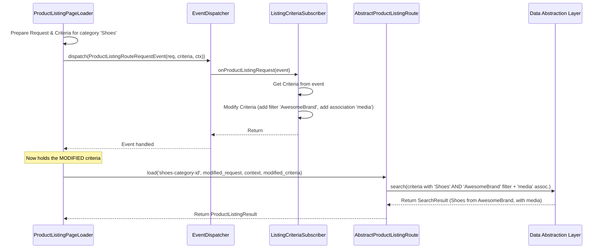

# Chapter 7: RouteRequestEvent

Welcome back! In [Chapter 6: Captcha Abstraction](06_captcha_abstraction_.md), we saw how Shopware uses a flexible system to handle different types of CAPTCHAs, often triggered by events within the request lifecycle. Events are a common pattern in Shopware, allowing different parts of the system to communicate and react to happenings. Now, let's explore a specific event that lets us influence how data is fetched for pages or components: the `RouteRequestEvent`.

**What problem does `RouteRequestEvent` solve?**

Imagine you're building a plugin for Shopware. Maybe you want to customize the product listing page so that it *always* shows products from a specific manufacturer ('AwesomeBrand') alongside the category filter, or perhaps you need to ensure that product reviews are *always* loaded with the product data whenever a product detail page is shown.

How can your plugin modify the data fetching instructions (like filters or associations) *just before* the standard Shopware code asks the database for the information? You don't want to change the core Shopware files (like the `ProductListingPageLoader` or `ProductPageLoader`) because that would make updates difficult.

This is where `RouteRequestEvent` comes in. It acts like a **signal flare** fired just before a specific internal **Store API route** (the ones used by [PageLoaders](04_page___pageloader_pattern_.md) or [PageletLoaders](05_pagelet___pageletloader_pattern_.md) to get data) is called. By listening for this flare (subscribing to the event), your plugin can step in and tweak the instructions (the `Request` or `Criteria`) before the data retrieval happens.

Think of it like placing an order with a warehouse:
1.  A `PageLoader` prepares the order details (Request & Criteria) – "I need 10 red shirts, size M".
2.  *Before* sending the order, it fires the `RouteRequestEvent` signal flare.
3.  Your plugin (a Subscriber, like a manager) sees the flare for "shirt orders".
4.  Your plugin quickly checks the order details (the `Request` and `Criteria` inside the event) and modifies them – "Actually, add 'must be cotton' to the requirements" (modifies Criteria).
5.  The modified order is then sent to the warehouse (the Store API route is called).

## Key Concepts

### 1. Events and Subscribers (The Newsletter)

Shopware uses an "Event System" heavily. It's like a newsletter subscription:
*   **Event:** An announcement that something interesting happened (e.g., `RouteRequestEvent`).
*   **Dispatcher:** The system that sends out the announcement.
*   **Subscriber:** Someone (like your plugin) who has subscribed to specific announcements and reacts when they receive one.

### 2. Store API Routes (The Internal Warehouse Doors)

These are *not* the URLs you type in your browser. They are internal endpoints used by Shopware's Storefront code (like PageLoaders) to fetch data. Examples might be `/store-api/product-listing/{categoryId}` or `/store-api/product/{productId}`. They are the doors to the data warehouse.

### 3. `RouteRequestEvent` (The Signal Flare)

This is the specific event we're interested in. It's dispatched right *before* one of those internal Store API routes is called. It carries important information:
*   `storefrontRequest`: The original request from the user's browser.
*   `storeApiRequest`: The request object prepared specifically for the Store API call.
*   `salesChannelContext`: Information about the current sales channel, language, currency, customer, etc.
*   `criteria`: The crucial **Criteria** object – the detailed instructions for what data to fetch.

```php
// File: Event/RouteRequest/RouteRequestEvent.php (Simplified Base Class)
abstract class RouteRequestEvent extends NestedEvent implements ShopwareSalesChannelEvent
{
    private readonly Criteria $criteria;

    // Constructor receiving requests, context, and criteria
    public function __construct(
        private readonly Request $storefrontRequest, // Browser Request
        private readonly Request $storeApiRequest,   // API Request
        private readonly SalesChannelContext $salesChannelContext,
        ?Criteria $criteria = null // Data fetching instructions
    ) {
        $this->criteria = $criteria ?? new Criteria();
    }

    // Method to get the API Request
    public function getStoreApiRequest(): Request { /* ... */ }

    // Method to get the Sales Channel Context
    public function getSalesChannelContext(): SalesChannelContext { /* ... */ }

    // Method to get the Criteria object (the instructions!)
    public function getCriteria(): Criteria
    {
        return $this->criteria;
    }
    // ... other getters ...
}
```
This base class defines what information is available in *any* `RouteRequestEvent`. Specific events for different routes (like cancelling an order) will extend this base class.

```php
// File: Event/RouteRequest/CancelOrderRouteRequestEvent.php (Example Specific Event)
// This event is fired just before the '/store-api/order/state/cancel' route is called.
class CancelOrderRouteRequestEvent extends RouteRequestEvent
{
    // No additional methods needed, just inherits everything
    // from RouteRequestEvent. Its existence signals WHICH route
    // is about to be called.
}
```
This specific event acts as a marker, telling subscribers exactly which Store API route is about to be processed.

### 4. `Criteria` Object (The Shopping List Instructions)

This object, accessible via `$event->getCriteria()`, holds all the details about the data being requested from the Store API. Think of it as a detailed shopping list:
*   **Filters:** Which items to include/exclude (e.g., `product.manufacturerId = 'awesome-brand-id'`).
*   **Sorting:** How to order the results (e.g., `product.name ASC`).
*   **Associations:** Which related data to load (e.g., load `media` or `reviews` along with the product).
*   **Pagination:** Limit and offset (e.g., show 20 items per page).
*   **Grouping, Aggregations:** More advanced options.

Subscribers can modify this `Criteria` object *directly* within the event.

### 5. Subscribers (The Managers)

These are PHP classes in your plugin that listen for specific events. They implement the `EventSubscriberInterface` from Symfony. When the event they listen for is dispatched, their designated method is called, receiving the event object (like `CancelOrderRouteRequestEvent`) as an argument.

## How to Use It: Always Filter Product Listings

Let's solve our example use case: A plugin needs to ensure that *all* product listing pages (like category pages or search results) *also* filter by manufacturer 'AwesomeBrand' and *always* load product media.

**Step 1: Create the Subscriber Class**

Create a PHP class in your plugin. Let's call it `ListingCriteriaSubscriber`.

```php
// File: <YourPlugin>/src/Subscriber/ListingCriteriaSubscriber.php

namespace YourPlugin\Subscriber;

use Shopware\Core\Framework\DataAbstractionLayer\Search\Criteria;
use Shopware\Core\Framework\DataAbstractionLayer\Search\Filter\EqualsFilter;
use Shopware\Storefront\Page\Product\Listing\ProductListingRouteRequestEvent; // Specific event!
use Symfony\Component\EventDispatcher\EventSubscriberInterface;

class ListingCriteriaSubscriber implements EventSubscriberInterface
{
    // ... (more code coming)
}
```
This class needs to implement the `EventSubscriberInterface`. We also import the specific event for the product listing route (`ProductListingRouteRequestEvent` - *Note: This specific event class might vary slightly depending on Shopware version or context, check the core code if unsure*) and classes needed for criteria modification.

**Step 2: Subscribe to the Event**

Implement the `getSubscribedEvents` method. This tells Shopware which event(s) this subscriber cares about and which method to call when the event occurs.

```php
// Inside ListingCriteriaSubscriber class:

public static function getSubscribedEvents(): array
{
    // Listen for the ProductListingRouteRequestEvent
    // and call the 'onProductListingRequest' method when it happens.
    return [
        ProductListingRouteRequestEvent::class => 'onProductListingRequest'
    ];
}
```
This maps the specific event class to a method name within our subscriber.

**Step 3: Implement the Reaction Method**

Create the `onProductListingRequest` method. It receives the event object as an argument.

```php
// Inside ListingCriteriaSubscriber class:

use Shopware\Core\Framework\DataAbstractionLayer\Search\Criteria;
use Shopware\Core\Framework\DataAbstractionLayer\Search\Filter\EqualsFilter;
// ... other necessary use statements

public function onProductListingRequest(ProductListingRouteRequestEvent $event): void
{
    // 1. Get the Criteria object from the event
    $criteria = $event->getCriteria();

    // 2. Add our manufacturer filter
    $criteria->addFilter(
        new EqualsFilter('product.manufacturer.id', 'awesome-brand-id') // Filter by ID
    );

    // 3. Add the media association
    $criteria->addAssociation('media');

    // That's it! The changes to $criteria are automatically reflected
    // because objects are passed by reference.
}
```
Inside this method, we get the `Criteria` object using `$event->getCriteria()` and then directly modify it by adding a new `EqualsFilter` and adding the `media` association.

**Step 4: Register the Subscriber**

Finally, tell Shopware about your subscriber by registering it in your plugin's `services.xml` file.

```xml
<!-- File: <YourPlugin>/src/Resources/config/services.xml -->
<container xmlns="http://symfony.com/schema/dic/services">
    <services>
        <service id="YourPlugin\Subscriber\ListingCriteriaSubscriber">
            <!-- This tag tells Shopware this service is an event subscriber -->
            <tag name="kernel.event_subscriber"/>
        </service>
    </services>
</container>
```
This registration ensures that Shopware's event dispatcher knows about your `ListingCriteriaSubscriber` and will call its `onProductListingRequest` method whenever a `ProductListingRouteRequestEvent` is dispatched.

**Result:** Now, every time a product listing is about to be loaded via the Store API (e.g., by `ProductListingPageLoader`), your subscriber will automatically add the 'AwesomeBrand' filter and the 'media' association to the `Criteria` *before* the data is fetched. The PageLoader doesn't even know this happened; it just uses the modified criteria.

## Internal Implementation Walkthrough

How does this work behind the scenes when, for example, the `ProductListingPageLoader` runs?



1.  **Preparation:** The `ProductListingPageLoader` prepares the `Request` and `Criteria` needed to fetch products for a specific category (e.g., 'Shoes').
2.  **Dispatch Event:** *Before* calling the `AbstractProductListingRoute`'s `load` method, the loader creates a `ProductListingRouteRequestEvent` containing the prepared request, criteria, and context. It then dispatches this event via the `EventDispatcher`.
3.  **Notify Subscriber:** The `EventDispatcher` finds our `ListingCriteriaSubscriber` (because it's registered and listening for this event) and calls its `onProductListingRequest` method, passing the event object.
4.  **Modify Criteria:** Our subscriber gets the `Criteria` object from the event and adds the `EqualsFilter` for 'AwesomeBrand' and the 'media' association directly to it.
5.  **Continue:** Control returns to the `ProductListingPageLoader`. The `$criteria` variable it holds now contains the modifications made by the subscriber.
6.  **Call Store API Route:** The loader calls `AbstractProductListingRoute::load`, passing the *modified* criteria.
7.  **Data Fetching:** The route uses the modified criteria to fetch data from the Data Abstraction Layer (DAL). The DAL query will now include conditions for the category ('Shoes') *and* the manufacturer ('AwesomeBrand'), and it will join the media table.
8.  **Return Result:** The filtered and enriched data is returned up the chain.

## Conclusion

The `RouteRequestEvent` mechanism provides a clean and powerful way for plugins or customizations to influence Store API data fetching *before* it happens.

*   It acts as a **signal flare** before a Store API route is called.
*   **Subscribers** can listen for these events (like `ProductListingRouteRequestEvent` or `CancelOrderRouteRequestEvent`).
*   Subscribers can access and **modify the `Criteria` object** within the event to change filters, sorting, associations, etc.
*   This allows you to customize data retrieval logic **without modifying core Shopware classes**, making your extensions more robust and maintainable.

We've seen how to hook in *before* data is fetched. But what if you want to modify data *after* a whole page (like the product detail page) has finished loading all its initial data?

Next up: [Chapter 8: PageLoadedHook](08_pageloadedhook_.md)

---

Generated by [AI Codebase Knowledge Builder](https://github.com/The-Pocket/Tutorial-Codebase-Knowledge)