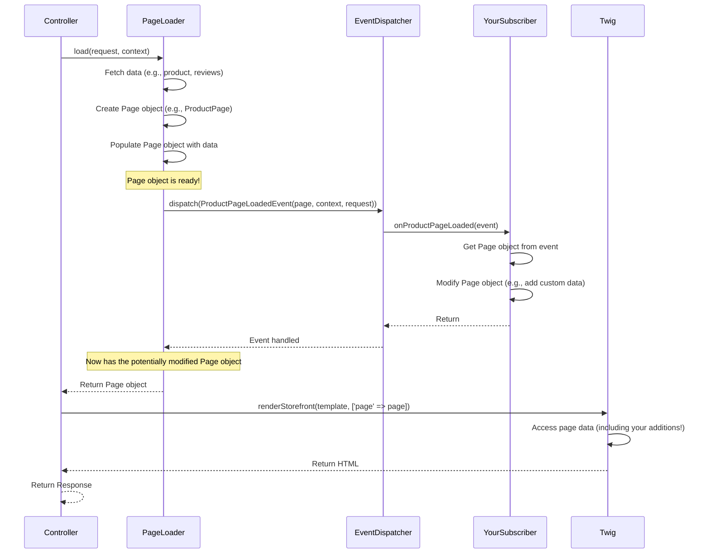

# Chapter 8: PageLoadedHook

Welcome to the final chapter! In [Chapter 7: RouteRequestEvent](07_routerequestevent_.md), we saw how plugins can hook into the data fetching process *before* a Store API route is called, allowing us to modify the *instructions* (the `Criteria`) for what data to get.

But what if the page data has already been fetched and assembled, and you want to add some extra information or make final adjustments *after* everything is loaded but *just before* the page is displayed to the user?

**What problem does `PageLoadedHook` solve?**

Imagine you want to display a special banner on the product detail page: "Yay! This awesome product qualifies for free shipping!". You need to check the product's price or maybe the total cart value *after* the `ProductPageLoader` has finished gathering all the product details and cart information. You need a way to inject this "show banner" flag into the page data right before the template is rendered.

Modifying the core `ProductPageLoader` ([Chapter 4: Page / PageLoader Pattern](04_page___pageloader_pattern_.md)) is not a good idea, as it makes updates difficult. We need a clean way to react to the fully loaded page.

The **`PageLoadedHook` concept** (often implemented via corresponding **Events** for plugin developers) provides exactly this opportunity. It's like the final quality check and touch-up station on an assembly line. The product (the `Page` object) is fully assembled, and this is the last chance to add a sticker or a small accessory before it gets packaged (rendered).

## Key Concepts

### 1. Hook vs. Event (A Subtle Distinction)

In Shopware, you'll often hear about "Hooks" and "Events". They are very similar concepts, both allowing you to react to things happening in the system.
*   **Events** (like `ProductPageLoadedEvent`) are the standard way for **PHP plugin developers** to subscribe and react using Symfony's EventDispatcher.
*   **Hooks** (like `ProductPageLoadedHook`) are primarily designed for Shopware's **App System** and **internal scripting features**. They provide a similar mechanism but tailored for scripts written in Twig or PHP within the Script Manager.

Essentially, when a `PageLoader` finishes loading data, it typically dispatches an **Event**. The scripting system listens for this event and triggers the corresponding **Hook** for any active scripts. For this chapter, we'll focus on the **Event** mechanism used by PHP plugin developers, as it achieves the same goal of reacting to the loaded page.

### 2. The Page Object (The Shopping Bag)

Remember our "Structured Shopping Bag" from [Chapter 4: Page / PageLoader Pattern](04_page___pageloader_pattern_.md)? This is the `Page` object (like `ProductPage`, `AccountOrderPage`, etc.) that the `PageLoader` carefully assembled, containing all the data needed for the view. The `...PageLoadedEvent` gives you direct access to this fully loaded `Page` object.

### 3. The Timing: After Loading, Before Rendering

This is crucial: The `...PageLoadedEvent` is dispatched *after* the corresponding `PageLoader` has finished its `load()` method and gathered all the core data, but *before* the [StorefrontController](03_storefrontcontroller_.md) calls `renderStorefront()` to generate the final HTML.



### 4. The Purpose: Modify or Extend Page Data

The primary goal is to add, change, or remove data within the `Page` object just before it's used by the template. This allows for flexible extensions without altering core logic.

## How to Use It: Adding a Custom Flag to the Product Page

Let's implement our "free shipping banner" example. We'll create an Event Subscriber that listens for the `ProductPageLoadedEvent` and adds a custom flag `showFreeShippingBanner` to the `ProductPage` object.

**Step 1: Create the Subscriber Class**

In your plugin, create a subscriber class.

```php
// File: <YourPlugin>/src/Subscriber/ProductPageSubscriber.php

namespace YourPlugin\Subscriber;

use Shopware\Storefront\Page\Product\ProductPageLoadedEvent; // The specific event!
use Symfony\Component\EventDispatcher\EventSubscriberInterface;

class ProductPageSubscriber implements EventSubscriberInterface
{
    // ... (more code coming)
}
```
This class needs to implement `EventSubscriberInterface` and know about the specific event `ProductPageLoadedEvent`.

**Step 2: Subscribe to the Event**

Tell Shopware which event to listen for and which method to call.

```php
// Inside ProductPageSubscriber class:

public static function getSubscribedEvents(): array
{
    // Listen for ProductPageLoadedEvent, call 'addFreeShippingFlag' method
    return [
        ProductPageLoadedEvent::class => 'addFreeShippingFlag'
    ];
}
```

**Step 3: Implement the Reaction Method**

Create the `addFreeShippingFlag` method. This is where the magic happens.

```php
// Inside ProductPageSubscriber class:

use Shopware\Core\Framework\Struct\ArrayStruct; // Use this to add custom data

public function addFreeShippingFlag(ProductPageLoadedEvent $event): void
{
    // 1. Get the fully loaded Page object from the event
    $page = $event->getPage();

    // 2. Get the product data from the Page object
    $product = $page->getProduct();

    // 3. Decide if the banner should show (example logic)
    $showBanner = false;
    if ($product->getPrice() && $product->getPrice()->getGross() > 50) {
        $showBanner = true;
    }

    // 4. Add our custom data to the Page object
    // Use addExtension for custom data. Give it a unique name!
    $page->addExtension(
        'yourPlugin_shippingInfo', // Unique key for your data
        new ArrayStruct(['showFreeShippingBanner' => $showBanner])
    );
}

```
*   We get the `ProductPage` object from the event.
*   We access data already loaded by the `PageLoader` (like `$page->getProduct()`).
*   We implement our custom logic (checking the price).
*   Crucially, we use `$page->addExtension()` to add our custom data. We wrap our data (`['showFreeShippingBanner' => $showBanner]`) inside an `ArrayStruct` and give the extension a unique name (`yourPlugin_shippingInfo`) to avoid conflicts with other plugins or core data.

**Step 4: Register the Subscriber**

Register your subscriber in your plugin's `services.xml`.

```xml
<!-- File: <YourPlugin>/src/Resources/config/services.xml -->
<container xmlns="http://symfony.com/schema/dic/services">
    <services>
        <service id="YourPlugin\Subscriber\ProductPageSubscriber">
            <!-- This tag registers the service as an event subscriber -->
            <tag name="kernel.event_subscriber"/>
        </service>
    </services>
</container>
```

**Step 5: Use the Data in Twig**

Now, in your product page Twig template (e.g., `storefront/page/product-detail/index.html.twig`), you can access the flag you added:

```twig
{# Get the custom data using the unique extension name #}


{# Check the flag within the custom data #}

    <div class="alert alert-success">
        Yay! This awesome product qualifies for free shipping!
    </div>


{# ... rest of the product page template ... #}

```
We access our custom data via `page.extensions.yourPlugin_shippingInfo` and then check the `showFreeShippingBanner` property within it.

**Result:** You've successfully added custom data to the product page *after* it was loaded, without changing any core Shopware `PageLoader`. The banner will now appear for products over €50.

## Internal Implementation Dive

Let's look briefly at the code involved.

**1. The `PageLoader` Dispatches the Event**

Inside a `PageLoader` (like `ProductPageLoader`), after loading data and creating the `$page` object, the event is dispatched:

```php
// Simplified from src/Storefront/Page/Product/ProductPageLoader.php
// ... load product, configurator etc. into $page ...

// Dispatch the event, passing the fully loaded $page object
$this->eventDispatcher->dispatch(
    new ProductPageLoadedEvent($page, $context, $request)
);

// Return the $page object (which might have been modified by subscribers)
return $page;

```
The key is that `eventDispatcher->dispatch` happens *before* the `return $page;`.

**2. The Specific `...PageLoadedEvent` Class**

Each page type has its own event class, inheriting common structure but providing access to its specific `Page` type.

```php
// File: src/Storefront/Page/Product/ProductPageLoadedEvent.php (Simplified)
namespace Shopware\Storefront\Page\Product;

use Shopware\Core\System\SalesChannel\SalesChannelContext;
use Shopware\Storefront\Page\PageLoadedEvent; // Base class for page events
use Symfony\Component\HttpFoundation\Request;

class ProductPageLoadedEvent extends PageLoadedEvent
{
    // Holds the specific ProductPage object
    protected ProductPage $page;

    public function __construct(
        ProductPage $page, // Expects a ProductPage
        SalesChannelContext $context,
        Request $request
    ) {
        $this->page = $page;
        parent::__construct($context, $request);
    }

    // Method for subscribers to get the ProductPage
    public function getPage(): ProductPage
    {
        return $this->page;
    }
}
```
It mainly stores the specific `Page` object and provides a `getPage()` method.

**3. The Base `PageLoadedHook` (For Scripts)**

While we focused on Events for PHP, the underlying concept for Scripts uses Hooks. There's a base `PageLoadedHook` class that specific hooks (like `ProductPageLoadedHook`) extend. These hooks are what get triggered for App Scripts when the corresponding Event is dispatched.

```php
// File: src/Storefront/Page/PageLoadedHook.php (Provided Snippet)
namespace Shopware\Storefront\Page;
// ... other imports ...
use Shopware\Core\Framework\Script\Execution\Hook;
use Shopware\Core\Framework\Script\Execution\Awareness\SalesChannelContextAware;

/**
 * @internal Base class for page loaded hooks used by scripts
 */
abstract class PageLoadedHook extends Hook implements SalesChannelContextAware
{
    // Defines services available within the script hook execution
    public static function getServiceIds(): array { /* ... */ }

    // Abstract method to get the page object (implemented by child hooks)
    abstract public function getPage();

    // Needs sales channel context
    abstract public function getSalesChannelContext(): SalesChannelContext;

    // ... other hook methods like getName() ...
}
```

```php
// File: src/Storefront/Page/Product/ProductPageLoadedHook.php (Example Specific Hook)
namespace Shopware\Storefront\Page\Product;
// ... other imports ...
use Shopware\Storefront\Page\PageLoadedHook;

/**
 * Triggered when the ProductPage is loaded (for scripts)
 */
class ProductPageLoadedHook extends PageLoadedHook
{
    use SalesChannelContextAwareTrait;
    final public const HOOK_NAME = 'product-page-loaded';

    public function __construct(
        private readonly ProductPage $page, // Holds the page
        SalesChannelContext $context
    ) { /* ... */ }

    public function getName(): string { return self::HOOK_NAME; }
    public function getPage(): ProductPage { return $this->page; } // Provides page access
}

```
These hook classes mirror the Events but are used by the Scripting engine. They provide access to the same `$page` object, allowing scripts to modify it just like PHP subscribers do via Events.

## Conclusion

The `PageLoadedHook` concept, accessed via **Events** (`...PageLoadedEvent`) in PHP or corresponding **Hooks** (`...PageLoadedHook`) in Scripts, is a vital tool for extending the Storefront.

*   It allows you to **react after** a `PageLoader` has fully assembled a `Page` object.
*   It provides **direct access** to the `Page` object.
*   You can **add, modify, or read** data on the `Page` object before it's rendered using methods like `addExtension()`.
*   This enables clean, maintainable customizations **without altering core Shopware logic**.

This concludes our introductory journey through some key concepts of the Shopware Storefront architecture! From understanding how requests are routed and themed, how controllers orchestrate responses, how data is loaded for pages and pagelets, to how events and hooks allow for flexible extension – you now have a foundational understanding of how the Storefront works. Happy coding!

---

Generated by [AI Codebase Knowledge Builder](https://github.com/The-Pocket/Tutorial-Codebase-Knowledge)