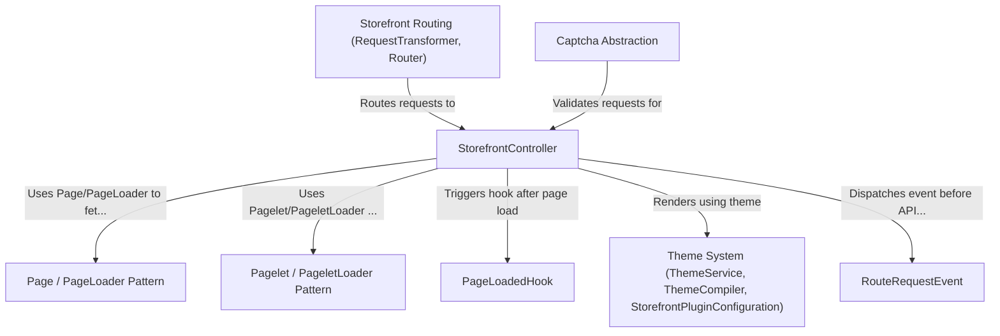

# Tutorial: Storefront

The **Storefront** project is the customer-facing part of the Shopware e-commerce system.
It handles incoming web requests, fetches data like *products or categories*, manages the visual **theme**, and displays pages to the user.
It uses patterns like *PageLoader* and *PageletLoader* to organize data loading and keep controllers clean.

**Source Repository:** [None](None)

## Chapters

1. [Storefront Routing (RequestTransformer, Router)
](01_storefront_routing__requesttransformer__router__.md)
2. [Theme System (ThemeService, ThemeCompiler, StorefrontPluginConfiguration)
](02_theme_system__themeservice__themecompiler__storefrontpluginconfiguration__.md)
3. [StorefrontController
](03_storefrontcontroller_.md)
4. [Page / PageLoader Pattern
](04_page___pageloader_pattern_.md)
5. [Pagelet / PageletLoader Pattern
](05_pagelet___pageletloader_pattern_.md)
6. [Captcha Abstraction
](06_captcha_abstraction_.md)
7. [RouteRequestEvent
](07_routerequestevent_.md)
8. [PageLoadedHook
](08_pageloadedhook_.md)

---

Generated by [AI Codebase Knowledge Builder](https://github.com/The-Pocket/Tutorial-Codebase-Knowledge)